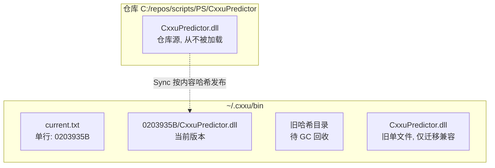
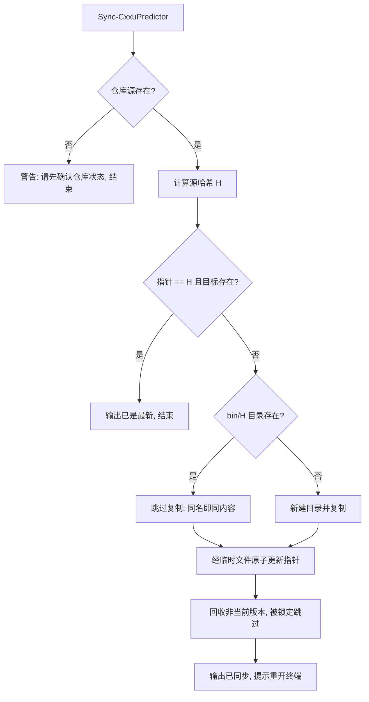
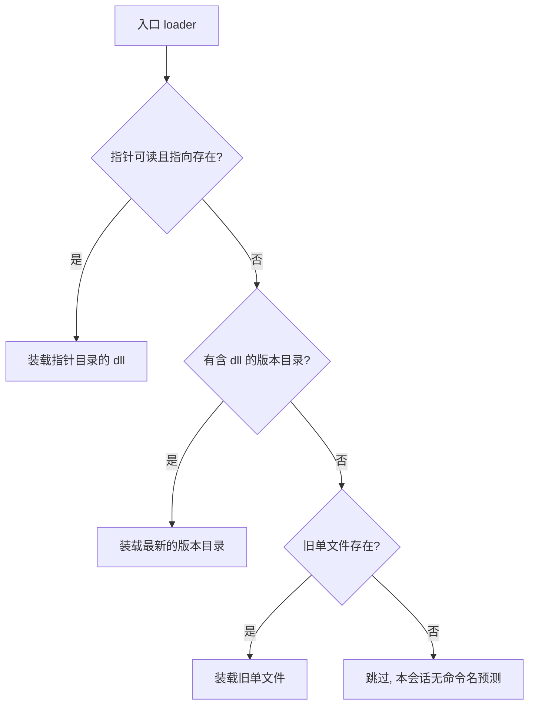
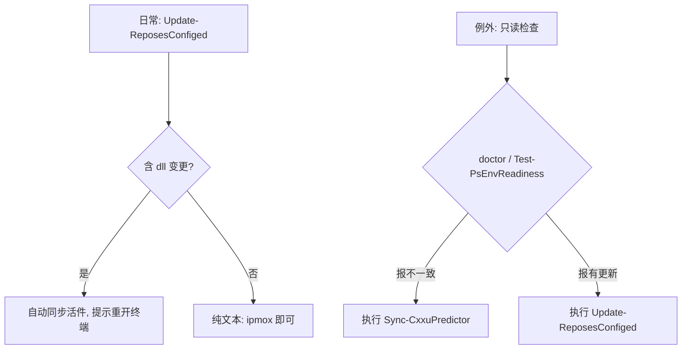

# 并排版本活件

> 本章讲一件事：`CxxuPredictor.dll` 的活件为什么按版本并排存放，以及各命令如何分工。术语（仓库源/活件/指针/自锁/他锁）以 `Module-Conventions.md §11` 为准。操作速查见 `Feature-Guide.md §9`，部署流程见 `Deploy-Guide.md §13`。

## 1. 背景

`CxxuPredictor` 必须编译成 `dll`（原因见 `Startup-Optimization.md §20`：PSReadLine 插件槽只接受 .NET 实现，且预测 20ms 预算纯 PowerShell 达不到）。 `dll` 一旦被会话加载，文件即被该进程锁定直到进程退出（.NET 程序集不随模块卸载而卸载，`Remove-Module` 后文件依然锁定，已实测）。

由此产生两个历史阶段：

- 仓库内加载：运行期直接加载仓库中的 `dll`，`git pull` 因文件锁定而失败，被迫配一整套清场逻辑（关闭其它会话、探测定锁、失败重试）。
- 外置单文件：活件搬到仓库外的固定路径，`git pull` 不再冲突；但同步仍是原地覆盖，只要有会话（包括执行同步的本会话）持有旧版，**复制必然失败**，并伴随入口警告刷屏。

结论：**只要更新语义是"覆盖旧文件"，锁就是不可消除的矛盾点**。并排版本把更新语义改为"发布新版本"，锁问题在结构上消失。

## 2. 目标与不变量

- 目标：同步操作在任何会话中执行都成功，不关闭任何会话，不输出警告。
- 不变量（一直成立，不因版本变化而改变）：
  1. **仓库源从不被加载**，因此版本推进（`git pull`）永远不受锁限制。
  2. 同步或删除完成后，当前会话内存中仍是旧代码，**必须重新打开终端**，再执行 `init`。
  3. 入口 loader **只静默装载**，不对比版本，不输出警告。

## 3. 静态结构

- 版本目录名是仓库源 SHA256 的前 8 位十六进制字符。同内容必同名，不同内容必不同名（哈希碰撞在 8 位截断下理论存在，实际构建频率下可忽略；即使碰撞，加载的仍是可用版本，只是可能不是最新，检查命令会报不一致）。
- 文件名在版本目录内恒为 `CxxuPredictor.dll`。**该约束不可放宽**：按路径导入时，模块名取文件名（不含扩展名），改名会导致 `Get-Module CxxuPredictor` 为空，全部检查逻辑失效（已实测踩坑）。
- 指针文件 `current.txt` 内容为单个目录名，无 BOM，无换行要求（读取时取首行并去空白）。

以上三条即指针协议的全部内容。图讲的是"东西放在哪"，下一节讲"怎么变过去"。

## 4. 同步流程

- 不受锁限制的形式化论证：
  1. 同步只执行两类写操作，一是新建目录并写入新文件（路径此前不存在，不可能被锁定），二是改写指针小文本文件（无进程长期持有）。
  2. 被锁定的旧版本文件从不触碰。**因此同步在任何会话中执行都成功**，无需关闭会话.  `-Force` 在同步路径上无意义（仅用于卸载路径保留，用于关闭其它会话）。
- 幂等：重复执行结果不变（第二次走"已是最新"分支），因此 `Update-ReposesConfiged` 可以无条件调用，无需预检。
- `-WhatIf` 显示将要新增的版本路径与指针目标，不执行写入。

## 5. 加载流程

- 旧会话继续使用装载时的旧版本，新会话使用指针指向的新版本。同一时刻存在多版本**是设计允许的状态，不是故障**。
- 指针损坏（空文件/指向不存在的目录）时自动降级，不报错；检查命令会报版本不一致，执行一次同步即恢复正常。

## 6. 回收与卸载

- 回收：每次同步后删除非当前版本的版本目录；被会话锁定的删除失败会被静默跳过，下次同步重试。旧单文件（迁移前产物）在无人持有时同样回收。
- 卸载（`Sync-CxxuPredictor -Uninstall`）：删除指针与全部版本目录；被锁定的版本会逐个报告，请关闭持有会话后重新执行。卸载后若不禁用自动加载（持久化 `$env:PsPredictor='False'`），下次同步或更新会重新安装。

## 7. 故障模式

| 现象 | 原因 | 处理 |
|---|---|---|
| 检查报与仓库不一致 | 拉取了新版本但尚未同步 | 执行 `Sync-CxxuPredictor`（任何会话都可执行） |
| 指针损坏或丢失 | 文件损坏/误删 | 执行一次同步即重建；期间 loader 自动降级，不中断使用 |
| 旧版本目录长期存在 | 一直有会话持有旧版，GC 跳过 | 正常。持有会话全部退出后的下次同步会回收 |
| 同步后本会话仍是旧行为 | 不变量 2：内存中是旧代码 | **重新打开终端**，再执行 `init` |
| 卸载后又出现 | 未禁用自动加载 | 持久化 `$env:PsPredictor='False'` |

## 8. 命令分工：更新为什么不需要专用命令

曾有一个专用更新命令（fetch 判断、单仓库拉取、`-Force` 重开一条龙），2026-09-21 退役，原因：日常更新只用 `Update-ReposesConfiged`（批量拉取），它收尾已自动同步活件；专用命令的剩余价值（单仓库精确更新、一键重开）不足以支撑一个命令，手动等价操作足够（关闭会话、重新打开、`init`）。现行分工只剩两层，各管各的知识：

- `Update-ReposesConfiged` 理解 git（批量拉取）。它回答"仓库有没有新版本"，拉取后若 scripts 含 dll 变更，自动同步活件并提示重开终端。
- `Sync-CxxuPredictor` 不理解 git，只理解内容哈希：给定仓库源，发布或删除活件。它回答"活件与源是否一致"。无参数调用即完成判断与执行，且幂等。

两者是**调用关系，不是并列关系**：前者收尾调用后者。**合并成一个命令不可取**：合并体会同时背负 git 语义（分支、合并）与文件语义（哈希、指针、回收），调用者无法单独表达"我只想同步文件"（本地重编、手动修复、首次安装都不涉及 git）。

对用户的负担评估：**日常只需要记住一个入口**——`Update-ReposesConfiged`（批量更新，含自动同步）。例外情况由只读检查指路：`doctor`（统一诊断入口）与 `Test-PsEnvReadiness`（备注列与建议行）会明确写出下一步命令。`Sync-CxxuPredictor` 极少需要手工执行。

## 9. 参见

- 操作速查：`Feature-Guide.md §9`（检查/安装/更新/移除四件套）。
- 部署流程：`Deploy-Guide.md §13`。
- 决策演进：`Agent-Handoff.md` #21（外置）、#27（自锁实测，已被推翻部分留档）、 #28（移除）、#29（并排版本，现行）。
- 语言规范：`Module-Conventions.md §11`（术语）、§12（行文风格）。
