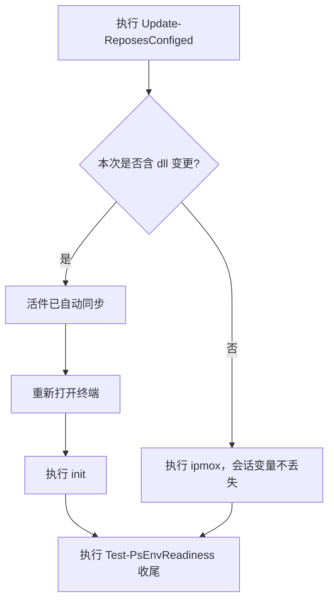

# scripts

> A collection of practical scripts for daily use: PowerShell modules (`PS/`, 67 modules, pwsh-first) and shell scripts (bash/zsh).
> 本仓库收录日常使用的实用脚本，包括 PowerShell 模块集（`PS/`，共 67 个模块，来源：`PS/docs/Module-Map.md`）与 shell 脚本库（bash/zsh）；本文档以中文撰写。
>
> 仓库地址：[github.com/xuchaoxin1375/scripts](https://github.com/xuchaoxin1375/scripts) · [gitee.com/xuchaoxin1375/scripts](https://gitee.com/xuchaoxin1375/scripts)

## 1. 读者指引

| 使用目标 | 建议阅读顺序 |
|---|---|
| 在新机器部署 PowerShell 环境 | 本文 §2 → `PS/docs/Deploy-Guide.md` |
| 日常使用（命令查询、补全配置） | `PS/docs/Feature-Guide.md`（§2 命令表；§7、§8、§10 补全；§9 dll 管理） |
| 故障定位 | 先执行 `doctor`，再按 `PS/docs/README.md` 分流 |
| 机器仅有 Windows PowerShell 5.1 | 本文 §2.3 → `PS/docs/Feature-Guide.md §13` |
| 查找功能归属的模块 | `PS/docs/Module-Map.md`（67 模块画像表） |
| 开发模块或编写自动化 | `AGENTS.md` → `PS/AGENTS.md` → `PS/docs/Agent-Handoff.md §3` |

## 2. 安装与部署（PowerShell 模块集）

### 2.1 一键部署

前置条件：具备 PowerShell 执行环境（`powershell.exe` 或 `pwsh`）与可用网络（直连或经镜像访问 `raw.githubusercontent.com`）。部署脚本默认从 github 经加速镜像获取；gitee 仅保留兼容（其实测对 `irm|iex` 常误报拦截，不作为默认源）。

```powershell
irm 'https://gh-proxy.com/https://raw.githubusercontent.com/xuchaoxin1375/scripts/refs/heads/main/PS/Deploy/Deploy-CxxuPsModules.ps1'|iex
```

执行者与行为：脚本先检查 PowerShell 7 与 git；已安装则跳过安装、直接拉取仓库（速度更快）；未安装则尝试自动安装，成功率取决于网络与权限，不保证成功，失败时见 §4 排查。需审查脚本内容或指定参数时，分步执行：

```powershell
irm 'https://gh-proxy.com/https://raw.githubusercontent.com/xuchaoxin1375/scripts/refs/heads/main/PS/Deploy/Deploy-CxxuPsModules.ps1' > ~/dcp.ps1
~/dcp.ps1 -RepoSource github
# 已有仓库需强制覆盖：Deploy-CxxuPsModules -Verbose -Confirm
```

完整参数与备用源见 `PS/Deploy/readme.md`。

### 2.2 部署后配置（补全栈）

§2.1 仅完成仓库落地与环境变量配置；补全栈需另行安装。前置条件：**关闭并重新打开终端**（profile 写入后生效，自动执行 `init`）。执行：

```powershell
Deploy-CompletionStack
# 善后再重开一次终端，缓存即就绪。边界：pwsh 低于 7.5 时给出警告（自研 predictor 不可用，其余补全正常）。
```

极简两条命令版见 `PS/docs/Deploy-Guide.md` 开头。

### 2.3 轻量部署

适用条件：目标机器仅有 Windows PowerShell 5.1，且无 git、无 pwsh 7。执行（在 `powershell.exe` 中）：

```powershell
irm 'https://gh-proxy.com/https://raw.githubusercontent.com/xuchaoxin1375/scripts/refs/heads/main/PS/Deploy/Deploy-CxxuPsModules.ps1' > ~/dcp.ps1
~/dcp.ps1 -Light
```

机制：无 git 时不提示安装，直接下载离线包（经 codeload 与中央镜像静默下载，不弹窗选择源）；`PSModulePath` 采用追加写入（不覆盖既有值）；结尾跳过 pwsh 安装，改为写入 5.1 专属 profile。善后：重新打开 `powershell.exe` 并执行 `init`。适用边界（B 档范围与禁区）见 `PS/docs/Feature-Guide.md §13`。

### 2.4 临时使用

适用条件：仅需个别模块，不获取全仓。执行：

```powershell
irm 'https://gh-proxy.com/https://raw.githubusercontent.com/xuchaoxin1375/scripts/refs/heads/main/PS/Deploy/Deploy.psm1'|iex   # Deploy 系列（含镜像测速、scoop、smb 等）
irm 'https://gh-proxy.com/https://raw.githubusercontent.com/xuchaoxin1375/scripts/refs/heads/main/PS/Tools/Tools.psm1'|iex     # Tools 系列小工具
```

### 2.5 本地开发验证

前置条件：本地已检出仓库；适用场景：改动尚未推送，需用本地代码验证部署效果。在仓库内直接执行一键脚本并附加 `-Dev`：

```powershell
C:/repos/scripts/PS/Deploy/Deploy-CxxuPsModules.ps1 -Dev # 可叠加 -Light -WhatIf；注意脚本尾部存在真实调用，先用 -WhatIf 空跑确认意图
```

机制：仓库根从脚本位置自动推导；`-Dev`（及 `-DevRoot`）透传全部 4 个一键脚本（`Deploy-CxxuPsModules`、`Deploy-GitForWindows`、`Deploy-Pwsh7Portable`、`Register-GithubHostsAutoUpdater`）；本地标记文件缺失时给出警告并回退远端，不中断执行。

## 3. 兼容性说明

- 本模块集建议使用 PowerShell 7 及以上版本（理由：完整功能与最佳性能；获取渠道包括联想应用商店，其版本可能非最新，不影响使用）。
- 67 个模块中 62 个兼容 Windows PowerShell 5.1（来源：各模块 `.psd1` 的版本声明；自查命令为 `Get-CxxuModuleCompatibility`）。兼容范围为 `init`、提示符、Tab 补全与历史记录；边界：预测视图与 dll 加载链保留在 7 及以上版本，不降级。
- 5.1 下读取含中文的 UTF-8 文档须使用 `Get-ContentUTF8`（原因：裸 `Get-Content` 按 GBK 解码，中文必乱码）。
- 5.1 专属 profile 可执行 `Install-Ps51Profile` 一键写入（与 7 的 profile 互不干扰）。

## 4. 加速镜像与故障排查

- 中央变量 `$env:PsGithubMirror` 统一管理镜像前缀（未设置时默认 `https://gh-proxy.com`；模块内静默测速，结果按会话缓存一次）。内置镜像过期时的处理：先执行 `Get-AvailableGithubMirrors` 测速，挑选最快者持久化（`Add-EnvVar -EnvVar PsGithubMirror -NewValue 'https://xxx'`）；可用列表与实测日期见 `PS/TestLinks/TestLinks.psm1` 头部注释。
- **禁止硬编码已失效的镜像域名**（`github.moeyy.xyz` 已停服，`ghproxy.cc` 与 `mirror.ghproxy.com` 已不可用，来源：同上头部注释实测记录）。自行搜集镜像时对照聚合页并注意甄别（多数已停服）：[GitHub文件加速|列表集合](https://yishijie.gitlab.io/ziyuan/)（聚合页，非下载前缀）、[镜像站点搜集 Issue #116](https://github.com/hunshcn/gh-proxy/issues/116#issuecomment-2339526975)。
- 会过期的外部资源（镜像站、上游版本、第三方域）统一登记于 `PS/docs/Deploy-Guide.md §14`；部署失败时先查该表，再更换链接。
- 执行策略报错给出路：先执行 `Set-ExecutionPolicy Bypass -Scope CurrentUser -Force` 后重试。git 读取配置报错给出路：移除或备份 `~/.gitconfig`（`rm ~/.gitconfig`，或 `mv ~/.gitconfig ~/.gitconfig.bak`）。

## 5. 手动克隆（不使用一键脚本时）

前置条件（Windows 必做）：先关闭 `autocrlf` 再克隆。原因：开启时 bash 脚本的换行会被改写为 CRLF，导致其在 git-bash 中执行失败。

```bash
git config --global core.autocrlf false
```

已在开启状态下克隆的补救（二选一）：删除仓库重克隆；或配置好模块后执行 `cd $sh;ls -Recurse *.sh,.inputrc.conf|Convert-CRLF -Replace -To LF;cd -` 将换行改回 LF。精简系统（如 alpine linux）需先安装 bash 与 git：`sudo apk add bash git`。

Windows（在 powershell 中执行；目录建议固定为 `C:/repos/scripts`，profile 与 conda 缓存中记录的即该路径）：

```powershell
New-Item -itemtype directory C:/repos -Verbose -ErrorAction SilentlyContinue
git clone --recursive --depth 1 --shallow-submodules https://github.com/xuchaoxin1375/scripts.git C:/repos/scripts
setx PsModulePath C:/repos/scripts/PS
```

国内从 gitee 克隆可能要求登录；github 免登录但直连不一定可用，不可用时经代理克隆：

```powershell
$proxy = "http://127.0.0.1:8800" # 代理 url
New-Item -itemtype directory C:/repos -Verbose -ErrorAction SilentlyContinue
git -c http.proxy="$Proxy" -c https.proxy="$Proxy" clone --recursive --depth 1 --shallow-submodules https://github.com/xuchaoxin1375/scripts.git C:/repos/scripts
setx PsModulePath C:/repos/scripts/PS
```

`*nix` 系统（`repo_source` 国内直连不通时更换代理或镜像，备选 gitee 可能要求登录）：

```bash
repos="$HOME/repos"
scripts="$repos/scripts"
repo_source="github.com"
mkdir -p "$repos"
git clone --recursive --depth 1 --shallow-submodules https://"$repo_source"/xuchaoxin1375/scripts.git "$scripts"
# 配置 shell 脚本库（兼容 bash/zsh）
sh_script_dir="$scripts/wp/woocommerce/woo_df/sh"
sh_sym="$HOME/sh" sh="$sh_sym"
ln -snfv "$sh_script_dir" "$sh_sym"
bash $sh/shellrc_addition.sh # 部署 prompt 主题与补全
exec bash # 使配置生效
```

克隆参数说明：`--depth 1` 仅获取最近一次提交（最省空间）；`--recursive` 一并获取子模块（`ble.sh` 建议携带）；`--shallow-submodules` 使子模块同样仅取最新；`--single-branch` 仅获取主分支。

## 6. Shell 脚本库与服务器

范围界定：个人电脑与服务器共用一套 shell 库（位于 `wp/woocommerce/woo_df/sh`，`$sh` 指向该目录）；服务器另有 nginx、fail2ban 等专用配置，本节方案不触碰服务器软件配置。

一键部署 shell 环境（未部署过则完整克隆，已部署则更新代码）：

```bash
bash <( curl -sSfL https://gitee.com/xuchaoxin1375/scripts/raw/main/wp/woocommerce/woo_df/sh/update_shell_config.sh)
```

服务器仅获取代码（参数语义以脚本内 `print_usage` 为准：`-U` 更新 shellrc，`-F` 强制更新配置文件，含覆盖 `nginx.conf`，酌情使用，`-R` 使用非默认的客户 IP 解析）：

```bash
## github
bash <(curl -SfL https://raw.githubusercontent.com/xuchaoxin1375/scripts/refs/heads/main/wp/woocommerce/woo_df/sh/update_repos.sh) -U # -F -R
## gitee（国内）
bash <(curl -SfL https://raw.giteeusercontent.com/xuchaoxin1375/scripts/raw/main/wp/woocommerce/woo_df/sh/update_repos.sh) -U # -F -R
```

更新脚本自身损坏时的自救：某次更新引入错误导致更新脚本不可用时，绕过 `$sh` 直接获取并执行（原因：首次使用时 `$sh` 未定义，脚本会尝试下载到根目录）。

```bash
curl -SfL https://raw.githubusercontent.com/xuchaoxin1375/scripts/refs/heads/main/wp/woocommerce/woo_df/sh/update_repos.sh -o $HOME/update_repos.sh && bash $HOME/update_repos.sh
```

脚本链接从仓库页面的“原始数据”（raw）处获取，github 与 gitee 均可：[github 仓库页](https://github.com/xuchaoxin1375/scripts/blob/main/wp/woocommerce/woo_df/sh/update_repos.sh) · [gitee 仓库页](https://gitee.com/xuchaoxin1375/scripts/blob/main/wp/woocommerce/woo_df/sh/update_repos.sh)。

虚拟机或模拟层与宿主机共用仓库（前置：先定义 `_REPO_BASE="repos/scripts"` 与 `_SH_RELATIVE="wp/woocommerce/woo_df/sh"`；wsl 连接 Windows 侧仓库，lima 连接 macOS 宿主仓库）：

```bash
# wsl
ln -snfv /mnt/c/repos ~/repos
ln -snfv /mnt/c/$_REPO_BASE/$_SH_RELATIVE ~/sh
bash ~/sh/shellrc_addition.sh && exec bash
# lima（mac）
ln -snfv $HOME/repos ~/repos
ln -snfv $HOME/$_REPO_BASE/$_SH_RELATIVE ~/sh
bash ~/sh/shellrc_addition.sh && exec bash
```

## 7. 日常使用与更新

- 开新终端后执行 `init`（完整环境）或 `p`（轻量常用）；`init -Timing` 输出分步耗时，启动缓慢时对照 `PS/docs/Startup-Optimization.md` 的性能基线定位。
- 命令查询按三段式：`Get-ModuleByCxxu`（5.1 可用）→ `Get-Command -Module <模块名>` 查看导出 → `Get-Command <命令>` 反查归属。补全、开机任务、手动启用清单见 `PS/docs/Feature-Guide.md`（§4、§7、§8、§10、§11）。
- 更新流程如下（`Update-ReposesConfiged` 批量拉取；`git pull` 仅写入仓库目录，**纯文本变更不会触发文件锁定**，可随时执行）：



- 上图的结论：含 dll 变更时必须重开终端再 `init`（程序集随进程，旧代码驻留内存）；纯文本变更执行 `ipmox` 即可。收尾统一执行 `Test-PsEnvReadiness`（附加 `-CheckRemote` 可顺便查看远端有无更新，该开关只读远端，不改动本地）。
- dll 活件机制（并排版本与指针，术语定义见 `PS/docs/Module-Conventions.md §11`）见 `PS/docs/Live-Versions.md`；仓库源 dll 无法加载时（macOS 或新版 pwsh 与构建机 SMA 不一致）按该文档 §10 本地重编。

## 8. 文档索引

`PS/docs/` 为唯一真相源（代码注释与文档矛盾时以文档为准）：

| 文档 | 内容说明 |
|---|---|
| `PS/docs/Feature-Guide.md` | 用户手册：命令表、补全、dll 管理、FAQ、手动启用清单（§11） |
| `PS/docs/Deploy-Guide.md` | 新机部署：极简两条命令、分步详解、多设备差异、更新（§13）、时效性清单（§14） |
| `PS/docs/Live-Versions.md` | 并排版本活件设计专章：结构、指针协议、流程、故障、命令分工 |
| `PS/docs/Module-Map.md` | 67 模块画像表：查找功能时先查表 |
| `PS/docs/Startup-Optimization.md` | 性能基线与搬迁史：改动热路径前先查阅 |
| `PS/docs/Agent-Handoff.md` | 踩坑编年史：记录每个决策的起因、实测与教训（agent 必读 §3） |
| `PS/docs/Module-Conventions.md` | 命名与编码铁律、文档语言规范 |
| `PS/docs/README.md` | 文档入口地图：新用户按任务分流 |
| `PS/AGENTS.md` | agent 工作入口：作用范围、换行、提交规范 |

检索方法：查找命令按 §7 三段式；定位故障先执行 `doctor`（其输出会点名文档章节）；查找决策理由按 Handoff 编号查阅。`PwshModuleByCxxu.md` 描述旧结构，仅供考古（三站镜像：[GitCode](https://gitcode.com/xuchaoxin1375/Scripts/blob/main/PwshModuleByCxxu.md) · [Gitee](https://gitee.com/xuchaoxin1375/scripts/blob/main/PwshModuleByCxxu.md) · [GitHub](https://github.com/xuchaoxin1375/scripts/blob/main/PwshModuleByCxxu.md)）。
