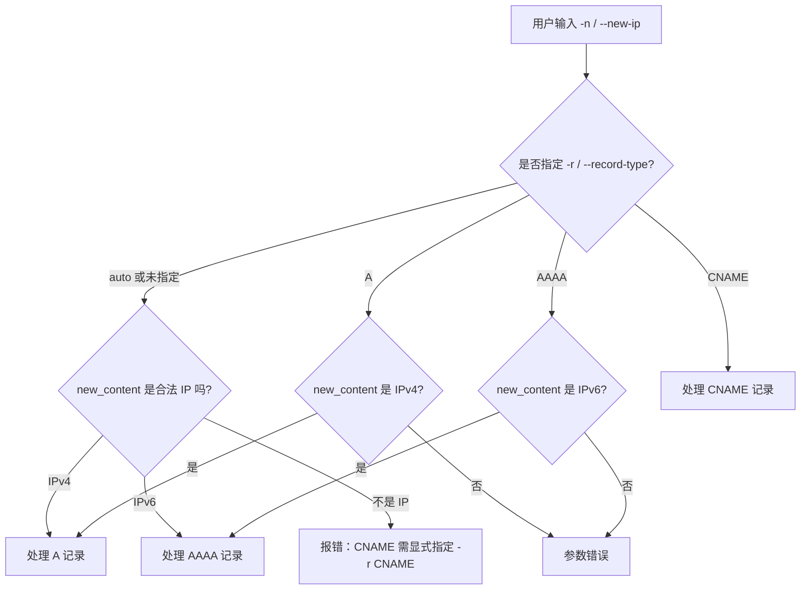
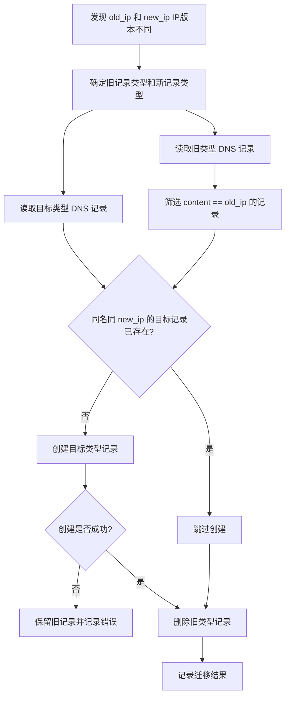
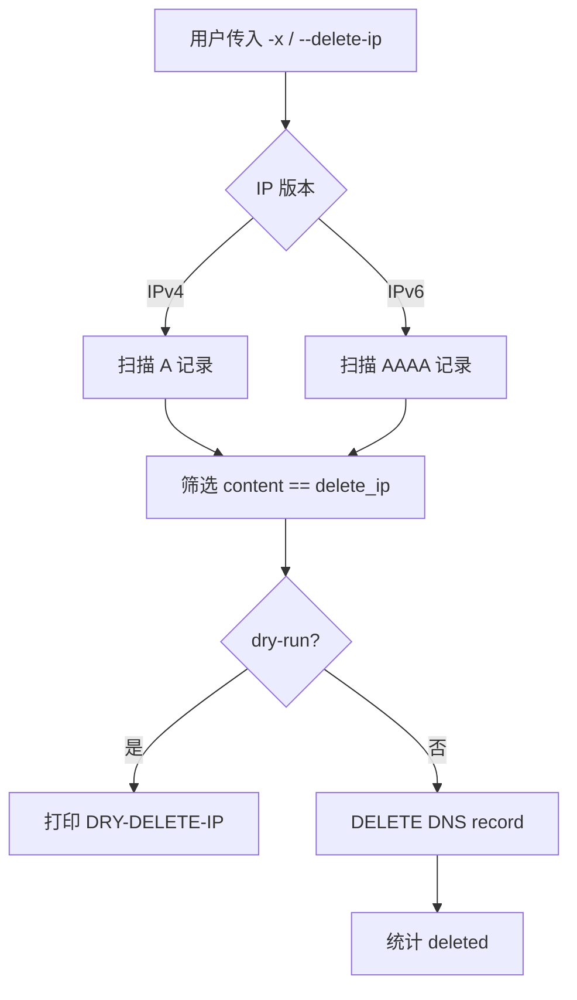
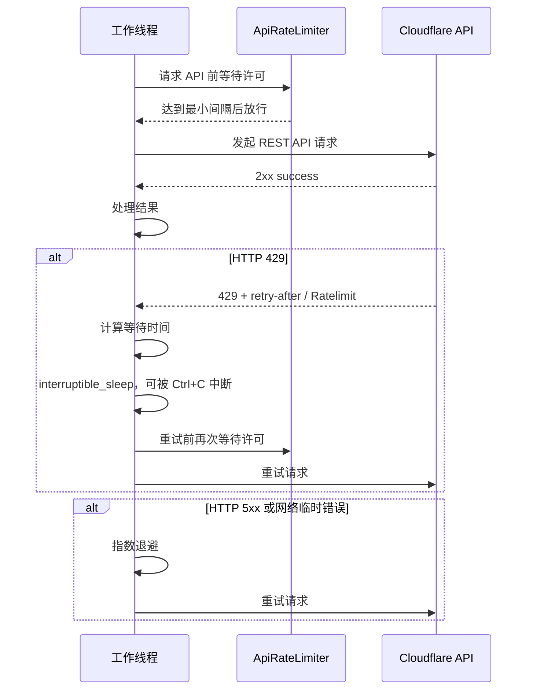
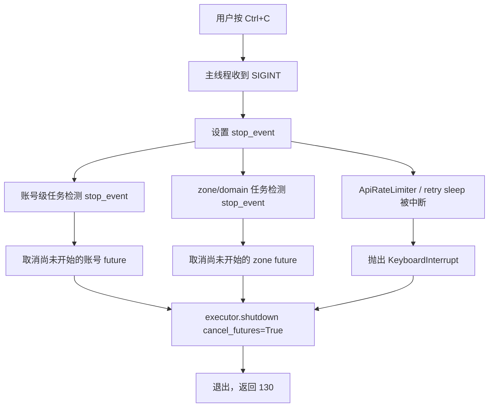
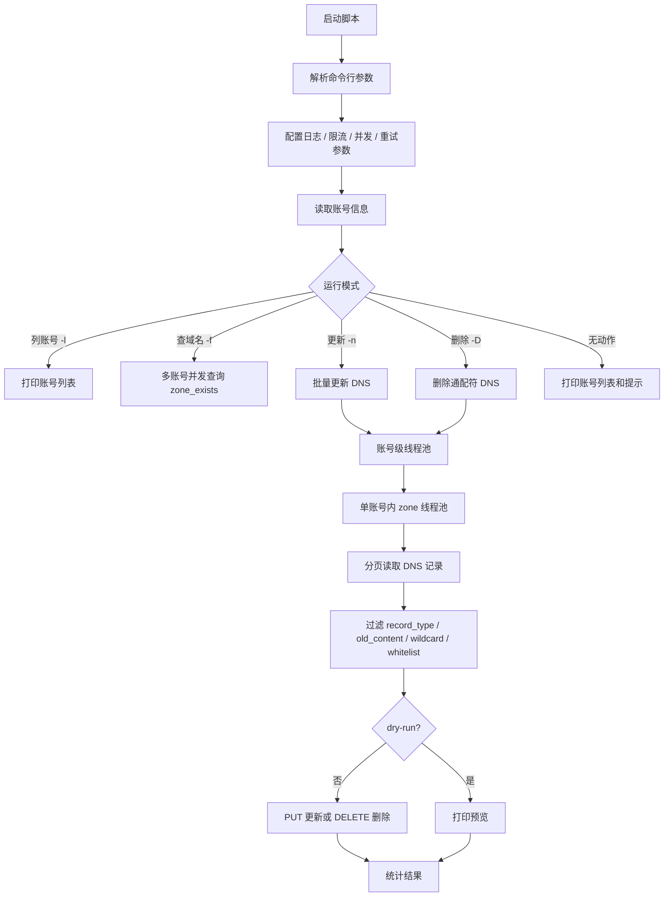
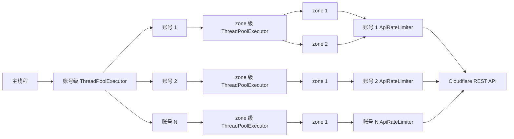
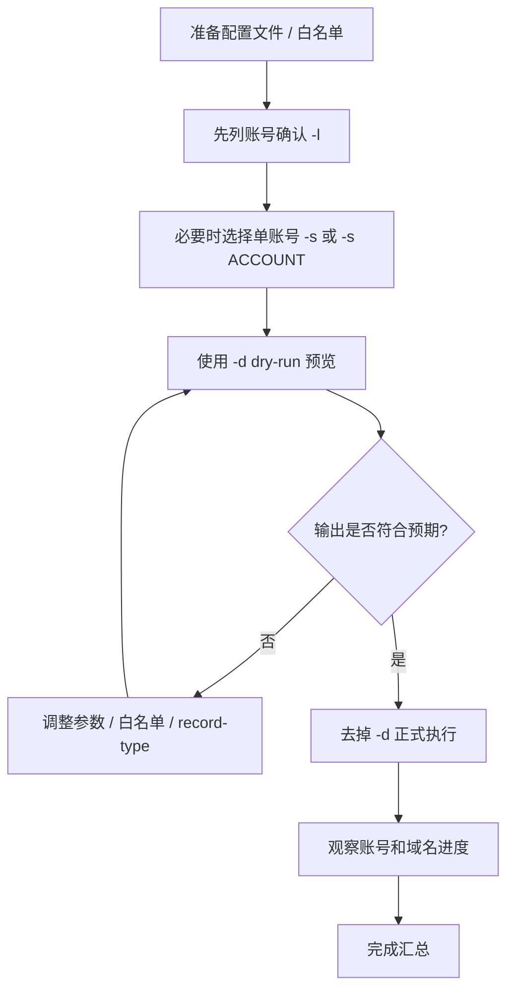

# Cloudflare DNS 批量修改 / 查询 / 清理工具

这是一个用于批量管理 Cloudflare DNS 记录的 Python 命令行工具。脚本支持多账号、多域名并发处理，支持 IPv4 / IPv6，支持删除通配符 DNS 记录，并内置了 Cloudflare API 保守限流与 Ctrl+C 多线程中断处理。

当前主脚本文件：

```text
cloudflare_dns_tool.py
```

---

## 目录

- [功能概览](#功能概览)
- [运行环境](#运行环境)
- [Cloudflare API 权限建议](#cloudflare-api-权限建议)
- [配置文件格式](#配置文件格式)
- [快速开始](#快速开始)
- [命令行参数](#命令行参数)
- [IPv4 / IPv6 设计](#ipv4--ipv6-设计)
- [IPv4 / IPv6 跨类型迁移](#ipv4--ipv6-跨类型迁移)
- [删除通配符记录](#删除通配符记录)
- [删除指向指定 IP 的记录](#删除指向指定-ip-的记录)
- [保守限流模式](#保守限流模式)
- [Ctrl+C 中断多线程](#ctrlc-中断多线程)
- [日志与审计](#日志与审计)
- [处理流程示意图](#处理流程示意图)
- [代码质量检查](#代码质量检查)
- [维护说明](#维护说明)
- [安全建议](#安全建议)

---

## 功能概览

### 1. 批量更新 DNS 记录

支持批量更新 Cloudflare 账号下所有 zone/domain 的 DNS 记录。

支持记录类型：

- `A`：IPv4
- `AAAA`：IPv6
- `CNAME`：域名别名

支持能力：

- 多账号处理
- 单账号内多域名并发处理
- 白名单过滤
- `old-ip` / `old-content` 过滤
- `dry-run` 预览模式
- 白名单模式下可选择是否处理子域名
- 自动根据 IPv4 / IPv6 推断记录类型

---

### 2. 删除以 `*` 开头的 DNS 记录

支持删除名称以星号开头的通配符记录，例如：

```text
*.example.com
*.sub.example.com
```

启用参数：

```bash
-D
--delete-wildcard
--delete-star-records
```

建议正式删除前先使用：

```bash
-d
--dry-run
```

---

### 3. IPv6 / AAAA 支持

脚本不再只支持 IPv4。

默认 `--record-type auto` 会自动判断：

| 输入内容                 | 自动处理记录类型        |
| ------------------------ | ----------------------- |
| IPv4，例如 `1.2.3.4`     | `A`                     |
| IPv6，例如 `2001:db8::1` | `AAAA`                  |
| CNAME 内容               | 需要手动指定 `-r CNAME` |

同时支持 IPv4 / IPv6 跨类型迁移：

```bash
# A(IPv4) -> AAAA(IPv6)：创建新 AAAA，并删除旧 A
python cloudflare_dns_tool.py -o 1.2.3.4 -n 2001:db8::1 -d

# AAAA(IPv6) -> A(IPv4)：创建新 A，并删除旧 AAAA
python cloudflare_dns_tool.py -o 2001:db8::1 -n 1.2.3.4 -d
```

---

### 4. 删除指向指定 IP 的记录

支持直接删除所有内容指向指定 IP 的 `A` / `AAAA` 记录：

```bash
# 删除指向 IPv4 的 A 记录，先 dry-run
python cloudflare_dns_tool.py -x 1.2.3.4 -d

# 删除指向 IPv6 的 AAAA 记录，先 dry-run
python cloudflare_dns_tool.py -x 2001:db8::1 -d
```

---

### 5. 多账号、多域名并发

支持两层并发：

| 层级             | 参数                       | 说明                                 |
| ---------------- | -------------------------- | ------------------------------------ |
| 账号级并发       | `-A` / `--account-workers` | 同时处理多少个 Cloudflare 账号       |
| 单账号内域名并发 | `-W` / `--workers`         | 单个账号内同时处理多少个 zone/domain |

---

### 6. 账号内域名处理计数

处理账号内域名时会输出类似：

```text
[账号:account-a] [3/18] 正在处理域名: example.com (账号共 18 个域名, 操作: 更新 A)
```

如果使用白名单，只处理部分域名，会输出：

```text
[账号:account-a] [2/5] 正在处理域名: example.com (账号共 18 个域名，本次待处理 5 个, 操作: 更新 AAAA)
```

---

### 7. Cloudflare API 保守限流模式

Cloudflare REST API 常规全局限制通常为：

```text
1200 requests / 5 minutes / user or account token
```

脚本支持：

- 每账号独立或全进程共享的 API 请求间隔控制
- 保守模式自动降低单账号内并发，并可保留多个账号并行处理
- HTTP 429 自动读取 `retry-after` / `Ratelimit` 响应头并退避重试
- 5xx / 网络临时错误指数退避重试

---

### 8. Ctrl+C 中断多线程

脚本已增强 Ctrl+C 处理：

- 主线程收到 Ctrl+C 后设置全局 `stop_event`
- 账号级任务和域名级任务共享该停止信号
- 尚未开始执行的 future 会被取消
- 已经运行中的线程会在下一次检查停止信号、下一次 API 请求前，或当前 HTTP 请求返回后尽快退出

---

### 9. 日志与审计

引入 `logging` 模块，支持将运行过程保存到日志文件，便于后期审计、排查和归档。

支持：

- `-L / --log-file` 指定日志文件路径
- `-G / --log-level` 指定日志级别
- `--log-overwrite` 控制是否覆盖旧日志
- 日志包含时间、级别、线程名和运行消息
- 命令行中的 token/key 会自动脱敏后再写入日志

---

## 运行环境

建议：

```text
Python >= 3.9
```

依赖：

```bash
pip install requests
```

开发 / 检查工具，可选：

```bash
pip install ruff pyright
```

---

## Cloudflare API 权限建议

如果使用 API Token，建议按最小权限配置。

### 查询 / 查找域名

至少需要：

```text
Zone:Read
```

### 更新 DNS / 删除 DNS

至少需要：

```text
Zone:Read
DNS:Edit
```

如果账号内有多个 zone，需要确保 token 覆盖目标 zone。

---

## 配置文件格式

默认配置路径来自脚本中的：

```python
CF_CONFIG_PATH
```

也可以通过命令行指定：

```bash
-C /path/to/cf_config.json
--config /path/to/cf_config.json
```

也可以用环境变量覆盖默认配置文件路径：

```bash
CF_CONFIG_PATH=/path/to/cf_config.json python cloudflare_dns_tool.py -l
```

### 配置文件示例

```json
{
  "accounts": {
    "account-a": {
      "cf_api_token": "token_xxx"
    },
    "account-b": {
      "cf_api_email": "name@example.com",
      "cf_api_key": "global_api_key_xxx"
    }
  }
}
```

支持两种认证方式：

1. API Token，推荐
2. Email + Global API Key，兼容旧方式

---

## 快速开始

### 查看账号列表

```bash
python cloudflare_dns_tool.py -l
```

等价长选项：

```bash
python cloudflare_dns_tool.py --list-accounts
```

---

### 从配置文件选择一个账号

交互式选择，兼容旧用法：

```bash
python cloudflare_dns_tool.py -s
```

直接按账号名选择：

```bash
python cloudflare_dns_tool.py -s account-a
```

也可以按邮箱或列表中的数字索引选择：

```bash
python cloudflare_dns_tool.py -s name@example.com
python cloudflare_dns_tool.py -s 2
```

---

### 查找某个域名在哪些账号中

```bash
python cloudflare_dns_tool.py -f example.com
```

---

### IPv4 批量更新，预览模式

```bash
python cloudflare_dns_tool.py -n 1.2.3.4 -d
```

等价长选项：

```bash
python cloudflare_dns_tool.py --new-ip 1.2.3.4 --dry-run
```

---

### IPv6 批量更新，预览模式

```bash
python cloudflare_dns_tool.py -n 2001:db8::1 -d
```

脚本会自动识别 IPv6，并处理 `AAAA` 记录。

---

### 只更新旧 IP 匹配的记录

IPv4：

```bash
python cloudflare_dns_tool.py -o 1.1.1.1 -n 2.2.2.2 -d
```

IPv6：

```bash
python cloudflare_dns_tool.py -o 2001:db8::10 -n 2001:db8::20 -d
```

IPv4 迁移到 IPv6：

```bash
python cloudflare_dns_tool.py -o 1.2.3.4 -n 2001:db8::1 -d
```

IPv6 迁移到 IPv4：

```bash
python cloudflare_dns_tool.py -o 2001:db8::1 -n 1.2.3.4 -d
```

---

### 删除指向指定 IP 的记录

删除所有指向指定 IPv4 的 A 记录：

```bash
python cloudflare_dns_tool.py -x 1.2.3.4 -d
```

删除所有指向指定 IPv6 的 AAAA 记录：

```bash
python cloudflare_dns_tool.py -x 2001:db8::1 -d
```

可配合白名单使用：

```bash
python cloudflare_dns_tool.py -w whitelist.txt -x 1.2.3.4 -d
```

---

### 更新 CNAME

CNAME 无法通过 IP 自动判断，因此需要指定记录类型：

```bash
python cloudflare_dns_tool.py -r CNAME -o old.example.com -n new.example.com -d
```

---

### 白名单模式

白名单文件示例：

```text
# 每行一个域名或 URL
example.com
https://www.example.net/path
*.example.org
```

运行：

```bash
python cloudflare_dns_tool.py -w whitelist.txt -n 1.2.3.4 -d
```

白名单模式下默认会处理该 zone 下的子域名记录。

如果只想处理根域名记录：

```bash
python cloudflare_dns_tool.py -w whitelist.txt -n 1.2.3.4 -N -d
```

---

## 命令行参数

| 短选项         | 长选项                                       | 说明                                                         |
| -------------- | -------------------------------------------- | ------------------------------------------------------------ |
| `-h`           | `--help`                                     | 查看帮助                                                     |
| `-V`           | `--version`                                  | 查看版本                                                     |
| `-n`           | `--new-ip`, `--new-content`                  | 新的 DNS 内容                                                |
| `-o`           | `--old-ip`, `--old-content`                  | 旧 DNS 内容过滤器                                            |
| `-w`           | `--whitelist`                                | 白名单文件路径                                               |
| `-D`           | `--domain`                                   | 直接指定域名（可多次使用，如 `-D example.com -D api.example.com`），与白名单同时使用时取交集 |
| `-r`           | `--record-type`                              | DNS 记录类型：`auto` / `A` / `AAAA` / `CNAME` / `ALL`        |
| `-d`           | `--dry-run`                                  | 预览模式，不实际修改 / 删除                                  |
| `-N`           | `--no-subdomains`                            | 白名单更新模式下只处理根域名                                 |
| `-D`           | `--delete-wildcard`, `--delete-star-records` | 删除名称以 `*` 开头的 DNS 记录                               |
| `-x`           | `--delete-ip`                                | 删除所有指向指定 IPv4/IPv6 的 A/AAAA 记录                    |
| `-W`           | `--workers`                                  | 单账号内 zone/domain 并发数                                  |
| `-A`           | `--account-workers`                          | 多账号并发数                                                 |
| `-c`           | `--conservative`                             | 保守限流模式                                                 |
| `-i`           | `--request-interval`                         | 相邻 API 请求的最小间隔，单位秒；作用范围由 `-q / --rate-limit-scope` 控制 |
| `-q`           | `--rate-limit-scope`                         | 限速范围：`account` 每账号独立限速，`global` 全进程共享限速；默认 `account` |
| `-R`           | `--api-max-retries`                          | 429 / 5xx / 网络错误最大重试次数                             |
| `-B`           | `--api-retry-base-delay`                     | 指数退避初始等待秒数                                         |
| `-M`           | `--api-retry-max-sleep`                      | 单次重试最大等待秒数                                         |
| `-L`           | `--log-file`                                 | 保存运行日志到指定文件，便于后期审计                         |
| `-G`           | `--log-level`                                | 日志文件记录级别：`DEBUG` / `INFO` / `WARNING` / `ERROR`     |
| 无             | `--log-overwrite`                            | 覆盖已有日志文件；默认追加写入                               |
| `-t`           | `--token`                                    | Cloudflare API Token                                         |
| `-e`           | `--email`                                    | Cloudflare 账号邮箱，配合 `-k`                               |
| `-k`           | `--key`, `--api-key`                         | Cloudflare Global API Key                                    |
| `-C`           | `--config`                                   | 配置文件路径                                                 |
| `-f`           | `--find-domain`                              | 查找域名存在于哪些账号中                                     |
| `-l`           | `--list-accounts`                            | 列出账号                                                     |
| `-s [ACCOUNT]` | `--select-account [ACCOUNT]`                 | 选择配置文件中的一个账号；不带值时交互式选择，带值时按账号名 / 邮箱 / 数字索引选择 |
| `-S`           | `--show-secrets`                             | 列账号时显示完整 token/key，默认隐藏                         |
| `--add-domain` | `--add-domain DOMAIN`                        | 在当前账号添加新域名（zone）                                   |
| `--add-record` | `--add-record NAME:TYPE:CONTENT`             | 添加 DNS 记录（可多次使用），格式 `name:type:content`          |
| `--proxied`    | `--proxied`                                  | 添加记录时启用 Cloudflare 代理                                 |
| `--ttl`        | `--ttl N`                                    | 添加记录的 TTL（默认 1=自动）                                  |
| `--delete-zone`| `--delete-zone {dns,full}`                   | 删除域名模式：`dns`=仅清空记录，`full`=彻底删除域名            |

---

## IPv4 / IPv6 设计

脚本通过 `ipaddress` 标准库判断输入内容。



设计目标：

- 避免把 IPv6 错写进 `A` 记录
- 避免把 IPv4 错写进 `AAAA` 记录
- 对 CNAME 明确要求用户指定类型，减少误操作

---

## IPv4 / IPv6 跨类型迁移

当同时提供 `-o / --old-ip` 和 `-n / --new-ip`，并且二者 IP 版本不同，脚本会自动进入跨类型迁移逻辑。

| 旧 IP | 新 IP | 处理方式                                                     |
| ----- | ----- | ------------------------------------------------------------ |
| IPv4  | IPv6  | 查找匹配旧 IPv4 的 `A` 记录，为同名记录创建 `AAAA`，然后删除旧 `A` |
| IPv6  | IPv4  | 查找匹配旧 IPv6 的 `AAAA` 记录，为同名记录创建 `A`，然后删除旧 `AAAA` |

示例：

```bash
# IPv4 -> IPv6
python cloudflare_dns_tool.py -o 1.2.3.4 -n 2001:db8::1 -d

# IPv6 -> IPv4
python cloudflare_dns_tool.py -o 2001:db8::1 -n 1.2.3.4 -d
```

迁移顺序：

1. 读取旧类型记录，例如 `A`。
2. 读取目标类型记录，例如 `AAAA`，检查是否已存在同名同内容记录。
3. 若目标记录不存在，则先创建目标记录。
4. 创建成功后删除旧记录。
5. 如果目标记录已存在，则跳过创建并删除旧记录。

这样设计是为了尽量避免“先删旧记录导致解析短暂中断”。



注意：跨类型迁移会删除旧记录。执行前强烈建议先加 `-d / --dry-run` 预览。

---

## 删除通配符记录

启用删除模式：

```bash
python cloudflare_dns_tool.py -D -d
```

删除模式下：

| `-r / --record-type` | 行为                                 |
| -------------------- | ------------------------------------ |
| `auto`               | 等同 `ALL`，匹配所有类型的通配符记录 |
| `ALL`                | 匹配所有类型的通配符记录             |
| `A`                  | 只删除 A 类型通配符记录              |
| `AAAA`               | 只删除 AAAA 类型通配符记录           |
| `CNAME`              | 只删除 CNAME 类型通配符记录          |

只预览删除 AAAA 通配符记录：

```bash
python cloudflare_dns_tool.py -D -r AAAA -d
```

实际删除前建议始终先 dry-run。

---

## 删除指向指定 IP 的记录

如果只想清理所有指向某个旧服务器 IP 的 DNS 记录，可以使用：

```bash
-x
--delete-ip
```

脚本会根据 IP 版本自动选择记录类型：

| IP 类型 | 自动扫描记录类型 |
| ------- | ---------------- |
| IPv4    | `A`              |
| IPv6    | `AAAA`           |

示例：

```bash
# 删除指向旧 IPv4 的所有 A 记录
python cloudflare_dns_tool.py -x 1.2.3.4 -d

# 删除指向旧 IPv6 的所有 AAAA 记录
python cloudflare_dns_tool.py -x 2001:db8::1 -d
```

支持白名单：

```bash
python cloudflare_dns_tool.py -w whitelist.txt -x 1.2.3.4 -d
```

白名单模式下默认处理子域名；如果只想处理 zone 根记录：

```bash
python cloudflare_dns_tool.py -w whitelist.txt -x 1.2.3.4 -N -d
```



实际删除前建议始终先 dry-run。

注意：`--delete-ip` 自身已经指定了要匹配和删除的 IP，因此不能再同时使用 `--old-ip / --old-content`。

---

## 限流模式

### 常用速度参数组合

如果你确认多个账号分别属于完全不同的 Cloudflare 用户，想稍微提高吞吐，可以不用 `--conservative`，只单独指定：

```bash
 python cloudflare_dns_tool.py  --account-workers 7   --workers 3   --request-interval 0.3 # 其他参数...
```

### 保守模式

启用：

```bash
python cloudflare_dns_tool.py -n 1.2.3.4 -c -d
```

保守模式会自动调整：

```text
-A / --account-workers <= 3
-W / --workers         <= 2
-i / --request-interval = 0.5 秒，除非用户手动指定
-q / --rate-limit-scope = account，默认每账号独立限速
```

这种模式更适合“账号可以并行，但单账号内请求要保守”的场景。

限速范围选择建议：

| 场景                                                         | 推荐 `--rate-limit-scope` | 说明                                             |
| ------------------------------------------------------------ | ------------------------- | ------------------------------------------------ |
| 多个配置账号分别使用不同 Cloudflare 用户 / 独立 token        | `account`                 | 每个账号独立限速，可提升整体吞吐                 |
| 多个配置账号实际共用同一个 Global API Key / 同一用户下 token | `global`                  | 所有账号共享限速器，更接近 Cloudflare 用户级限额 |
| 不确定账号/token 是否共享用户级限额                          | `global` 或调大 `-i`      | 更稳，降低 429 风险                              |
| 账号很多，但每个账号域名不多                                 | `account` + 较小 `-W`     | 保留账号级并行，限制单账号内部请求密度           |

注意：`account` 作用域是按脚本配置中的账号任务创建限速器。若多个配置项复用了同一个 Cloudflare token 或同一个用户身份，它们在 Cloudflare 侧仍可能累计到同一个用户级限额，此时建议使用 `-q global`。

也可以不启用保守模式，只手动设置请求间隔和限速范围：

```bash
# 每个账号独立限速，默认行为
python cloudflare_dns_tool.py -n 1.2.3.4 -A 2 -W 3 -i 0.3 -q account -d

# 全进程共享限速，适合同一用户 / 同一 Global API Key 下的多个账号
python cloudflare_dns_tool.py -n 1.2.3.4 -A 2 -W 3 -i 0.3 -q global -d
```

### 限流处理流程



---

## Ctrl+C 中断多线程

脚本安装了 Ctrl+C 处理器：

```python
install_ctrl_c_handler(stop_event)
```

并在线程等待处使用了带 timeout 的 `wait()`，而不是长期阻塞的 `as_completed()`，从而提升中断响应速度。

### 中断处理示意图



说明：

- 已经开始执行的 HTTP 请求无法强制立即杀死，但设置了 `timeout=30`。
- 请求返回或超时后，线程会检查 `stop_event` 并退出。
- 尚未开始的任务会尽量取消。

---

## 日志与审计

脚本引入了 Python 标准库 `logging`，可以把控制台输出和关键运行信息保存到日志文件，便于后期审计。

### 启用日志文件

```bash
python cloudflare_dns_tool.py -n 1.2.3.4 -c -d -L ./logs/cf_dns_audit.log
```

删除通配符记录并保存日志：

```bash
python cloudflare_dns_tool.py -D -c -d -L ./logs/delete_wildcard.log
```

### 日志级别

默认日志级别为 `INFO`。

```bash
python cloudflare_dns_tool.py -n 1.2.3.4 -d -L ./logs/run.log -G INFO
```

如果需要记录 API 请求的调试信息，例如 endpoint、状态码、分页参数，可以使用：

```bash
python cloudflare_dns_tool.py -n 1.2.3.4 -d -L ./logs/debug.log -G DEBUG
```

### 追加或覆盖

默认是追加写入，避免误删历史审计记录：

```bash
python cloudflare_dns_tool.py -l -L ./logs/audit.log
```

如果确认要覆盖旧日志：

```bash
python cloudflare_dns_tool.py -l -L ./logs/audit.log --log-overwrite
```

### 日志内容示例

日志格式：

```text
时间    级别    线程名    消息
```

示例：

```text
2026-06-30 03:27:51    INFO    MainThread    Cloudflare DNS tool started, version=20260630
2026-06-30 03:27:51    INFO    MainThread    argv=cloudflare_dns_tool.py -C cf_config.json -s account-a -l -L audit.log
2026-06-30 03:27:51    INFO    MainThread    已选择账号: account-a
2026-06-30 03:28:02    INFO    ThreadPoolExecutor-1_0    [DRY-UPDATE] A example.com: 1.1.1.1 -> 2.2.2.2
```

### 敏感信息处理

启动命令写入日志时会自动脱敏以下参数值：

```text
-t / --token
-k / --key / --api-key
```

账号列表中的 token/key 仍遵循脚本原有策略：默认脱敏，只有显式使用 `-S / --show-secrets` 才会完整显示并写入日志。因此审计模式下不建议同时使用 `-S`。

---

## 处理流程示意图

### 主流程



### 并发结构



上图是默认 `-q account` 的结构。若使用 `-q global`，所有 zone 线程会共享同一个全进程 `ApiRateLimiter`。

---

## 代码质量检查

已使用以下工具检查：

```bash
python3 -m ruff format cloudflare_dns_tool.py
python3 -m ruff check cloudflare_dns_tool.py
python3 -m pyright cloudflare_dns_tool.py
python3 -m py_compile cloudflare_dns_tool.py
```

当前结果：

```text
All checks passed!
0 errors, 0 warnings, 0 informations
```

说明：

- `ruff format`：格式化代码
- `ruff check`：检查常见代码质量问题
- `pyright`：静态类型检查
- `py_compile`：Python 语法编译检查

---

## 维护说明

### 关键类 / 函数

| 名称                          | 作用                                        |
| ----------------------------- | ------------------------------------------- |
| `CloudflareDNSUpdater`        | Cloudflare DNS 操作封装                     |
| `ApiRateLimiter`              | 本进程内共享 API 请求限速器                 |
| `OperationStats`              | 多线程安全统计更新 / 删除 / 跳过 / 错误数量 |
| `DNSOperationResult`          | 单条 DNS 操作结果结构                       |
| `get_all_zones()`             | 分页读取账号下所有 zone                     |
| `get_dns_records()`           | 分页读取 DNS 记录                           |
| `batch_update()`              | 当前账号批量更新 DNS 记录                   |
| `batch_delete_wildcard()`     | 当前账号批量删除通配符记录                  |
| `run_find_mode()`             | 多账号查找域名                              |
| `run_operation_for_account()` | 单账号执行更新或删除                        |
| `install_ctrl_c_handler()`    | 安装 Ctrl+C 多线程停止信号处理              |

---

### 新增记录类型的思路

如果后续需要支持更多 DNS 记录类型，例如 `TXT`、`MX`，需要考虑：

1. 是否适合批量更新 `content`
2. Cloudflare API 对该记录类型是否还需要额外字段
3. 是否应加入 `UPDATABLE_RECORD_TYPES`
4. 是否允许删除通配符时按该类型过滤
5. 是否需要新的内容校验逻辑

当前更新模式只开放：

```python
UPDATABLE_RECORD_TYPES = {"A", "AAAA", "CNAME"}
```

删除通配符模式支持：

```python
DELETE_RECORD_TYPES = {"A", "AAAA", "CNAME", "ALL"}
```

---

### 为什么更新模式不支持 `ALL`

更新 DNS 记录需要确定新内容适用于哪种记录类型：

- IPv4 只能写入 `A`
- IPv6 只能写入 `AAAA`
- CNAME 内容需要写入 `CNAME`

如果更新模式允许 `ALL`，可能导致错误地把 IP 写入 CNAME，或把 CNAME 写入 A / AAAA，因此脚本明确禁止更新模式使用 `ALL`。

---

## 安全建议

1. 推荐使用 Cloudflare API Token，而不是 Global API Key。
2. Token 使用最小权限原则。
3. 不要把真实 token 提交到 Git 仓库。
4. `-l / --list-accounts` 默认会隐藏 token/key。
5. 只有确认安全时才使用：

```bash
-S
--show-secrets
```

6. 删除通配符记录前务必先执行：

```bash
-D -d
```

确认输出结果后再正式删除。

---

## 常用命令速查

```bash
# 查看账号
python cloudflare_dns_tool.py -l

# 交互式选择账号
python cloudflare_dns_tool.py -s

# 直接按账号名选择账号
python cloudflare_dns_tool.py -s account-a

# 查询域名在哪些账号中
python cloudflare_dns_tool.py -f example.com

# IPv4 更新预览
python cloudflare_dns_tool.py -n 1.2.3.4 -d

# IPv6 更新预览
python cloudflare_dns_tool.py -n 2001:db8::1 -d

# 保守模式更新预览
python cloudflare_dns_tool.py -n 1.2.3.4 -c -d

# 只更新旧 IP 匹配的记录
python cloudflare_dns_tool.py -o 1.1.1.1 -n 2.2.2.2 -d

# 更新 CNAME
python cloudflare_dns_tool.py -r CNAME -o old.example.com -n new.example.com -d

# 删除通配符记录预览
python cloudflare_dns_tool.py -D -d

# 保守模式删除通配符记录预览
python cloudflare_dns_tool.py -D -c -d

# IPv4 -> IPv6 迁移预览：创建 AAAA 并删除旧 A
python cloudflare_dns_tool.py -o 1.2.3.4 -n 2001:db8::1 -d

# IPv6 -> IPv4 迁移预览：创建 A 并删除旧 AAAA
python cloudflare_dns_tool.py -o 2001:db8::1 -n 1.2.3.4 -d

# 删除所有指向指定 IPv4 的 A 记录预览
python cloudflare_dns_tool.py -x 1.2.3.4 -d

# 删除所有指向指定 IPv6 的 AAAA 记录预览
python cloudflare_dns_tool.py -x 2001:db8::1 -d

# 只删除 AAAA 通配符记录预览
python cloudflare_dns_tool.py -D -r AAAA -d

# 指定配置文件
python cloudflare_dns_tool.py -C ./cf_config.json -l

# 自定义 API 请求间隔
python cloudflare_dns_tool.py -n 1.2.3.4 -i 0.5 -d

# 保存审计日志
python cloudflare_dns_tool.py -n 1.2.3.4 -c -d -L ./logs/cf_dns_audit.log

# DEBUG 级别日志，包含 API endpoint / 状态码等调试信息
python cloudflare_dns_tool.py -n 1.2.3.4 -d -L ./logs/debug.log -G DEBUG
```

---

## 建议执行顺序

高风险操作，例如批量更新或删除通配符记录，建议按以下步骤执行：



---

## 版本

当前脚本版本常量：

```python
VERSION = "20260630"
```

查看版本：

```bash
python cloudflare_dns_tool.py -V
```

---

## 添加域名与 DNS 记录（新增功能）

### 典型用法示例

```bash
# 添加域名 + 多条记录（最常用）
python cloudflare_dns_tool.py \
    --add-domain domain.com \
    --add-record "domain.com:A:203.0.113.10" \
    --add-record "www:A:203.0.113.10" \
    --add-record "api:A:203.0.113.20" \
    --add-record "domain.com:AAAA:2001:db8::10" \
    --proxied --ttl 300 --dry-run

# 仅添加记录到已有域名
python cloudflare_dns_tool.py -z domain.com \
    --add-record "dev:A:203.0.113.50" \
    --add-record "@:CNAME:target.com"
```

### 记录格式

- `--add-record "name:type:content"`
  - `name`：`@`（根域名）或 `www`、`api` 等子域名
  - `type`：`A`、`AAAA`、`CNAME`、`MX` 等（支持 `AUTO` 自动判断）
  - `content`：IP 地址或目标值

### 针对 domain.com 的完整示例

```bash
python cloudflare_dns_tool.py --add-domain domain.com \
    --add-record "domain.com:A:203.0.113.10" \
    --add-record "www:A:203.0.113.10" \
    --add-record "api:A:203.0.113.20" \
    --add-record "mail:A:203.0.113.30" \
    --add-record "domain.com:MX:10 mail.domain.com" \
    --add-record "domain.com:AAAA:2001:db8::10" \
    --proxied
```
