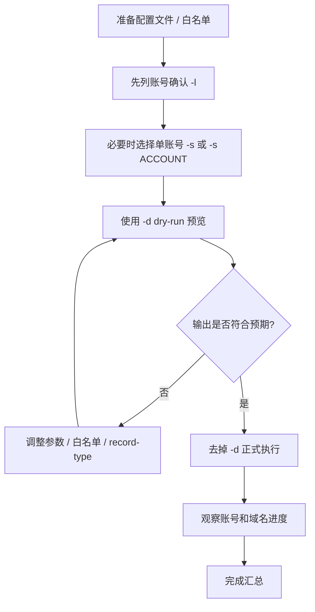
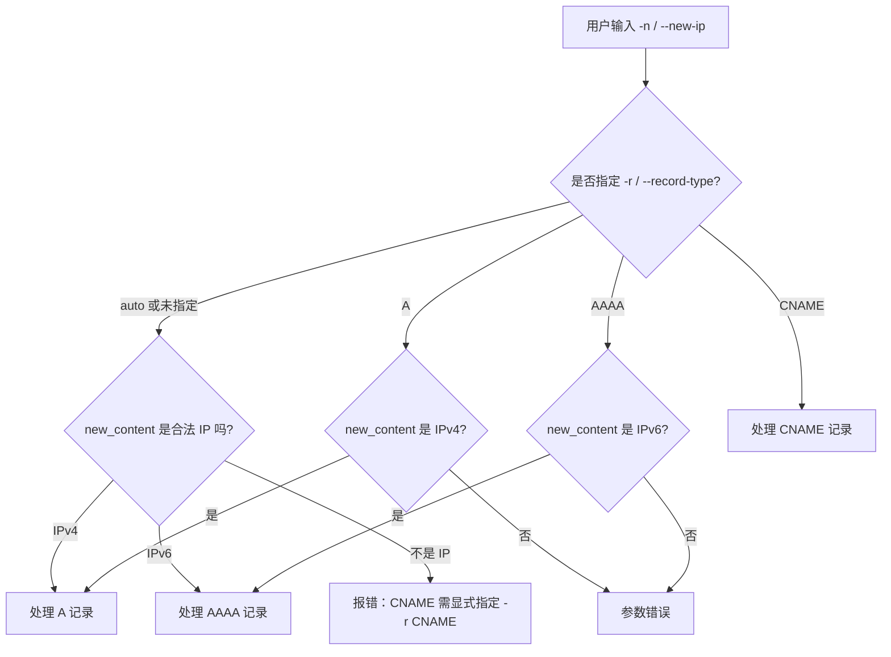
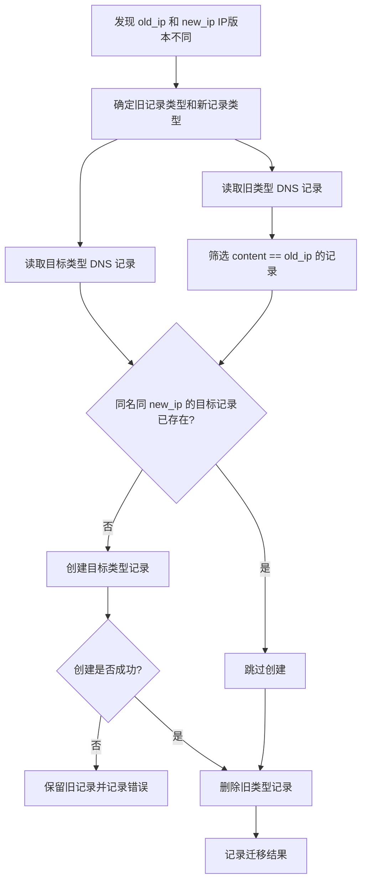
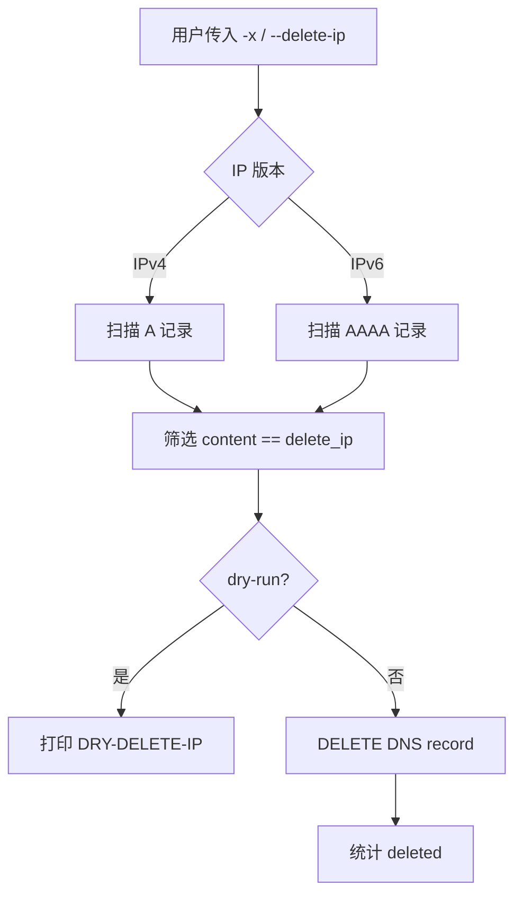
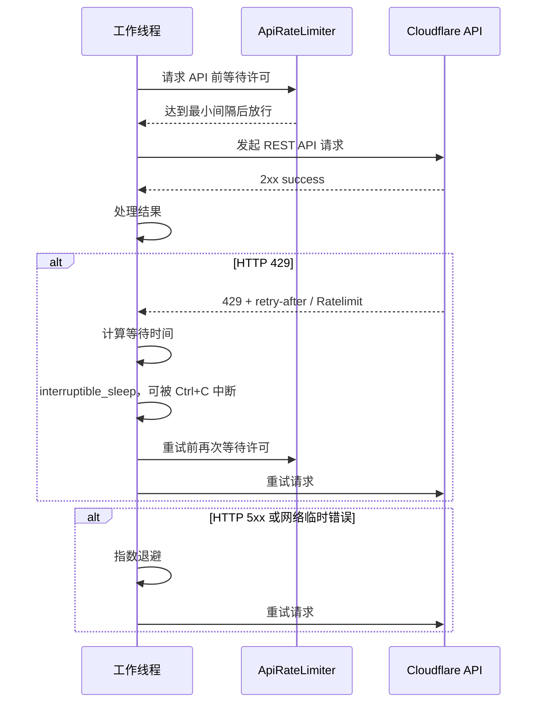
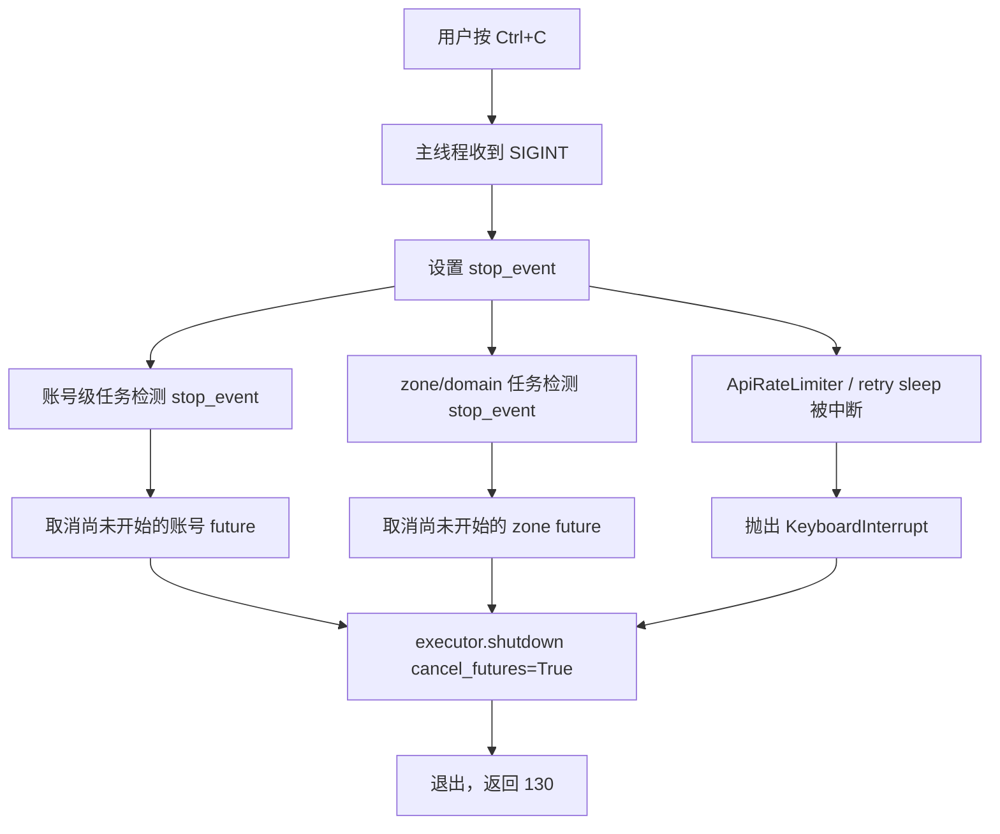
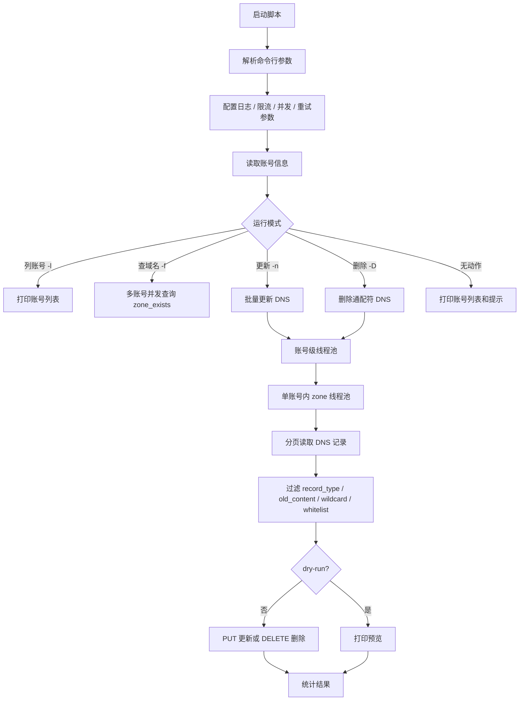
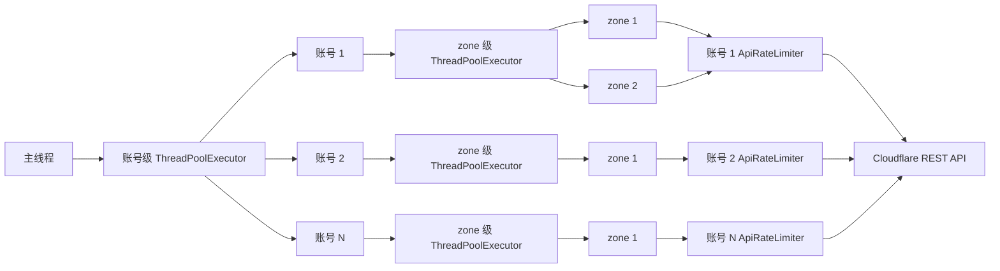

[toc]

# Cloudflare DNS 批量修改 / 查询 / 清理工具

这是一个用于批量管理 Cloudflare DNS 记录的 Python 命令行工具。脚本支持多账号、多域名并发处理，支持 IPv4 / IPv6，支持删除通配符 DNS 记录，并内置了 Cloudflare API 保守限流与 Ctrl+C 多线程中断处理。

当前主脚本文件：

```text
cloudflare_dns_tool.py
```

---

## 功能概览

| 能力 | 说明 | 详见 |
|---|---|---|
| 批量更新 | A/AAAA/CNAME，多账号并发，白名单，dry-run 预览 | [批量更新](#批量更新-dns-记录) |
| IPv6 与跨类型迁移 | auto 推断类型，IPv4/IPv6 双向迁移 | [IPv6 支持与跨类型迁移](#ipv6-支持与跨类型迁移) |
| 删除通配符 | 删除名称以 `*` 开头的记录 | [删除通配符记录](#删除通配符记录) |
| 删除指定 IP | 清理指向旧服务器 IP 的记录 | [删除指向指定 IP 的记录](#删除指向指定-ip-的记录) |
| 列出 zone | 导出所有账号的 zone（默认仅 active），CSV | [列出所有账号的 zone](#列出所有账号的-zone) |
| 添加域名与记录 | `--add-domain` / `--add-record` | [添加域名与 DNS 记录](#添加域名与-dns-记录) |
| 代理/TTL 设置 | 内容不变，批量改代理与 TTL | [批量设置代理状态与 TTL](#批量设置代理状态与-ttl) |
| 备份与导出 | 变更前快照，json/bind 导出 | [变更前备份与导出](#变更前备份与导出) |
| 失败清单与 verdict | 未完成项 CSV 重跑，三态结论 | [失败清单、重跑与运行结论](#失败清单重跑与运行结论) |
| 出口代理 | 代理出口访问 API，故障切换 | [出口代理](#出口代理) |
| 限流/中断/日志 | 速度档位，Ctrl+C，审计日志 | [限流模式](#限流模式) |
| 批量添加（Web，已移除） | 曾为操作页批量添加模式，对应 `--add-domain/--add-record` | [WEBUI_LESSONS.md](WEBUI_LESSONS.md) |
| 跨账号查找（Web，已移除） | 曾为浏览页全账号精确匹配，对应 `-f` | [WEBUI_LESSONS.md](WEBUI_LESSONS.md) |
| 任务级代理（Web，已移除） | 曾为提交时覆盖出口代理，仅驻内存 | [WEBUI_LESSONS.md](WEBUI_LESSONS.md) |
| Web 操作台 | 已彻底移除，教训见文档 | [WEBUI_LESSONS.md](WEBUI_LESSONS.md) |

---

## 运行环境

建议：

```text
Python >= 3.9
```

依赖：

```bash
pip install requests
```

开发 / 检查工具，可选：

```bash
pip install ruff pyright
```

---

## Cloudflare API 权限建议

如果使用 API Token，建议按最小权限配置。

### 查询 / 查找域名

至少需要：

```text
Zone:Read
```

### 更新 DNS / 删除 DNS

至少需要：

```text
Zone:Read
DNS:Edit
```

如果账号内有多个 zone，需要确保 token 覆盖目标 zone。

---

1. 推荐使用 Cloudflare API Token，而不是 Global API Key。
2. Token 使用最小权限原则。
3. 不要把真实 token 提交到 Git 仓库。
4. `-l / --list-accounts` 默认会隐藏 token/key。
5. 只有确认安全时才使用：

```bash
-S
--show-secrets
```

6. 删除通配符记录前务必先执行：

```bash
-D -d
```

确认输出结果后再正式删除。

---

## 配置文件格式

默认配置路径来自脚本中的：

```python
CF_CONFIG_PATH
```

也可以通过命令行指定：

```bash
-C /path/to/cf_config.json
--config /path/to/cf_config.json
```

也可以用环境变量覆盖默认配置文件路径：

```bash
CF_CONFIG_PATH=/path/to/cf_config.json python cloudflare_dns_tool.py -l
```

### 配置文件示例

```json
{
  "accounts": {
    "account-a": {
      "cf_api_token": "token_xxx"
    },
    "account-b": {
      "cf_api_email": "name@example.com",
      "cf_api_key": "global_api_key_xxx"
    }
  }
}
```

支持两种认证方式：

1. API Token，推荐
2. Email + Global API Key，兼容旧方式

---

## 快速开始

### 查看账号列表

```bash
python cloudflare_dns_tool.py -l
```

等价长选项：

```bash
python cloudflare_dns_tool.py --list-accounts
```

---

### 从配置文件选择一个账号

交互式选择，兼容旧用法：

```bash
python cloudflare_dns_tool.py -s
```

直接按账号名选择：

```bash
python cloudflare_dns_tool.py -s account-a
```

也可以按邮箱或列表中的数字索引选择：

```bash
python cloudflare_dns_tool.py -s name@example.com
python cloudflare_dns_tool.py -s 2
```

---

### 列出所有账号的 zone

导出所有账号下的 zone（域名），默认只保留 `active` 状态，可用 CSV 输出：

```bash
# 打印到屏幕
python cloudflare_dns_tool.py --list-zones

# 导出 CSV（UTF-8-SIG，Excel 可直接打开）
python cloudflare_dns_tool.py --list-zones --zones-output ./cf_active_zones.csv

# 不限状态，导出全部 zone
python cloudflare_dns_tool.py --list-zones --zone-status all --zones-output ./cf_all_zones.csv
```

CSV 列：`account,name,status,zone_id,nameservers`。退出码 `0` 表示所有账号读取成功，
`1` 表示存在读取失败的账号。

该能力也被跨工具脚本 `../domain_fix/domain_fix.py` 复用，用于计算 spaceship
正常域名与 Cloudflare zone 的差集并修复误删域名。

---

### 查看某个域名的 DNS 记录

```bash
# 打印表格
python cloudflare_dns_tool.py --list-dns example.com

# 输出 JSON（--quiet 让日志走 stderr，stdout 只留 JSON，便于脚本解析）
python cloudflare_dns_tool.py --list-dns example.com --json --quiet
```

该能力替代了旧工具 `flarectl dns list`，供 PowerShell 模块 `PS/Cloudflare` 调用。

---

## DNS 记录幂等与防劈叉

`--add-record` 与 `--provision` 写入记录时使用同一套「幂等 upsert」语义（`ensure_dns_record`）：

| 场景 | 行为 |
|---|---|
| 同名同类型、内容与代理/TTL 完全一致 | **跳过**（`unchanged`），不重复添加 |
| 同名同类型、内容不同（如 `sub` 由 IP1 改为 IP2） | **覆盖**（`PUT`），不产生第二条 |
| 同名同类型存在多条（历史重复） | 保留一条并更新，**删除多余** |
| 新增 A/AAAA 而同名存在 CNAME | 删除同名 CNAME 后再写 A/AAAA（CNAME 与其它类型互斥） |
| 新增 CNAME 而同名存在其它记录 | 删除同名其它记录后再写 CNAME |
| TXT/MX 等多值类型 | 仅当存在完全相同记录时跳过，否则**追加**（不覆盖，允许多值） |

A 与 AAAA 视为不同记录，可共存（双栈）；`www` 与根域名 `@` 视为不同名字，互不影响。

若确实需要同一主机名指向多个 IP（A/AAAA 多值轮询），加 `--allow-multi-value`：此时 A/AAAA 改为「完全相同则跳过、否则追加」，不再覆盖或去重；CNAME 仍始终单值。

```bash
# 同名多 IP（默认会覆盖；显式允许多值）
python cloudflare_dns_tool.py -z example.com \
    --add-record "www:A:1.2.3.4" --add-record "www:A:5.6.7.8" --allow-multi-value
```

---

### 查找某个域名在哪些账号中

```bash
python cloudflare_dns_tool.py -f example.com
```

查询过程会为每个账号输出详细上下文，例如：

```text
[CHECK] [账号 2/10] name=account-b, email=name@example.com, auth=key, domain=example.com
[MISS] [账号 2/10] name=account-b, email=name@example.com, auth=key, domain=example.com, elapsed=0.42s
[ERR] [账号 3/10] name=account-c, email=bad@example.com, auth=key, domain=example.com, elapsed=0.31s: HTTP 400, API 请求失败: ...
```

使用 API Token 且配置中没有邮箱时，会显示 `email=不可用`。日志始终不会输出 API Token
或 Global API Key。CSV/Excel 中的空单元格（包括 Pandas 读取后的 `NaN`）不会再作为账号提交
给 Cloudflare；缺少有效邮箱或 Key 的行会显示配置行号并被跳过。

---

### IPv4 批量更新，预览模式

```bash
python cloudflare_dns_tool.py -n 1.2.3.4 -d
```

等价长选项：

```bash
python cloudflare_dns_tool.py --new-ip 1.2.3.4 --dry-run
```

---

### IPv6 批量更新，预览模式

```bash
python cloudflare_dns_tool.py -n 2001:db8::1 -d
```

脚本会自动识别 IPv6，并处理 `AAAA` 记录。

---

### 只更新旧 IP 匹配的记录

IPv4：

```bash
python cloudflare_dns_tool.py -o 1.1.1.1 -n 2.2.2.2 -d
```

IPv6：

```bash
python cloudflare_dns_tool.py -o 2001:db8::10 -n 2001:db8::20 -d
```

IPv4 迁移到 IPv6：

```bash
python cloudflare_dns_tool.py -o 1.2.3.4 -n 2001:db8::1 -d
```

IPv6 迁移到 IPv4：

```bash
python cloudflare_dns_tool.py -o 2001:db8::1 -n 1.2.3.4 -d
```

---

### 删除指向指定 IP 的记录

删除所有指向指定 IPv4 的 A 记录：

```bash
python cloudflare_dns_tool.py -x 1.2.3.4 -d
```

删除所有指向指定 IPv6 的 AAAA 记录：

```bash
python cloudflare_dns_tool.py -x 2001:db8::1 -d
```

可配合白名单使用：

```bash
python cloudflare_dns_tool.py -w whitelist.txt -x 1.2.3.4 -d
```

---

### 更新 CNAME

CNAME 无法通过 IP 自动判断，因此需要指定记录类型：

```bash
python cloudflare_dns_tool.py -r CNAME -o old.example.com -n new.example.com -d
```

---

### 白名单模式

白名单文件示例：

```text
# 每行一个域名或 URL
example.com
https://www.example.net/path
*.example.org
```

运行：

```bash
python cloudflare_dns_tool.py -w whitelist.txt -n 1.2.3.4 -d
```

白名单模式下默认会处理该 zone 下的子域名记录。

如果只想处理根域名记录：

```bash
python cloudflare_dns_tool.py -w whitelist.txt -n 1.2.3.4 -N -d
```

---

### 指定配置文件

```bash
python cloudflare_dns_tool.py -C ./cf_config.json -l
```

### 自定义 API 请求间隔

```bash
python cloudflare_dns_tool.py -n 1.2.3.4 -i 0.5 -d
```

---

## 建议执行顺序

高风险操作，例如批量更新或删除通配符记录，建议按以下步骤执行：


```mermaid
flowchart TD
    A[准备配置文件 / 白名单] --> B[先列账号确认 -l]
    B --> C[必要时选择单账号 -s 或 -s ACCOUNT]
    C --> D[使用 -d dry-run 预览]
    D --> E{输出是否符合预期?}
    E -->|否| F[调整参数 / 白名单 / record-type]
    F --> D
    E -->|是| G[去掉 -d 正式执行]
    G --> H[观察账号和域名进度]
    H --> I[完成汇总]
```

---

## 批量更新 DNS 记录
支持批量更新 Cloudflare 账号下所有 zone/domain 的 DNS 记录。

支持记录类型：

- `A`：IPv4
- `AAAA`：IPv6
- `CNAME`：域名别名

支持能力：

- 多账号处理
- 单账号内多域名并发处理
- 白名单过滤
- `old-ip` / `old-content` 过滤
- `dry-run` 预览模式
- 白名单模式下可选择是否处理子域名
- 自动根据 IPv4 / IPv6 推断记录类型

支持两层并发：

| 层级             | 参数                       | 说明                                 |
| ---------------- | -------------------------- | ------------------------------------ |
| 账号级并发       | `-A` / `--account-workers` | 同时处理多少个 Cloudflare 账号       |
| 单账号内域名并发 | `-W` / `--workers`         | 单个账号内同时处理多少个 zone/domain |

处理账号内域名时会输出类似：

```text
[账号:account-a] [3/18] 正在处理域名: example.com (账号共 18 个域名, 操作: 更新 A)
```

如果使用白名单，只处理部分域名，会输出：

```text
[账号:account-a] [2/5] 正在处理域名: example.com (账号共 18 个域名，本次待处理 5 个, 操作: 更新 AAAA)
```

用法示例见[快速开始](#快速开始)。

---

## IPv6 支持与跨类型迁移

脚本通过 `ipaddress` 标准库判断输入内容。


```mermaid
flowchart TD
    A[用户输入 -n / --new-ip] --> B{是否指定 -r / --record-type?}
    B -->|auto 或未指定| C{new_content 是合法 IP 吗?}
    C -->|IPv4| D[处理 A 记录]
    C -->|IPv6| E[处理 AAAA 记录]
    C -->|不是 IP| F[报错：CNAME 需显式指定 -r CNAME]
    B -->|A| G{new_content 是 IPv4?}
    G -->|是| D
    G -->|否| H[参数错误]
    B -->|AAAA| I{new_content 是 IPv6?}
    I -->|是| E
    I -->|否| H
    B -->|CNAME| J[处理 CNAME 记录]
```

设计目标：

- 避免把 IPv6 错写进 `A` 记录
- 避免把 IPv4 错写进 `AAAA` 记录
- 对 CNAME 明确要求用户指定类型，减少误操作

### 跨类型迁移

当同时提供 `-o / --old-ip` 和 `-n / --new-ip`，并且二者 IP 版本不同，脚本会自动进入跨类型迁移逻辑。

| 旧 IP | 新 IP | 处理方式                                                     |
| ----- | ----- | ------------------------------------------------------------ |
| IPv4  | IPv6  | 查找匹配旧 IPv4 的 `A` 记录，为同名记录创建 `AAAA`，然后删除旧 `A` |
| IPv6  | IPv4  | 查找匹配旧 IPv6 的 `AAAA` 记录，为同名记录创建 `A`，然后删除旧 `AAAA` |

示例：

```bash
# IPv4 -> IPv6
python cloudflare_dns_tool.py -o 1.2.3.4 -n 2001:db8::1 -d

# IPv6 -> IPv4
python cloudflare_dns_tool.py -o 2001:db8::1 -n 1.2.3.4 -d
```

迁移顺序：

1. 读取旧类型记录，例如 `A`。
2. 读取目标类型记录，例如 `AAAA`，检查是否已存在同名同内容记录。
3. 若目标记录不存在，则先创建目标记录。
4. 创建成功后删除旧记录。
5. 如果目标记录已存在，则跳过创建并删除旧记录。

这样设计是为了尽量避免“先删旧记录导致解析短暂中断”。


```mermaid
flowchart TD
    A[发现 old_ip 和 new_ip IP版本不同] --> B[确定旧记录类型和新记录类型]
    B --> C[读取旧类型 DNS 记录]
    B --> D[读取目标类型 DNS 记录]
    C --> E[筛选 content == old_ip 的记录]
    D --> F{同名同 new_ip 的目标记录已存在?}
    E --> F
    F -->|否| G[创建目标类型记录]
    F -->|是| H[跳过创建]
    G --> I{创建是否成功?}
    I -->|否| J[保留旧记录并记录错误]
    I -->|是| K[删除旧类型记录]
    H --> K
    K --> L[记录迁移结果]
```

注意：跨类型迁移会删除旧记录。执行前强烈建议先加 `-d / --dry-run` 预览。

---

## 删除通配符记录

启用删除模式：

```bash
python cloudflare_dns_tool.py -D -d
```

删除模式下：

| `-r / --record-type` | 行为                                 |
| -------------------- | ------------------------------------ |
| `auto`               | 等同 `ALL`，匹配所有类型的通配符记录 |
| `ALL`                | 匹配所有类型的通配符记录             |
| `A`                  | 只删除 A 类型通配符记录              |
| `AAAA`               | 只删除 AAAA 类型通配符记录           |
| `CNAME`              | 只删除 CNAME 类型通配符记录          |

只预览删除 AAAA 通配符记录：

```bash
python cloudflare_dns_tool.py -D -r AAAA -d
```

实际删除前建议始终先 dry-run。

---

## 删除指向指定 IP 的记录

如果只想清理所有指向某个旧服务器 IP 的 DNS 记录，可以使用：

```bash
-x
--delete-ip
```

脚本会根据 IP 版本自动选择记录类型：

| IP 类型 | 自动扫描记录类型 |
| ------- | ---------------- |
| IPv4    | `A`              |
| IPv6    | `AAAA`           |

示例：

```bash
# 删除指向旧 IPv4 的所有 A 记录
python cloudflare_dns_tool.py -x 1.2.3.4 -d

# 删除指向旧 IPv6 的所有 AAAA 记录
python cloudflare_dns_tool.py -x 2001:db8::1 -d
```

支持白名单：

```bash
python cloudflare_dns_tool.py -w whitelist.txt -x 1.2.3.4 -d
```

白名单模式下默认处理子域名；如果只想处理 zone 根记录：

```bash
python cloudflare_dns_tool.py -w whitelist.txt -x 1.2.3.4 -N -d
```


```mermaid
flowchart TD
    A[用户传入 -x / --delete-ip] --> B{IP 版本}
    B -->|IPv4| C[扫描 A 记录]
    B -->|IPv6| D[扫描 AAAA 记录]
    C --> E[筛选 content == delete_ip]
    D --> E
    E --> F{dry-run?}
    F -->|是| G[打印 DRY-DELETE-IP]
    F -->|否| H[DELETE DNS record]
    H --> I[统计 deleted]
```

实际删除前建议始终先 dry-run。

注意：`--delete-ip` 自身已经指定了要匹配和删除的 IP，因此不能再同时使用 `--old-ip / --old-content`。

---

## 添加域名与 DNS 记录

### 典型用法示例

```bash
# 添加域名 + 多条记录（最常用）
python cloudflare_dns_tool.py \
    --add-domain domain.com \
    --add-record "domain.com:A:203.0.113.10" \
    --add-record "www:A:203.0.113.10" \
    --add-record "api:A:203.0.113.20" \
    --add-record "domain.com:AAAA:2001:db8::10" \
    --proxied --ttl 300 --dry-run

# 仅添加记录到已有域名
python cloudflare_dns_tool.py -z domain.com \
    --add-record "dev:A:203.0.113.50" \
    --add-record "@:CNAME:target.com"
```

### 记录格式

- `--add-record "name:type:content"`
  - `name`：`@`（根域名）或 `www`、`api` 等子域名
  - `type`：`A`、`AAAA`、`CNAME`、`MX` 等（支持 `AUTO` 自动判断）
  - `content`：IP 地址或目标值

### 针对 domain.com 的完整示例

```bash
python cloudflare_dns_tool.py --add-domain domain.com \
    --add-record "domain.com:A:203.0.113.10" \
    --add-record "www:A:203.0.113.10" \
    --add-record "api:A:203.0.113.20" \
    --add-record "mail:A:203.0.113.30" \
    --add-record "domain.com:MX:10 mail.domain.com" \
    --add-record "domain.com:AAAA:2001:db8::10" \
    --proxied
```

---

## 域名激活、邮箱转发与设置（库能力）

以下能力以 `CloudflareDNSUpdater` 方法形式提供，主要供跨工具脚本
[`../domain_fix/domain_fix.py`](../domain_fix/domain_fix.py) 在重新添加域名后编排调用；
命令行工具本身未直接暴露全部开关。

| 方法 | 作用 |
|---|---|
| `get_account_id()` | 解析并缓存当前凭证的账号 ID（创建 zone、邮箱转发需要） |
| `create_zone(domain, account_id=None)` | 创建 zone，自动带 `account.id`（拿不到则保持旧行为） |
| `get_zone_by_name(domain)` / `get_zone(zone_id)` | 按域名/ID 查询 zone 详情 |
| `wait_zone_active(zone_id, timeout, interval)` | 轮询 zone 状态直到 `active` 或超时 |
| `ensure_dns_record(...)` | 幂等写入单条 DNS 记录（存在且一致则跳过） |
| `update_zone_setting(zone_id, setting_id, value)` | 更新单个 zone 设置（ssl、speed_brain 等） |
| `apply_zone_settings(zone_id, settings)` | 批量应用设置，逐项容错 |
| `ensure_email_routing_address(email)` | 确保转发目标邮箱存在（返回是否已验证） |
| `configure_email_routing(zone_id, name, email)` | 补齐 MX/SPF/DKIM、启用路由、设置 catch-all |
| `load_cf_globals(config_path)` | 读取旧 `cf_config.json` 顶层默认值 |

说明：

- 邮箱转发目标地址必须先在 Cloudflare 完成验证，未验证时只启用路由、不设置 catch-all。
- DNS 记录与 SSL/安全设置在 `pending` zone 上即可写入；但 **Email Routing 要求 zone 为 `active`**
  （否则 API 报 403/code 2009）。`provision_zone` 会在配邮箱前先查 zone 状态，未激活时记
  `deferred:requires-active-zone` 而非 error，待激活后重跑补配。
- `get_cf_accounts()` 现在会透传旧配置里的 `default_server_ip` 与 `email_routing_verified`。
- 旧脚本 `legacy/cf_config_api.py` 依赖已不可用的 `cloudflare` SDK；其邮箱转发/SSL/安全等
  能力已用纯 `requests` 在上述方法中重建，不再需要该 SDK。

---

## 域名批量配置（--provision）

`--provision` 是旧 `cf_config_api.py configure` 的替代：按表格对域名配置 DNS、邮箱转发、SSL、基础安全与加速。它先在各账号中定位 zone（未找到且加 `--create-zone` 时在首个账号创建），再逐项配置。

```bash
# 对 table.csv 中的域名配置（默认账号配置里的 ssl_mode/security_mode/default_forward_email）
python cloudflare_dns_tool.py --provision --provision-table table.csv

# 指定账号与默认服务器 IP，结果导出 CSV
python cloudflare_dns_tool.py --provision --provision-table table.csv \
    --select-account account2 --server-ip 1.2.3.4 --provision-output provision.csv

# 只加 zone 与 DNS，不碰邮箱/SSL/安全，也不等待激活
python cloudflare_dns_tool.py --provision --provision-table table.csv \
    --no-email --no-ssl --no-security --no-optimize --no-activation
```

表格格式兼容旧 `cf_domains`：CSV 列 `domain,ip,forward,security,ssl,Note`（`ip`/`forward`/`ssl` 按域名覆盖默认值），或 conf/txt 每行一个域名。

| 参数 | 默认 | 说明 |
|---|---|---|
| `--provision-table PATH` | 必填 | 域名表格 |
| `--provision-output PATH` | 屏幕 | 结果 CSV（UTF-8-SIG） |
| `--server-ip IP` | 账号 `default_server_ip` | 无记录配置时生成 `@` 与 `www` 两条 A/AAAA |
| `--forward-email EMAIL` | 配置 `default_forward_email` | 邮箱转发目标 |
| `--ssl-mode` | 配置 `ssl_mode` | `flexible`/`full`/`strict`/`off` |
| `--security` / `--no-security` | 取 `security_mode` | 基础安全开关 |
| `--optimize` / `--no-optimize` | 开启 | 加速增益开关 |
| `--no-dns` / `--no-email` / `--no-ssl` / `--no-activation` | 关闭 | 关闭对应步骤 |
| `--create-zone` | 关闭 | zone 不存在时创建 |
| `--activation-timeout` / `--activation-interval` | `300` / `5` | 激活等待 |

库层面对应 `ZoneProvisionOptions` + `provision_zone(updater, zone_id, zone_name, domain, options)`，供 `../domain_fix/domain_fix.py` 与 PS 模块复用；结果 CSV 列见 `PROVISION_CSV_FIELDNAMES`。`ZoneProvisionOptions.verbose=True` 时会逐条打印 DNS 记录（名/类型/内容/状态与原因）与邮箱所需记录/结果，便于审计（默认关闭，不影响 CLI/PS 复用）。

---

## 批量设置代理状态与 TTL
```bash
# 全量开启橙云，先预览
python cloudflare_dns_tool.py --set-proxied on -d

# 仅对指向旧 IP 的 A 记录关闭代理并改 TTL
python cloudflare_dns_tool.py --set-proxied off --set-ttl 300 -o 1.1.1.1 -d
```

---

## 变更前备份与导出
```bash
# 导出待处理 zone（json 全量，可读可审计；bind 为简化记录格式，仅供参考）
python cloudflare_dns_tool.py -w whitelist.txt --export json --export-dir ./cf_export -d
python cloudflare_dns_tool.py -s account-a --export bind --export-dir ./cf_export

# 正式变更前自动快照，备份失败则中止变更（无备份不变更）
python cloudflare_dns_tool.py -n 1.2.3.4 --backup-dir ./cf_backup --failed-output failures.csv
```

---

## 失败清单、重跑与运行结论
批量结束输出对账行（`expected/completed/cancelled`），失败与取消行可导出 CSV：

```bash
# 先导出失败/取消清单
python cloudflare_dns_tool.py -n 1.2.3.4 --failed-output failures.csv

# 仅重跑清单中的域名；已完成项因内容一致自动跳过，天然幂等
python cloudflare_dns_tool.py -n 1.2.3.4 --resume-from failures.csv
```

CSV 列：`account,zone,record_id,name,type,old_content,new_content,action,status,attempts,error,timestamp`（UTF-8-SIG，Excel 可直接打开）。

- `zone` 为空的行是账号级哨兵（例如 zone 列表拉取失败）：重跑时该账号全量执行。
- 清单中没有的域名会被有意跳过；`--resume-from` 是白名单语义。

每次批量结束都会输出 `[VERDICT]` 行，明确三态之一：

```text
[VERDICT] 完美执行：2 个账号全部成功，无失败、无取消、无未完成条目。
[VERDICT] 未完美执行：成功 1，失败 2，取消账号 0，未完成条目 9（失败 7，取消 2）。重试未能挽救的条目见失败清单。
[VERDICT] 任务被中断：未能完美执行，成功 1，失败 0，取消账号 1，未完成条目 5。
```

非完美时附主要原因 Top5 与重跑命令（`--resume-from <清单>`，其余参数保持本次不变）。退出码：`0`=完美，`1`=有失败/取消，`130`=被中断。

---

## 出口代理
经代理出口访问 Cloudflare API（例如本机 mihomo `http://127.0.0.1:7897`）：

```bash
# 单个代理
python cloudflare_dns_tool.py -n 1.2.3.4 -P http://127.0.0.1:7897 -d

# 多个代理轮转（默认 round-robin），也可写入文件每行一个
python cloudflare_dns_tool.py -n 1.2.3.4 -P http://127.0.0.1:7897 -P http://127.0.0.1:7898
python cloudflare_dns_tool.py -n 1.2.3.4 --proxy-file ./proxies.txt --proxy-mode failover -d
```

说明：

- 仅支持 `http` / `https` 代理；URL 中的账号口令只用于建连，日志中自动脱敏为 `scheme://host:port`。
- 网络错误触发代理冷却（默认 60 秒）与自动切换；`429` / `5xx` 属服务端语义，不标记代理故障（轮转模式下次自然换出口）。
- 代理改变出口 IP 与链路，可缓解 IP 级限流/封禁并提高重试成功率；但 Cloudflare 配额按 credential 计算（1200/5min），配额侧仍需 `--conservative` / `--request-interval`。

---

## 限流模式

### 常用速度参数组合

如果你确认多个账号分别属于完全不同的 Cloudflare 用户，想稍微提高吞吐，可以不用 `--conservative`，只单独指定：

```bash
 python cloudflare_dns_tool.py  --account-workers 7   --workers 3   --request-interval 0.3 # 其他参数...
```

### 速度档位

默认 `--speed eco` 保守执行，尽量不触碰 Cloudflare 限流。着急时可提档：

```bash
# 默认即保守档，等价旧 -c
python cloudflare_dns_tool.py -n 1.2.3.4 -d

# 略微偏快：账号多、每账号域名少时的日常批量
python cloudflare_dns_tool.py -n 1.2.3.4 --speed balanced -d

# 快速档：429 风险明显上升，失败项进清单后重跑
python cloudflare_dns_tool.py -n 1.2.3.4 --speed fast --failed-output failures.csv

# 极限档：不额外限速，只建议配合清单重跑使用
python cloudflare_dns_tool.py -n 1.2.3.4 --speed turbo --failed-output failures.csv
```

| 档位       | 账号并发 | 单账号内并发 | 请求间隔（每账号） | 说明                           |
| ---------- | -------- | ------------ | ------------------ | ------------------------------ |
| `eco`      | 3        | 2            | 0.5s（约 2 请求/秒） | 默认，尽量不触碰限流           |
| `balanced` | 5        | 4            | 0.2s               | 略微偏快                       |
| `fast`     | 8        | 6            | 0.1s               | 快速档，限流风险明显上升       |
| `turbo`    | 20       | 20           | 0s                 | 不额外限速，需配合清单重跑     |

显式指定的 `-W / -A / -i` 优先于档位（仍钳制在 1~20）。`fast` / `turbo` 启动时会明确打印风险提示；提速档下触发的失败与取消同样记入失败清单，不静默丢失。

旧 `-c / --conservative` 保留，等价于 `--speed eco`。

### 保守模式

启用：

```bash
python cloudflare_dns_tool.py -n 1.2.3.4 -c -d
```

保守模式会自动调整：

```text
-A / --account-workers <= 3
-W / --workers         <= 2
-i / --request-interval = 0.5 秒，除非用户手动指定
-q / --rate-limit-scope = account，默认每账号独立限速
```

这种模式更适合“账号可以并行，但单账号内请求要保守”的场景。

限速范围选择建议：

| 场景                                                         | 推荐 `--rate-limit-scope` | 说明                                             |
| ------------------------------------------------------------ | ------------------------- | ------------------------------------------------ |
| 多个配置账号分别使用不同 Cloudflare 用户 / 独立 token        | `account`                 | 每个账号独立限速，可提升整体吞吐                 |
| 多个配置账号实际共用同一个 Global API Key / 同一用户下 token | `global`                  | 所有账号共享限速器，更接近 Cloudflare 用户级限额 |
| 不确定账号/token 是否共享用户级限额                          | `global` 或调大 `-i`      | 更稳，降低 429 风险                              |
| 账号很多，但每个账号域名不多                                 | `account` + 较小 `-W`     | 保留账号级并行，限制单账号内部请求密度           |

注意：`account` 作用域是按脚本配置中的账号任务创建限速器。若多个配置项复用了同一个 Cloudflare token 或同一个用户身份，它们在 Cloudflare 侧仍可能累计到同一个用户级限额，此时建议使用 `-q global`。

也可以不启用保守模式，只手动设置请求间隔和限速范围：

```bash
# 每个账号独立限速，默认行为
python cloudflare_dns_tool.py -n 1.2.3.4 -A 2 -W 3 -i 0.3 -q account -d

# 全进程共享限速，适合同一用户 / 同一 Global API Key 下的多个账号
python cloudflare_dns_tool.py -n 1.2.3.4 -A 2 -W 3 -i 0.3 -q global -d
```

### 限流处理流程


```mermaid
sequenceDiagram
    participant Worker as 工作线程
    participant Limiter as ApiRateLimiter
    participant CF as Cloudflare API

    Worker->>Limiter: 请求 API 前等待许可
    Limiter-->>Worker: 达到最小间隔后放行
    Worker->>CF: 发起 REST API 请求
    CF-->>Worker: 2xx success
    Worker->>Worker: 处理结果

    alt HTTP 429
        CF-->>Worker: 429 + retry-after / Ratelimit
        Worker->>Worker: 计算等待时间
        Worker->>Worker: interruptible_sleep，可被 Ctrl+C 中断
        Worker->>Limiter: 重试前再次等待许可
        Worker->>CF: 重试请求
    end

    alt HTTP 5xx 或网络临时错误
        Worker->>Worker: 指数退避
        Worker->>CF: 重试请求
    end
```

---

## Ctrl+C 中断多线程

脚本安装了 Ctrl+C 处理器：

```python
install_ctrl_c_handler(stop_event)
```

并在线程等待处使用了带 timeout 的 `wait()`，而不是长期阻塞的 `as_completed()`，从而提升中断响应速度。

### 中断处理示意图


```mermaid
flowchart TD
    A[用户按 Ctrl+C] --> B[主线程收到 SIGINT]
    B --> C[设置 stop_event]
    C --> D[账号级任务检测 stop_event]
    C --> E[zone/domain 任务检测 stop_event]
    C --> F[ApiRateLimiter / retry sleep 被中断]
    D --> G[取消尚未开始的账号 future]
    E --> H[取消尚未开始的 zone future]
    F --> I[抛出 KeyboardInterrupt]
    G --> J[executor.shutdown cancel_futures=True]
    H --> J
    I --> J
    J --> K[退出，返回 130]
```

说明：

- 已经开始执行的 HTTP 请求无法强制立即杀死，但设置了 `timeout=30`。
- 请求返回或超时后，线程会检查 `stop_event` 并退出。
- 尚未开始的任务会尽量取消。
- `run_list_zones_mode()`（多账号导出 zone）收到中断时会设置 `stop_event`、取消未开始的账号
  任务并 `shutdown(cancel_futures=True)` 后再向上抛出；`collect_account_zones()` 会把同一个
  `stop_event` 传给 `CloudflareDNSUpdater`，使各账号的分页读取尽快退出（此前未传递，会等分页跑完）。

---

## 日志与审计

脚本引入了 Python 标准库 `logging`，可以把控制台输出和关键运行信息保存到日志文件，便于后期审计。

### 启用日志文件

```bash
python cloudflare_dns_tool.py -n 1.2.3.4 -c -d -L ./logs/cf_dns_audit.log
```

删除通配符记录并保存日志：

```bash
python cloudflare_dns_tool.py -D -c -d -L ./logs/delete_wildcard.log
```

### 日志级别

默认日志级别为 `INFO`。

```bash
python cloudflare_dns_tool.py -n 1.2.3.4 -d -L ./logs/run.log -G INFO
```

如果需要记录 API 请求的调试信息，例如 endpoint、状态码、分页参数，可以使用：

```bash
python cloudflare_dns_tool.py -n 1.2.3.4 -d -L ./logs/debug.log -G DEBUG
```

### 追加或覆盖

默认是追加写入，避免误删历史审计记录：

```bash
python cloudflare_dns_tool.py -l -L ./logs/audit.log
```

如果确认要覆盖旧日志：

```bash
python cloudflare_dns_tool.py -l -L ./logs/audit.log --log-overwrite
```

### 日志内容示例

日志格式：

```text
时间    级别    线程名    消息
```

示例：

```text
2026-06-30 03:27:51    INFO    MainThread    Cloudflare DNS tool started, version=20260630
2026-06-30 03:27:51    INFO    MainThread    argv=cloudflare_dns_tool.py -C cf_config.json -s account-a -l -L audit.log
2026-06-30 03:27:51    INFO    MainThread    已选择账号: account-a
2026-06-30 03:28:02    INFO    ThreadPoolExecutor-1_0    [DRY-UPDATE] A example.com: 1.1.1.1 -> 2.2.2.2
```

### 敏感信息处理

启动命令写入日志时会自动脱敏以下参数值：

```text
-t / --token
-k / --key / --api-key
```

账号列表中的 token/key 仍遵循脚本原有策略：默认脱敏，只有显式使用 `-S / --show-secrets` 才会完整显示并写入日志。因此审计模式下不建议同时使用 `-S`。

---

## 处理流程示意图

### 主流程


```mermaid
flowchart TD
    A[启动脚本] --> B[解析命令行参数]
    B --> C[配置日志 / 限流 / 并发 / 重试参数]
    C --> D[读取账号信息]
    D --> E{运行模式}

    E -->|列账号 -l| F[打印账号列表]
    E -->|查域名 -f| G[多账号并发查询 zone_exists]
    E -->|更新 -n| H[批量更新 DNS]
    E -->|删除 -D| I[删除通配符 DNS]
    E -->|无动作| J[打印账号列表和提示]

    H --> K[账号级线程池]
    I --> K
    K --> L[单账号内 zone 线程池]
    L --> M[分页读取 DNS 记录]
    M --> N[过滤 record_type / old_content / wildcard / whitelist]
    N --> O{dry-run?}
    O -->|是| P[打印预览]
    O -->|否| Q[PUT 更新或 DELETE 删除]
    Q --> R[统计结果]
    P --> R
```

### 并发结构


```mermaid
flowchart LR
    Main[主线程] --> AccountPool[账号级 ThreadPoolExecutor]
    AccountPool --> Acc1[账号 1]
    AccountPool --> Acc2[账号 2]
    AccountPool --> AccN[账号 N]

    Acc1 --> ZonePool1[zone 级 ThreadPoolExecutor]
    Acc2 --> ZonePool2[zone 级 ThreadPoolExecutor]
    AccN --> ZonePoolN[zone 级 ThreadPoolExecutor]

    ZonePool1 --> Z11[zone 1]
    ZonePool1 --> Z12[zone 2]
    ZonePool2 --> Z21[zone 1]
    ZonePoolN --> ZN1[zone 1]

    Z11 --> Limiter1[账号 1 ApiRateLimiter]
    Z12 --> Limiter1
    Z21 --> Limiter2[账号 2 ApiRateLimiter]
    ZN1 --> LimiterN[账号 N ApiRateLimiter]
    Limiter1 --> CF[Cloudflare REST API]
    Limiter2 --> CF
    LimiterN --> CF
```

上图是默认 `-q account` 的结构。若使用 `-q global`，所有 zone 线程会共享同一个全进程 `ApiRateLimiter`。

---

## 命令行参数

| 短选项         | 长选项                                       | 说明                                                         |
| -------------- | -------------------------------------------- | ------------------------------------------------------------ |
| `-h`           | `--help`                                     | 查看帮助                                                     |
| `-V`           | `--version`                                  | 查看版本                                                     |
| `-n`           | `--new-ip`, `--new-content`                  | 新的 DNS 内容                                                |
| `-o`           | `--old-ip`, `--old-content`                  | 旧 DNS 内容过滤器                                            |
| `-w`           | `--whitelist`                                | 白名单文件路径                                               |
| `-D`           | `--domain`                                   | 直接指定域名（可多次使用，如 `-D example.com -D api.example.com`），与白名单同时使用时取交集 |
| `-r`           | `--record-type`                              | DNS 记录类型：`auto` / `A` / `AAAA` / `CNAME` / `ALL`        |
| `-d`           | `--dry-run`                                  | 预览模式，不实际修改 / 删除                                  |
| `-N`           | `--no-subdomains`                            | 白名单更新模式下只处理根域名                                 |
| `-D`           | `--delete-wildcard`, `--delete-star-records` | 删除名称以 `*` 开头的 DNS 记录                               |
| `-x`           | `--delete-ip`                                | 删除所有指向指定 IPv4/IPv6 的 A/AAAA 记录                    |
| `-W`           | `--workers`                                  | 单账号内 zone/domain 并发数，不指定时按 `--speed` 取值         |
| `-A`           | `--account-workers`                          | 多账号并发数，不指定时按 `--speed` 取值                       |
| 无             | `--speed {eco,balanced,fast,turbo}`          | 速度档位，默认 `eco` 保守；显式 `-W/-A/-i` 优先于档位          |
| `-c`           | `--conservative`                             | 保守模式（等价于 `--speed eco`，兼容旧用法）                   |
| `-i`           | `--request-interval`                         | 相邻 API 请求的最小间隔，单位秒；作用范围由 `-q / --rate-limit-scope` 控制 |
| `-q`           | `--rate-limit-scope`                         | 限速范围：`account` 每账号独立限速，`global` 全进程共享限速；默认 `account` |
| `-R`           | `--api-max-retries`                          | 429 / 可重试状态码 / 网络错误最大重试次数                          |
| `-B`           | `--api-retry-base-delay`                     | 指数退避初始等待秒数                                         |
| `-M`           | `--api-retry-max-sleep`                      | 单次重试最大等待秒数                                         |
| `-L`           | `--log-file`                                 | 保存运行日志到指定文件，便于后期审计                         |
| `-G`           | `--log-level`                                | 日志文件记录级别：`DEBUG` / `INFO` / `WARNING` / `ERROR`     |
| 无             | `--log-overwrite`                            | 覆盖已有日志文件；默认追加写入                               |
| `-t`           | `--token`                                    | Cloudflare API Token                                         |
| `-e`           | `--email`                                    | Cloudflare 账号邮箱，配合 `-k`                               |
| `-k`           | `--key`, `--api-key`                         | Cloudflare Global API Key                                    |
| `-C`           | `--config`                                   | 配置文件路径                                                 |
| `-f`           | `--find-domain`                              | 查找域名存在于哪些账号中                                     |
| 无             | `--list-zones`                               | 列出所有账号下的 zone（默认仅 active）                       |
| 无             | `--zones-output PATH`                        | `--list-zones` 的 CSV 输出路径（UTF-8-SIG）                  |
| 无             | `--zone-status {active,all}`                 | `--list-zones` 的 zone 状态过滤，默认 `active`               |
| 无             | `--list-dns ZONE`                            | 列出指定 zone 的 DNS 记录（配合 `--json`）                   |
| 无             | `--quiet`                                    | 日志改道 stderr，stdout 只留 JSON/CSV 等机器输出             |
| 无             | `--provision`                                | 域名配置模式：DNS/邮箱/SSL/安全/加速                         |
| 无             | `--provision-table PATH`                     | `--provision` 的域名表格                                     |
| 无             | `--provision-output PATH`                    | `--provision` 结果 CSV 输出路径                              |
| 无             | `--server-ip IP`                             | `--provision` 默认服务器 IP                                  |
| 无             | `--forward-email EMAIL`                      | `--provision` 默认邮箱转发目标                               |
| 无             | `--ssl-mode MODE`                            | `--provision` 的 SSL 模式                                    |
| 无             | `--create-zone`                              | `--provision` 时不存在则创建 zone                            |
| `-l`           | `--list-accounts`                            | 列出账号                                                     |
| `-s [ACCOUNT]` | `--select-account [ACCOUNT]`                 | 选择配置文件中的一个账号；不带值时交互式选择，带值时按账号名 / 邮箱 / 数字索引选择 |
| `-S`           | `--show-secrets`                             | 列账号时显示完整 token/key，默认隐藏                         |
| `--add-domain` | `--add-domain DOMAIN`                        | 在当前账号添加新域名（zone）                                   |
| `--add-record` | `--add-record NAME:TYPE:CONTENT`             | 添加 DNS 记录（可多次使用），格式 `name:type:content`          |
| `--proxied`    | `--proxied`                                  | 添加记录时启用 Cloudflare 代理                                 |
| `--ttl`        | `--ttl N`                                    | 添加记录的 TTL（默认 1=自动）                                  |
| 无             | `--allow-multi-value`                        | 允许同名 A/AAAA 多值（默认关闭，同名只保留一条）              |
| `--delete-zone`| `--delete-zone {dns,full}`                   | 删除域名模式：`dns`=仅清空记录，`full`=彻底删除域名            |
| 无             | `--export {json,bind}`                       | 导出模式：将待处理 zone 的记录导出为文件                      |
| 无             | `--export-dir DIR`                           | 导出目录（默认 `./cf_export`）                                |
| 无             | `--backup-dir DIR`                           | 变更前自动快照目录；备份失败则中止变更                        |
| 无             | `--set-proxied {on,off}`                     | 批量设置记录代理状态（内容不变）                              |
| 无             | `--set-ttl N`                                | 批量设置记录 TTL（1=自动，内容不变）                          |
| 无             | `--failed-output PATH`                       | 失败/取消清单写入 CSV（UTF-8-SIG），便于重跑补齐             |
| 无             | `--resume-from PATH`                         | 从失败清单 CSV 重跑，仅处理清单中的域名                      |
| `-P`           | `--proxy URL`                                | 出口代理，可多次使用（例如 `-P http://127.0.0.1:7897`）      |
| 无             | `--proxy-file PATH`                          | 代理文件路径，每行一个代理 URL，与 `-P` 合并使用              |
| 无             | `--proxy-mode MODE`                          | 多代理调度：`round-robin` / `sticky` / `failover`，默认轮转   |

---

## Web 操作台（单一前端重建）

启动入口 `start_web_ui.py`，后端 `webui/backend/`，前端 `webui/frontend/`（构建产物
`webui/frontend/dist/`）；说明见 [webui/README.md](webui/README.md)，操作见
[webui/USAGE.md](webui/USAGE.md)。设计约束与历史教训见 [WEBUI_LESSONS.md](WEBUI_LESSONS.md)。

---

## 代码质量检查

每次修改 `cloudflare_dns_tool.py` 后，都应执行本节推荐的完整检查。不要只运行语法检查；
格式、常见代码问题和静态类型也必须通过后再提交或交付修改。

在仓库根目录 `pys` 下执行：

```bash
ruff format cf_api/cloudflare_dns_tool.py cf_api/tests/
ruff check cf_api/cloudflare_dns_tool.py cf_api/tests/
ruff format --check cf_api/cloudflare_dns_tool.py cf_api/tests/
pyright cf_api/cloudflare_dns_tool.py
python -m py_compile cf_api/cloudflare_dns_tool.py
git diff --check -- cf_api/cloudflare_dns_tool.py
```

当前结果：

```text
All checks passed!
0 errors, 0 warnings, 0 informations
```

说明：

- `ruff format`：格式化代码
- `ruff check`：检查常见代码质量问题
- `ruff format --check`：确认文件已符合统一格式，适用于最终验证和 CI
- `pyright`：静态类型检查
- `py_compile`：Python 语法编译检查
- `git diff --check`：检查尾随空格等差异格式问题

若修改影响命令行参数或启动流程，还应执行冒烟测试与回归测试：

```bash
python cf_api/cloudflare_dns_tool.py --help
python -m unittest cf_api.tests.test_cf_dns_reliability
```

---

## 维护说明

### 关键类 / 函数

| 名称                          | 作用                                        |
| ----------------------------- | ------------------------------------------- |
| `CloudflareDNSUpdater`        | Cloudflare DNS 操作封装                     |
| `ApiRateLimiter`              | 本进程内共享 API 请求限速器                 |
| `OperationStats`              | 多线程安全统计更新 / 删除 / 跳过 / 错误数量 |
| `DNSOperationResult`          | 单条 DNS 操作结果结构                       |
| `get_all_zones()`             | 分页读取账号下所有 zone                     |
| `get_dns_records()`           | 分页读取 DNS 记录                           |
| `batch_update()`              | 当前账号批量更新 DNS 记录                   |
| `batch_delete_wildcard()`     | 当前账号批量删除通配符记录                  |
| `run_find_mode()`             | 多账号查找域名                              |
| `run_list_zones_mode()`       | 多账号列出/导出 zone（active 过滤，CSV）     |
| `collect_account_zones()`     | 读取单账号 zone 并转换为 CSV 行              |
| `run_operation_for_account()` | 单账号执行更新或删除                        |
| `create_zone()`               | 创建 zone（可带 account id）                 |
| `wait_zone_active()`          | 轮询 zone 直到 active                        |
| `trigger_activation_check()`  | 触发一次 zone 激活检查（催激活，`PUT .../activation_check`） |
| `ensure_dns_record()`         | 幂等写入单条 DNS 记录                        |
| `update_zone_setting()` / `apply_zone_settings()` | 更新 zone 设置（SSL/加速/安全） |
| `configure_email_routing()`   | 补齐 DNS、启用邮箱路由、设置 catch-all（返回的 records_status 含每条记录状态与原因） |
| `load_cf_globals()`           | 读取旧 cf_config.json 顶层默认值              |
| `install_ctrl_c_handler()`    | 安装 Ctrl+C 多线程停止信号处理              |

---

### 新增记录类型的思路

如果后续需要支持更多 DNS 记录类型，例如 `TXT`、`MX`，需要考虑：

1. 是否适合批量更新 `content`
2. Cloudflare API 对该记录类型是否还需要额外字段
3. 是否应加入 `UPDATABLE_RECORD_TYPES`
4. 是否允许删除通配符时按该类型过滤
5. 是否需要新的内容校验逻辑

当前更新模式只开放：

```python
UPDATABLE_RECORD_TYPES = {"A", "AAAA", "CNAME"}
```

删除通配符模式支持：

```python
DELETE_RECORD_TYPES = {"A", "AAAA", "CNAME", "ALL"}
```

---

### 为什么更新模式不支持 `ALL`

更新 DNS 记录需要确定新内容适用于哪种记录类型：

- IPv4 只能写入 `A`
- IPv6 只能写入 `AAAA`
- CNAME 内容需要写入 `CNAME`

如果更新模式允许 `ALL`，可能导致错误地把 IP 写入 CNAME，或把 CNAME 写入 A / AAAA，因此脚本明确禁止更新模式使用 `ALL`。

---

## 版本

当前脚本版本常量：

```python
VERSION = "20260929"
```

查看版本：

```bash
python cloudflare_dns_tool.py -V
```
