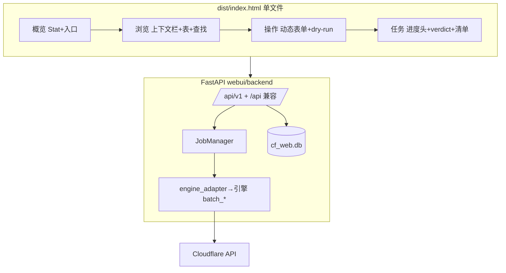

# WebUI 教训（单一前端已重建，历史保留）

原“双前端已移除”状态已过期：`webui/` 现为单一前端（后端 `webui/backend/` +
前端 `webui/frontend/dist/index.html`），本节保留历史教训，现状见第四节。

## 一、必须保留的后端设计

1. 引擎零侵入：`engine_adapter` 以 `importlib` 按路径加载 `cloudflare_dns_tool.py`；
   引擎内 `sys.exit` 全部转为 `EngineError`，密钥经 `mask_secret` 脱敏后才返给界面。
2. 任务模型：`jobs.JobManager` 线程池执行，`threading.local` 绑定当前任务，
   `log_print` 打补丁分流一份到任务日志，同时保留控制台输出；取消走 `stop_event`，
   与 CLI 语义一致；结果集上限 `max_results=2000`，日志 `deque(maxlen=2000)`。
3. 三级进度：任务（账号完成数）→ 账号卡（`account_status`）→ 域名明细
  （`zone_order`/`zone_states`，`progress_cb` 回调上报 `done/error/cancelled`）。
   结论复用引擎 `build_final_verdict`，失败清单复用 `FAILURE_CSV_FIELDNAMES`。
4. 接口分层：`/api` 兼容旧端，`/api/v1` 为主接口；`Deps` 注入
  （`get_accounts/get_manager/get_password/get_proxy_pool`）保证可测试性。
5. 分页一律服务端：`_paginate` 上限 200/页；`records` 先全量取再过滤分页，
   大账号不再全量下发 JSON。日志增量拉取 `offset/limit`，SSE 用标准库
   `StreamingResponse` 实现，无新增依赖。
6. 安全铁律：默认仅监听 `127.0.0.1`，对外监听无口令拒绝启动；
   口令走 `X-Auth-Token`；错误映射 `404`（不存在）/`400`（参数）/`502`（引擎故障）。
   任务级代理仅驻内存，不落盘、不进审计与日志（审计只记数量与模式）。
7. 持久化：标准库 `sqlite3`（WAL），`jobs_history` 终态 `upsert`，
   `audit_log` 记录 `execute` 提交与单条增删改；库文件放账号配置同目录 `cf_web.db`。
8. 预设同源：`/api/meta` 下发 `SPEED_PRESETS`、默认值与快照/导出目录
   （派生自配置文件所在目录 `cf_backup`/`cf_export`），前端只读展示，档位解析不由前端算。
9. SPA 回退防穿越：`candidate.startswith(base + os.sep)` 校验，未命中回退 `index.html`。
10. 单条记录校验（与 Cloudflare 网页版对齐）：`RECORD_TYPES` 允许到 `TXT/MX/NS/CAA/SRV`；
    仅 `A/AAAA/CNAME` 可开代理；代理开时 `TTL` 锁定 `1`；`TTL` 仅 `1` 或 `60~86400`；
    `@` 展开为根域名，短名自动补 zone 后缀；`PATCH` 省略字段沿用原值。
11. 提交校验与 CLI 对齐（`validate_job_params`）：删除类必须限定范围
    （白名单或指定域名）；删域名必须填快照目录；添加模式必须有目标
    （新域名或指定域名首个）；`add_records` 服务端预检 `parse_add_record_spec`；
    上传重跑清单上限 2MB，存临时文件。

## 二、前端教训（重设计时取舍）

1. 双前端并行是主败因：v1/v2 行为需逐项对齐（双击填入、批量勾选、记录弹窗约束），
   维护成本翻倍。重设计只保留单一前端。
2. 可用交互（建议继承）：单上下文栏（账号+域名+搜索+类型快筛）+ 单页滚动
   （内层滚动仅限弹窗体与日志框）；账号库/域名库进弹窗，双击填入下一步，
   复选框跨页保留、“所选送操作页”去重追加；记录行双击填入操作页旧内容与类型；
   命令面板 `Ctrl+K`（拼音选词时回车不误触）；操作表单按模式动态字段，
   高级速度项收折叠区，`dry_run` 默认开；删域名二次确认须输入 `DELETE`。
3. 任务页：进度头 `sticky`（进度+取消/下载清单）；历史与审计明细走弹窗；
   结束显示 `verdict`，失败清单一键下载 CSV（含 BOM）。

## 三、重设计约束

- 后端路由与字段不随意改名；新增接口先加 `/api/v1`，旧 `/api` 保留兼容。
- 任何变更仍跑 `ReadMe.md`“代码质量检查”全套（Ruff、Pyright、py_compile、
  `git diff --check`）与 `python -m unittest cf_api.tests.test_cf_dns_reliability`。
- 重设计的新前端以上述后端契约为依据，单一前端，不再双轨。

## 四、重建记录（2026-10 单一前端已落地，本节与实现同步维护）

已实现单一前端 + 全部功能补齐，架构如下（与 `webui/README.md` 同源，改一处须同步另一处）：

补齐项：`resume-upload` 落盘、`find` 跨账号查找、单条 `PATCH/DELETE` 按 id、
provision 全流程（DNS/等激活/邮箱/SSL/安全/加速）、zones `status` 过滤、
`meta.proxy` 数量模式。契约增量见 `tests/test_webui_extra.py`，黄金
`tests/test_webui.py` 未动。

## 五、本轮改进（与实现同步）

- 接线修复：`-N`（`oNoSub→include_subdomains`）、添加代理/TTL/多值开关、通配符模式说明块。
- 下载链：`zones.csv`（5000 行上限）、任务 `exports` 列表与文件下载（目录白名单内）。
- provision：`create_zone` 开关、激活超时/间隔可调（非法 400）。
- 调参：高级区 `-W/-A/-i/-R/-B/-M` 留空按档位、填值覆盖钳制；`whitelist-upload` 等价 `-w`。
- 直觉：行内“填入”按钮（双击的键盘/触屏等价）、浏览加载态与行内错误盒、任务结果翻页、预览/执行徽章、一键重跑失败域。
- 未做（有意）：配置文件切换（任意路径读风险）、任务级代理（仍仅启动时全局，见启动参数）、
  日志文件 `-L`（任务日志+历史/审计覆盖查询场景）。
