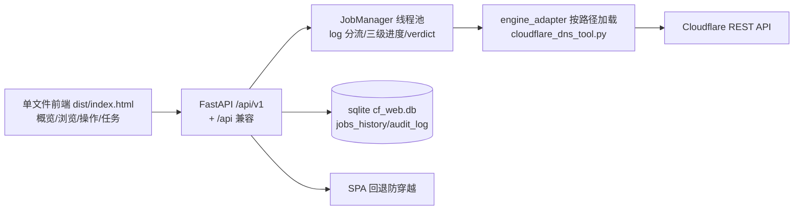
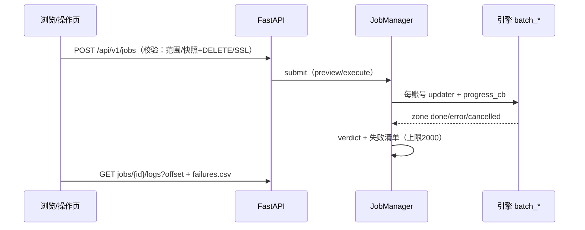

# WebUI（单一前端重建）

后端 `webui/backend/`，前端 `webui/frontend/`（源码 `src/index.html`，构建产物 `dist/index.html`，`npm run build` 仅复制，无重型依赖）。

## 启动

```bash
python start_web_ui.py --config <cf_config.csv|json> --port 8600
# 对外监听必须设口令
python start_web_ui.py --host 0.0.0.0 --port 8600 --password <pwd>
```

- 默认仅监听 `127.0.0.1`；对外无口令拒绝启动。
- 口令走请求头 `X-Auth-Token`；前端记住到 `localStorage`。
- 全局代理仅驻内存：`-P URL` / `--proxy-file`，审计只记数量与模式。

## 架构





## 接口

- 主接口 `/api/v1`：`meta/accounts/zones(status|csv)/records(GET/POST/PATCH/DELETE)/find?domain=/zones/activation-check/jobs/jobs/{id}[/logs|results|failures|failures.csv|cancel|zones|exports|exports/{n}]/resume-preview/resume-upload/whitelist-upload/history/audit`。
- 兼容旧端 `/api/meta`、`/api/accounts`。
- 分页一律服务端，上限 200/页；日志增量 `offset/limit`；失败清单 CSV 含 BOM。
- 持久化 `sqlite3`（WAL），库文件在配置同目录 `cf_web.db`；旧库缺列自动迁移。
- `meta` 下发 `SPEED_PRESETS`、默认值、快照/导出目录与代理数量模式，前端只读展示。

## 约束

- 引擎零侵入：`engine_adapter` 按路径加载 `cloudflare_dns_tool.py`，`sys.exit` 转 `EngineError`，密钥脱敏。
- 提交校验与 CLI 对齐：删除类限定范围，删域名需快照目录 + `DELETE` 确认，`add_records` 预检，清单 2MB 上限。
- 单条校验与网页版对齐：仅 A/AAAA/CNAME 可开代理，代理开时 TTL 锁定 1，TTL 仅 1 或 60~86400。
- 任务三级进度：任务 → 账号卡 → 域名明细（`progress_cb`），结论复用 `build_final_verdict`。
