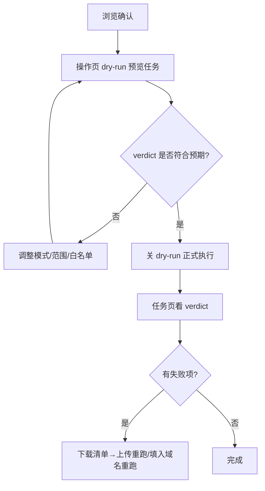

# WebUI 使用说明

## 1 打开

```powershell
.\serve-webui.ps1              # 后台启动 8600（推荐，shell 立即返回）
```

浏览器访问 `http://127.0.0.1:8600`。排障看 `.\serve-webui.ps1 -Logs`；前台调试才用 `python start_web_ui.py --port 8600`。

## 2 建议顺序

1. 概览确认账号数与配置路径。
2. 浏览页选账号填域名查记录，双击行填入操作页。
3. 操作页选模式，保持 `dry-run` 开提交预览任务。
4. 任务页看进度与 `verdict`，确认无误后回操作页关掉 `dry-run` 正式执行。
5. 有失败项时下载失败清单，下次用重跑清单预览后填入域名重跑。

## 3 高风险动作

- 删除通配符 / 删 IP / 删域名必须先限定域名范围。
- 删域名必须填快照目录并输入 `DELETE`，否则 400 拒绝。
- 正式变更前建议填快照目录做自动备份；备份失败会中止变更。

## 4 全量能力对照（CLI → Web）

| CLI | Web |
|---|---|
| `-f` 查找域名 | 浏览页“全账号查找” → `GET /api/v1/find?domain=` |
| `--list-dns` | 浏览页查询 → `GET /api/v1/records`（服务端分页） |
| 单条增改 | 新建/编辑弹窗 → `POST /api/v1/records`；按 id 改 → `PATCH`；按 id 删 → `DELETE` |
| 批量更新/删除/添加/设属性/导出 | 操作页模式 → `POST /api/v1/jobs`（`dry_run` 默认开） |
| `--provision` 全流程 | 操作页 provision：服务器 IP/转发邮箱/SSL/步骤开关 → 同名模式任务 |
| 失败清单重跑 | 清单上传 `POST /api/v1/resume-upload` 落盘返回 path；或预览后填入域名提交；任务页“一键重跑失败域”自动填入 |
| 白名单文件 | `POST /api/v1/whitelist-upload` 解析后填入文本框并记入提交（等价 `-w`） |
| 域名列表导出 | 浏览页“域名 CSV” → `GET /api/v1/zones.csv`（UTF-8-SIG，5000 行上限） |
| 备份产物下载 | 任务页“导出文件” → `GET /api/v1/jobs/{id}/exports[/{n}]`（仅限导出/快照目录内） |
| 显式调参 | 高级区 `-W/-A/-i/-R/-B/-M` 留空按档位，填值钳制覆盖（账号并发越界 400） |
| 催激活 | 域名激活等待在 provision 内自动执行；也可调 `POST /api/v1/zones/activation-check` |



## 5 快捷键

- `Ctrl+K` 命令面板：输域名或账号跳转浏览。
- `[` 折叠/展开侧边栏。
- 390/768/1440 三宽可用，窄屏表格转横滑，页面无横向滚动。
