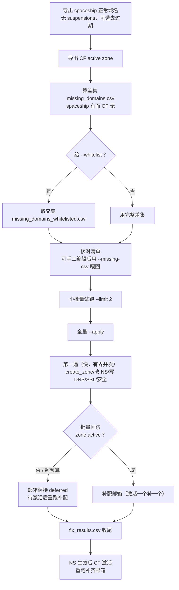

# domain_fix — spaceship 与 Cloudflare 域名差集检测与修复

本工具用于修复「Cloudflare 误删正常域名」的问题，并在重新添加后按需补齐 Cloudflare 配置：

1. 导出 **spaceship** 全部账号下的 **正常域名**（无 `suspensions`）为 CSV。
2. 导出 **Cloudflare** 全部账号下的 **active zone**（正常/激活）为 CSV。
3. 计算差集：**在 spaceship 正常、但不在 Cloudflare** 的域名，写入缺失清单 CSV。
4. 可用**白名单**收窄为「差集 ∩ 白名单」，只修复交集内的域名。
5. `--apply` 时把最终域名重新添加（`create_zone`）到指定 Cloudflare 账号，并按需：
   - 写入 **DNS 记录**（默认根域名 `@` + `www` 两条 A/AAAA 记录）；
   - **等待 zone 激活**（可选顺带在 spaceship 侧把 NS 指向新 zone 分配的 nameservers）；
   - **重建邮箱转发**（补齐 MX/SPF/DKIM、启用 Email Routing、设置 catch-all）；
   - 设置 **SSL 模式**；
   - 启用**基础安全**（`always_use_https` / `browser_check` / `security_level`，不含反机器人/RUM）；
   - 启用**免费加速增益**（`speed_brain` / `0rtt` / `early_hints`）。

> 前提假设：Cloudflare 上的域名是 spaceship 域名的子集，差集即为「应当存在却被 Cloudflare
> 删掉」的域名。若某些 spaceship 域名本就不打算接入 Cloudflare，请先用 `--whitelist` 收窄范围。

## 一、文件位置

```text
pys/
├── spaceship_api/spaceship_api.py     # 域名来源（状态过滤 + CSV 导出）
├── cf_api/cloudflare_dns_tool.py      # Cloudflare 侧（zone 导出、DNS、激活、邮箱、设置等底层能力）
└── domain_fix/
    ├── domain_fix.py                  # 本工具（桥接上面两者并编排修复流程）
    └── README.md                      # 本文档
```

## 二、输出目录约定

默认输出目录 = **spaceship 配置文件所在目录** 下的 `domain_fix/` 子目录。例如配置为
`C:/repos/configs/deploy_configs/spaceship_config.json`，则输出：

```text
C:/repos/configs/deploy_configs/domain_fix/
├── spaceship_normal_domains.csv    # spaceship 正常域名
├── cf_active_domains.csv           # Cloudflare active zone
├── missing_domains.csv             # 差集（完整待修复清单）
├── missing_domains_whitelisted.csv # 差集 ∩ 白名单（仅 --whitelist 时生成）
├── fix_results.csv                 # --apply 后的修复/配置结果
└── unfinished_domains.csv          # 中断时未处理的域名（仅中断且存在未处理时生成）
```

可用 `--output-dir` 覆盖；当 `--ss-status` 非 `normal` 时，spaceship 侧文件名变为
`spaceship_<status>_domains.csv`。

## 三、推荐运行流程

按下述五步走（以白名单 `C:/Users/Administrator/Desktop/dms.txt` 为例；不用白名单可跳过
第 2 步）。默认直接执行（`--apply`），仅预览时加 `--dry-run`：

```bash
# 第 1 步：算差集（联网导出两侧 CSV，加 --dry-run 只预览、不改动任何东西）
python domain_fix.py --dry-run
# -> <配置目录>/domain_fix/missing_domains.csv（完整待修复清单）

# 第 2 步：白名单取交集（复用已导出 CSV，不再联网）
python domain_fix.py --dry-run --no-export --whitelist "C:/Users/Administrator/Desktop/dms.txt"
# -> <配置目录>/domain_fix/missing_domains_whitelisted.csv（待重加域名列表）

# 第 3 步：打开交集清单核对（控制台只预览前 20 个，以 CSV 为准）；
# 若手工增删过行，按“手工编辑清单”一节用 --missing-csv 喂回

# 第 4 步：小批量试跑 2 个，确认链路与配置无误
python domain_fix.py --no-export --whitelist "C:/Users/Administrator/Desktop/dms.txt" --apply --limit 2 --server-ip 1.2.3.4
# -> <配置目录>/domain_fix/fix_results.csv（逐域名结果）

# 第 5 步：试跑无误后，去掉 --limit 全量执行（第一遍快速建站/NS/DNS，随后批量回访等激活、激活一个补一个邮箱，一次跑完）
python domain_fix.py --no-export --whitelist "C:/Users/Administrator/Desktop/dms.txt" --apply --server-ip 1.2.3.4
```

说明：

- 第 1、2 步可合并为一条：`python domain_fix.py --dry-run --whitelist "C:/Users/Administrator/Desktop/dms.txt"`，
  一次联网同时产出两个清单；拆开的好处是白名单可反复调整、秒级重筛而不重新联网。
- `--server-ip` 决定默认 `@`/`www` 记录的 IP（不给且账号无 `default_server_ip` 时跳过 DNS 步骤）；
  目标账号默认最后一个，指定方式见“目标账号指定”一节。
- 其它常用组合：只加 zone 不碰其它（`--apply --no-dns --no-email --no-ssl --no-security --no-optimize`）；
  精细 DNS 与旧配置表（`--apply --records-file records.csv --zones-file cf_domains.csv`，见第四节与第六节）。

### 数据来源：最新计算结果 vs 指定旧文件

- **默认**：联网重新计算最新结果。
- `--ss-csv PATH` / `--cf-csv PATH`：分别指定某一侧的已有 CSV，指定后该侧跳过联网；可只指定一个。
- `--no-export`：不联网，复用输出目录中默认文件名的两个 CSV。
- `--missing-csv PATH`：直接使用已算好的差集，跳过两个来源的导出与差集计算。

优先级：`--missing-csv` > `--ss-csv`/`--cf-csv` > `--no-export` > 联网计算。

`--exclude-expired` 在差集计算前剔除已过期域名（依据 `expirationDate`），对新鲜导出、
`--ss-csv`/`--no-export`、`--missing-csv` 三路均生效；缺失或无法解析该字段的行会被保留。

### 白名单文件格式

纯文本，**一行一个域名**；自动去除多余空格、行内注释，兼容 `http(s)://` 前缀与路径、IDN：

```text
# 以 # 开头的整行或行尾注释会被忽略
a.com
  b.com            # 前后空格、行内注释都能处理
https://xn--c1yn.com/path
café.com
```

给出 `--whitelist` 后，只对「差集 ∩ 白名单」进行预览与修复，交集清单写入
`missing_domains_whitelisted.csv`。控制台会打印白名单总数、交集数量、被排除数量；
若白名单中有域名不在差集中（无需修复或不在 spaceship 正常集合），会预览提示，
可据此清理白名单。

### 手工编辑清单

交集清单可手工增删行，编辑后用 `--missing-csv` 把文件喂回去，**不要再加 `--whitelist`**
（否则会在已编辑的清单上再交集一次）：

```bash
python domain_fix.py --missing-csv "<配置目录>/domain_fix/missing_domains_whitelisted.csv" --apply --server-ip 1.2.3.4
```

三个要求：

1. 表头行必须保留，且必须有 `name` 列（修复只认该列，多余列无碍）；
2. 用 Excel 编辑后须另存为 **CSV UTF-8**（默认 CSV/ANSI 会破坏非 ASCII 内容）；
3. 同样可先加 `--limit 2` 试跑。`--missing-csv` 跳过两侧导出与差集计算，直接修文件里的域名。

### 续跑 / 补配必须用 --missing-csv 喂回

域名一旦被重新添加到 Cloudflare 并**激活**，它就不再是「spaceship 正常、Cloudflare 无」的差集
成员：此时**重新联网算差集不会包含它**，若邮箱仍是 `deferred`（等激活时被延期）也不会被补配。
要续跑/补配，请把仍待处理的清单用 `--missing-csv` 喂回：

```bash
# 用完整白名单交集清单，或自己筛出的子集（至少含 name 列，可带 account 列）
python domain_fix.py --missing-csv "<配置目录>/domain_fix/missing_domains_whitelisted.csv" --apply
```

中断后同理：用 `unfinished_domains.csv`（中断时未处理清单）或原清单继续跑即可。这与上面
“手工编辑清单”是同一机制，区别只是用途（续跑/补配 vs 手工改动）。

### 目标账号指定

默认写到 CF 配置的**最后一个**账号；`--add-account` 支持三种指定方式：数字序号
（从 1 开始，如 `--add-account 2`）、账号名（如 `--add-account cf00`）、登录邮箱；
名称/邮箱为精确匹配（忽略大小写与首尾空格）。先用 `python cloudflare_dns_tool.py -l`
列出账号及其序号，再按需指定；执行时核对 `[4/4]` 行打印的账号名。

### 结果判读

每个域名依次执行：`create_zone`（已存在则回查复用）→ 改 NS（默认开，先用差集 CSV 的
`account` 列预选 spaceship 账号）→ 写 DNS → SSL → 基础安全/加速（第一遍不逐域等待激活；
邮箱转发要求 zone `active`，未激活先记 `deferred`，由随后的批量回访在激活后补配；
`--no-activation` 则跳过等待）；单项失败只记账，不中断其它域名。

看 `fix_results.csv` 收尾：`zone_status`（zone 当前状态 `pending`/`active`/`moved`/`exists`）、
`activation`（`active` 为已激活，`pending:<status>` 为待激活）、`record_status`（如
`@:added;www:added`）、`email_status`（`pending_verification` 表示目标邮箱未验证，需收件人点击
验证邮件后重跑；`deferred` 表示 zone 未激活，待激活后重跑补配）、`error` 列非空即致命失败
（只计 zone 级错误；NS/记录/邮箱/SSL/安全的非致命错误见汇总行的“部分失败”）。

新 zone 通常是 `pending`：NS 默认由脚本自动改好，可用 `Get-CFZoneInfoFromTable` 自行查询
激活进度；坚持手动改 NS 则加 `--no-set-nameservers`，此时需到 spaceship 把该域名的 NS
改为 `fix_results.csv` 中 `nameservers` 列的值。

控制台输出：每行行首带本地时间戳（`YYYY-MM-DD HH:MM:SS`）；启动打印脚本版本
（自身文件修改时间，`YYYY.MM.DD-HHMM`）、`[4/4]` 行打印选中的 CF 账号（含邮箱）、
`修复步骤` 行打印 `server-ip` 与 `forward-email` 的实际取值、逐域行打印 `activation` 状态。
**详情日志（默认开启，`--no-detail` 关闭）**：每个 DNS 记录与邮箱步骤单独打印，便于逐条核对：

```text
[NS] example.com 目标NS=april.ns.cloudflare.com; lamar.ns.cloudflare.com（当前: jimmy.ns.cloudflare.com; rosa.ns.cloudflare.com）→ 更新
[NS] example.com spaceship 侧 NS 已更新
[NS] other.com 当前NS=april.ns.cloudflare.com; lamar.ns.cloudflare.com 与目标一致，跳过
[激活] pending.com 已触发一次激活检查（当前 pending）
[DNS] example.com A @ -> 1.2.3.4 [added]（已新增记录）
[DNS] example.com A www -> 1.2.3.4 [unchanged]（记录已存在且一致）
[邮箱] example.com MX example.com: added
[邮箱] example.com 结果: ok（邮箱转发已配置到 box@example.com）
```

`[NS]` 行来自 spaceship 侧改 NS（旧/新 nameservers 与结果），是“域名更改”的直接记录；
`[激活]` 行表示回访时对仍未激活（`pending`/`moved` 等）的 zone 主动触发了一次激活检查
（每个域名每次运行只催一次）。

邮箱各步骤在 zone 激活后由回访补配时才出现（第一遍未激活时打印“暂缓”）。收尾汇总行
`新建 X, 复用 Y, 失败 Z, 部分失败 W, 完成 M/N（未处理 K）`：`新建`=本次 `create_zone` 成功，
`复用`=zone 已存在、回查后沿用；`失败`只计致命（zone 级）错误，`部分失败`为 NS/记录/邮箱/
SSL/安全等非致命步骤出错（这些错误落在各自列，不写 `error`）；`未处理`为被中断而未产出行者，
同时写入 `unfinished_domains.csv`（含 `tag/domain/account/reason`），可重跑补齐。
加 `-L` 另写日志文件：**全量捕获**——屏幕上的全部输出（含上述详情行、底层库的裸 `print`
与异常 traceback）都会同步进文件；本工具的结构化行另带级别与线程名（UTF-8，默认追加）。

## 四、DNS 记录指定方式

优先级从高到低：

1. `--records-file` 中该域名的行；
2. `--record "name:type:content"`（可重复）指定的全局记录；
3. `--zones-file` 中该域名的 `ip` 列，或 `--server-ip` / cf 账号配置的 `default_server_ip`：
   自动生成 **`@` 与 `www` 两条 A（IPv6 时为 AAAA）记录**（典型场景）。

若以上都缺，则跳过 DNS 步骤（不会写入错误记录）。

### 记录文件（推荐，按域名精细指定）

CSV 列：`domain,name,type,content,proxied,ttl,priority`。`domain` 为空的行作为**全局默认**。

```csv
domain,name,type,content,proxied,ttl,priority
,@,A,1.2.3.4,true,1,
,www,A,1.2.3.4,true,1,
api.example.com,api,CNAME,target.example.com,false,300,
example.com,@,MX,10 mail.example.com,false,1,10
```

- `name` 支持 `@`（根域名）、`www`、`api` 或完整域名。
- `proxied` 缺省取 `--proxied`（默认开启）；`ttl` 缺省 1（自动）；`priority` 仅 MX 等需要。

写入采用幂等 upsert：同名同类型内容一致则跳过，不一致则覆盖（A/AAAA/CNAME），并清理同名多余记录、避免劈叉；A/AAAA 默认同名单值，如需同一主机名多个 IP，加 `--allow-multi-value`。TXT/MX 等多值类型仅在完全相同记录存在时跳过，否则追加。

### 命令行全局记录

```bash
python domain_fix.py --apply --record @:A:1.2.3.4 --record www:A:1.2.3.4
```

## 五、修复步骤与开关

`--apply` 默认执行下列步骤（有对应数据时），`--activation` 默认开启：

| 步骤 | 说明 | 开关 |
|---|---|---|
| 添加 zone | `create_zone`（自动带 account id，已存在则回查复用） | 无法关闭（核心动作） |
| 改 NS | 通过 spaceship API 把 NS 指向新 zone 的 nameservers（默认开启） | `--no-set-nameservers` |
| DNS 记录 | 按上一节规则写入，幂等（存在且一致则跳过） | `--no-dns` |
| 等待激活 | 第一遍不等；批量回访轮询 `status` 到 `active`，并对未激活 zone 触发一次激活检查（默认开启） | `--no-activation` |
| 邮箱转发 | 补齐 MX/SPF/DKIM、启用路由、设置 catch-all | `--no-email` |
| SSL 模式 | 取 cf 配置 `ssl_mode` 或 `--ssl-mode` | `--no-ssl` |
| 基础安全 | `always_use_https` / `browser_check` / `security_level` | `--no-security` |
| 加速增益 | `speed_brain` / `0rtt` / `early_hints` | `--no-optimize` |

- NS：新 zone 建好后立即改 NS（不等激活），让 CF 尽早开始检测；按差集 CSV 的 `account` 列
  预选 spaceship 账号凭证（避免遍历全部账号），先查 spaceship 侧现状，已是目标组合则跳过
  （`nameservers-unchanged`），否则更新并打印 `[NS] 旧 → 新`。如 spaceship 配置不可用会警告并跳过。
  可用 `--no-set-nameservers` 关闭，改回手动改 NS。
- 激活：默认等待。第一遍**不逐域等待**（只建站/NS/DNS，快），激活状态先记
  `skipped`；随后由批量回访统一轮询，激活一个补一个邮箱（见下条）。仅当关闭回访
  （`--revisit-timeout 0`）时，才回退为单域内等待（`--activation-timeout` 生效）。
  `--no-activation` 则第一遍与回访都不等，`activation` 记 `skipped` 直接返回。
- 回访（`--activation` 且 `--revisit-timeout > 0` 时）：第一遍只管建站/NS/DNS（快），
  之后批量回访——**按域名指数退避**（间隔从 `--activation-interval` 起逐次翻倍、上限
  60s，只有到期的域名才被探测），激活一个补一个邮箱，直到全完成或 `--revisit-timeout`
  总预算（默认 1800 秒，0 关闭）耗尽；每轮落盘，Ctrl+C 不丢数。回访时会**主动触发一次
  激活检查**（`PUT /zones/{id}/activation_check`）催激活；这只是把 zone 放进优先重查队列，
  通常数分钟到数小时，不保证立即生效。预算耗尽仍未激活的行保持 `deferred`，下次重跑继续补。
  一次运行、尽量不跑第二遍；退避避免了每轮全量重扫，大幅削减无效轮询，也避免工作线程
  被单个域名的激活轮询占满，并发吞吐更高。
- 邮箱转发：若目标邮箱未验证，脚本会创建目标地址、启用路由并补齐 MX，但**暂不设置 catch-all**，
  结果标记 `pending_verification`，需收件人点击验证邮件后重跑。
  若 zone 尚未激活则记 `deferred:requires-active-zone`（Email Routing 要求 active），待激活后重跑补配。
- 安全/加速：逐项容错，免费套餐不支持某项时只记录该项失败，不影响其它步骤。

### 全流程示意



### 转发邮箱：激活前能否设置，激活后能否生效

结论：**激活前设不上，激活后重跑即生效**。依据是 `configure_email_routing` 的调用链（`cf_api/cloudflare_dns_tool.py`）与一次真实 403（`Active zone required`，code 2009）：

1. 建目标收件地址（账号级，与 zone 无关）：创建并查询验证状态，未验证则后继只配路由、不设 catch-all。
2. 查启用路由所需的 DNS 记录（`GET /zones/{id}/email/routing/dns`，zone 级，返回记录数组）：
   `pending` 在此直接 403（`Active zone required`，code 2009），这是整步被门控卡住的位置。
   注意：`POST` 同路径是“启用路由”端点（返回 settings 对象），不可用于取记录——此前误调即为用户实测裸错的根因。
3. 补 MX/SPF/DKIM 记录（DNS 本身在 `pending` 上可写，与 A 记录同理，但工具把整步绑在一起延期，不单独预写）。
4. 读设置（`GET /zones/{id}/email/routing`），未启用才调新版启用端点（旧 `POST .../enable` 已废弃）。
5. 设 catch-all（zone 级，要求 active 且目标邮箱已验证）。

所以 `pending` 时邮箱整步记 `deferred:requires-active-zone`（不是 error，不污染失败计数）；NS 生效、CF 判 `active` 后重跑同一命令，zone 走 `exists` 复用、门控放行，邮箱正常配上。目标邮箱未验证时则记 `pending_verification`，点验证邮件后重跑。

想复刻旧脚本“一次跑完、不用额外动作”的体验：默认即等（回访总预算 `--revisit-timeout`
默认 1800 秒，NS 生效慢可再调大），第一遍建站配完后脚本自动回访、激活一个补一个邮箱；
考证：旧脚本当年也是这个路数——`legacy/cf_config_api.py` 的 `get_or_create_zone` 建站后等激活
最多约 53 秒（先 3 秒 + 10 轮×5 秒轮询），等不到才硬着头皮往下走；而误删重加时 NS 往往根本没变，
CF 秒判 `active`，50 秒绰绰有余，所以体感像“没等”。今天的差别只是 API 变严了（`pending` 调
`POST /email/routing/dns` 直接 403/code 2009），等待本身仍是正解。

### 与 Deploy-WpSitesOnline 流程的对照

上面这套步骤与 PS 侧 `Deploy-WpSitesOnline`（`PS/WpOnline/WpOnline.psm1:7`）定义的加域流程一一对应，
底层走的是同一套 `cloudflare_dns_tool.py` 能力：

| 标准流程 | Deploy-WpSitesOnline（PS 侧） | domain_fix（本工具） |
|---|---|---|
| 域名加入 CF 账号 | `Add-CFZoneDNSRecords -AddRecordAtOnce` 建 zone | `create_zone`（已存在回查复用） |
| 查 CF 分配的 NS 并落盘 | `Get-CFZoneNameServersTable` → `domains_nameservers.csv`（domain,ns1,ns2） | `fix_results.csv` 的 `nameservers` 列（`;` 连接） |
| 注册商侧改 NS | `Update-SSNameServers` 调 `update_nameservers.py`（流程内必做） | `--set-nameservers` 内联调 spaceship API（默认开启，可用 `--no-set-nameservers` 关闭） |
| DNS/邮箱/安全配置 | `Add-CFZoneConfig`（`--provision --no-activation`） | `provision_zone` 同一引擎（激活等待交由回访承担） |
| 等待激活 | `Add-CFZoneCheckActivation` 读状态 + 外层 20×30 秒轮询 | 回访轮询到 `active` 或预算耗尽（并触发激活检查） |

两处差异注意：

1. **NS 更新现在默认开启**——`domain_fix` 建好 zone 即自动改 NS（与 Deploy 一致）。
   若 spaceship 配置不可用会警告并跳过；坚持手动改 NS 则加 `--no-set-nameservers`。
   仍建议抽查 `fix_results.csv` 的 `nameservers` 列确认一致。
2. 想走 Deploy 式的“先落表核对、再批量改 NS”两段式，可在修复后用
   `Get-CFZoneNameServersTable -FromTable <域名表>` 生成中间表核对，再调 `Update-SSNameServers`。

## 六、兼容旧配置

`--zones-file` 兼容旧 `cf_domains` 表格列：`domain,ip,forward,security,ssl,Note`（也支持
`conf`/`txt` 每行一个域名）；`ip`/`forward`/`ssl`/`security` 按域名覆盖全局默认值。

全局默认值优先从 **cf 配置的 JSON** 读取：

| 来源 | 字段 |
|---|---|
| cf 配置顶层 | `default_forward_email`、`ssl_mode`、`security_mode` |
| cf 账号 | `default_server_ip` |

若 `--cf-config` 指向的是 `cf_config.csv`，但同目录存在 `cf_config.json`，脚本会回退到该
JSON 读取上述旧字段（账号来源仍以 `--cf-config` 为准）。命令行 `--server-ip`、`--forward-email`、
`--ssl-mode`、`--security/--no-security`、`--optimize/--no-optimize` 优先级最高。

## 七、参数速查

| 参数 | 默认值 | 说明 |
|---|---|---|
| `--ss-config` / `--cf-config` | 自动探测 | spaceship / Cloudflare 配置 |
| `--output-dir` | `<配置目录>/domain_fix` | CSV 输出目录 |
| `--ss-status` / `--zone-status` | `normal` / `active` | 两侧状态过滤 |
| `--exclude-expired` | 关闭 | 剔除已过期域名（未过期且正常才进入差集） |
| `--no-export` / `--ss-csv` / `--cf-csv` / `--missing-csv` | — | 数据来源选择 |
| `--whitelist PATH` | 空 | 白名单；只修复「差集 ∩ 白名单」 |
| `--add-account` | 最后一个 CF 账号 | 修复目标账号（账号名/邮箱/序号） |
| `--limit N` | `0`（不限） | 单次最多修复多少个域名 |
| `--apply` / `--dry-run` | 执行 | 真正执行；`--dry-run` 仅预览 |
| `--server-ip` | 账号 `default_server_ip` | 默认记录 IP（生成 @ 与 www） |
| `--records-file PATH` | 空 | 记录 CSV（见第四节） |
| `--record NAME:TYPE:CONTENT` | 空 | 全局记录，可重复 |
| `--proxied` / `--no-proxied` | 开启 | 新增记录默认代理状态 |
| `--ttl N` | `1` | 新增记录默认 TTL |
| `--allow-multi-value` | 关闭 | 允许同名 A/AAAA 多值（默认同名只保留一条） |
| `--zones-file PATH` | 空 | 旧格式域名配置表 |
| `--forward-email` | cf 配置默认值 | 邮箱转发目标地址 |
| `--ssl-mode` | cf 配置 `ssl_mode` | `flexible`/`full`/`strict`/`off` |
| `--security` / `--no-security` | 取 `security_mode` | 基础安全开关 |
| `--optimize` / `--no-optimize` | 开启 | 加速增益开关 |
| `--no-dns` / `--no-email` / `--no-ssl` | 关闭 | 关闭对应步骤 |
| `--activation` / `--no-activation` | 开启 | 等待激活（批量回访轮询到 `active` 或超预算；`--no-activation` 跳过） |
| `--activation-timeout` / `--activation-interval` | `300` / `5` | 单域等待预算（仅 `--revisit-timeout 0` 回退时生效）/ 轮询间隔 |
| `--revisit-timeout` | `1800`（0 关闭） | 批量回访总预算（`--activation` 开启时；0 则回退为单域内等待） |
| `--set-nameservers` / `--no-set-nameservers` | 开启 | 自动改 spaceship 侧 NS（默认开启） |
| `-L` / `--log-file` | 空（不写文件） | 运行日志文件：全量捕获屏幕输出（含库的裸 print/traceback）+ 结构化行，UTF-8 |
| `-G` / `--log-level` | `INFO` | 结构化日志行（`log_print`）的记录级别；裸输出不受此过滤 |
| `--log-overwrite` | 追加 | 覆盖已有日志文件 |
| `--add-workers` | `4` | 修复并发线程数（共享限速器兜底，提速用） |
| `--detail` / `--no-detail` | 开启 | 逐条打印 DNS 记录与邮箱步骤；`--no-detail` 只看逐域汇总 |

## 八、fix_results.csv 列

`account,domain,zone_status,zone_id,nameservers,activation,record_status,email_status,ssl_status,security_status,error,timestamp`

常见状态值：

| 字段 | 取值示例 | 含义 |
|---|---|---|
| `zone_status` | `pending`/`active`/`exists` | zone 当前状态；回访确认为 active 时会刷新（不再出现“pending 却 activation=active”的矛盾）；`exists` 为已存在但回查不到状态 |
| `activation` | `active`/`pending:<status>`/`skipped`/`error:<msg>`（可带 `nameservers-set`/`unchanged` 前缀，见下） | 激活结果 |
| `record_status` | `@:added;www:unchanged` | 每条记录状态（added/updated/unchanged/error） |
| `email_status` | `ok`/`pending_verification:<msg>`/`deferred:requires-active-zone`/`error:<msg>`/`no-forward-email` | 邮箱转发结果（`deferred` 为 zone 未激活，待激活后重跑补配）。注意：邮箱所需 MX/SPF/DKIM 若某条写入失败，目前只在详情日志的 `[邮箱] …: error（原因）` 体现，不改变本列（见第九节“已知限制”） |
| `ssl_status` | `flexible`/`no-ssl-mode`/`error:<msg>` | SSL 结果 |
| `security_status` | `ok=6/6`/`ok=4/6;errors=...` | 安全/加速设置结果 |
| `timestamp` | ISO8601(UTC) | 统一为**完成时间**：第一遍收尾时间，被回访刷新后为最近一次回访时间 |

### 控制台逐域行解读（示例）

控制台逐域行与上表列一一对应（另有行首时间戳；并行时完成行乱序到达，`[序号/总数]` 可辨）：

```text
[2/35] domain.com: zone=pending, activation=nameservers-set|skipped, dns=@:added;www:added, email=deferred:requires-active-zone, ssl=flexible
```

逐段解读：

1. `zone=pending`——CF 侧当前状态 `pending`（尚未激活）；`active` 为已激活，`moved` 为
   zone 被移动/正等 NS 生效，`exists` 为已存在但回查不到状态。**是否本次新建看汇总行的
   `新建/复用`**（`zone_status` 只反映 zone 状态，不区分新建与复用）。
2. `activation=nameservers-set|skipped`——两段式，由 `|` 连接：前段是 NS 动作，
   `nameservers-set`（已改写）/`nameservers-unchanged`（已一致，跳过）/
   `nameservers-error:<原因>`（改 NS 失败）；后段是激活等待结果，`skipped`（未等待）/
   `active`（已激活）/`pending:<状态>`（仍等待中）/`error:<原因>`。本例：NS 已改写；
   后段 `skipped` 表示第一遍未逐域等待激活，稍后由批量回访刷新为 `active` 或
   `pending:<状态>`（回访行会单独打印）。
3. `dns=@:added;www:added`——每条记录 `名:状态`，`added`（新增）/`updated`（覆盖）/
   `unchanged`（已一致，跳过）/`error`（失败）。本例两条都是新增。
4. `email=deferred:requires-active-zone`——邮箱未配：Email Routing 要求 zone 为 `active`，
   当前 `pending` 故整步延期（不是失败）；待激活后重跑同一命令补配。
5. `ssl=flexible`——SSL 模式已设为 `flexible`（`pending` 上可写，不受激活影响）。

下一步：等 NS 生效、CF 判 `active` 后重跑同一命令（zone 走 `exists` 复用），`email` 会补成
`ok`（目标邮箱已验证）或 `pending_verification`（点验证邮件后重跑）。

## 九、依赖与注意事项

- 依赖同仓库的 `spaceship_api` 与 `cf_api`，二者已被本工具自动加入 `sys.path`。
- Python 依赖：`requests`；若 Cloudflare 使用 CSV/Excel 配置或 Excel 版 `--zones-file`，还需 `pandas`。
- **默认直接执行**（`--apply`），只有显式加 `--dry-run` 才只预览；动真格前建议先核对 `missing_domains.csv`。
- 邮箱转发要求目标邮箱**已验证**；未验证时会创建地址并提示，需人工完成验证后重跑。
- Cloudflare 不允许同一用户重复添加同一 zone：重复项记为 `exists`，不影响其它步骤。
- `--set-nameservers` 会改动域名在注册商侧的 NS，默认开启；坚持手动改 NS 则加 `--no-set-nameservers`。
- 并发与限流（已按官方配额审计，2026-10-02）：Cloudflare 官方配额为每凭证 1200 请求/5 分钟
  （约 4 请求/秒，另有按 IP 200/秒），429 附 `retry-after` 秒数。修复默认 `--add-workers 4`
  + `--request-interval 0.3`（单限速器全局约 3.3 请求/秒，低于配额）；多线程共享同一个线程安全
  限速器（`Lock` + 到达间隔下限 + 429 后自适应退避）与线程独立 `Session`，429 按 `retry-after`
  退避、指数重试（默认最多 5 次）。提速（`--add-workers` 调大）时保持 `--request-interval`
  不低于 0.3；spaceship 侧无客户端限流，保持默认串行即可。
- 并发模型：第一遍采用**有界窗口**并发——同时最多 `--add-workers` 个域名在执行，完成一个再补一个
  （不会一次性排队全部任务），且一定会排空最后一窗；每完成一个立即落盘 `fix_results.csv`，
  中断/强制退出尽量不丢结果。第一遍不逐域等待激活（只建站/NS/DNS），激活与补邮箱交给批量回访
  （按域名指数退避，只有到期才探测），工作线程因此不会被单个慢域名占满；spaceship 客户端按线程
  复用，且用差集 CSV 的 `account` 列预选账号凭证，避免改 NS 时遍历全部账号（原先每域名可能多打
  ~20 次请求）。
- 效率说明：单域名约 12–15 次 CF 调用；其中 DNS 写入走同 zone 缓存（每类 LIST 只查一次，
  稳态每条记录约 1 次 POST），`--add-workers 4`（默认）+ 0.3 秒下限约 3 记录/秒。
  实际吞吐受 `--request-interval` 全局限速约束（3.3 请求/秒），调大 `--add-workers` 主要
  用于掩盖网络延迟；要更快可在配额内把 `--request-interval` 降到 0.25 左右（Cloudflare
  约 4 请求/秒）。
- 中断：Ctrl+C 优雅退出——第一次 Ctrl+C 取消排队任务、进行中任务借助 stop 信号尽快收尾
  （cf 侧等待与请求均可中断，spaceship 侧等当前请求返回），已完成部分落盘，无 traceback；
  **再按一次 Ctrl+C 立即强制退出**（用于某个请求长时间卡住时）。导出阶段也会响应停止信号
  （CF 各账号的 zone 读取线程会尽快退出；spaceship 侧等当前请求返回）。退出码 130，
  未完成的重跑补齐（第一遍每完成一个域名即落盘、回访每轮落盘，均可断点续跑）；未处理域名
  另落盘到 `unfinished_domains.csv`（`tag,domain,account,reason`）。
- 运行日志：加 `-L <文件>` 后屏幕照常输出，同时把全部输出写入该文件（父目录自动创建，
  UTF-8）。文件内含三类内容：`log_print` 的结构化行（`时间\t级别\t线程\t消息`，受 `-G`
  过滤）、底层库经 stdout/stderr 的裸输出、以及异常 traceback；默认追加，`--log-overwrite`
  覆盖。Ctrl+C 强制退出路径也会先刷新日志，尽量不丢。
- 手动催激活：`flarectl zone check --zone <域名>`（需 `CF_API_TOKEN`），或直接
  `PUT /zones/{id}/activation_check`；与回访时的自动触发等价，二者都只是把 zone 放进
  优先重查队列，不保证立即激活。
- 续跑/补配：已重新添加并激活的域名不再属于“差集”，**重算差集不会包含它**；要补邮箱或
  续跑，务必用 `--missing-csv <清单>` 喂回（详见第三节“续跑 / 补配必须用 --missing-csv 喂回”）。
- 已知限制：邮箱所需记录（MX/SPF/DKIM）在 `configure_email_routing` 内逐条 upsert，某条失败
  只在详情日志 `[邮箱] …: error（原因）` 体现，暂不计入 `email_status` 与“部分失败”；若遇
  邮件不通，请结合 `[邮箱]` 详情行排查（该问题已记录，后续可纳入统计）。

## 十、相关文档

- [../spaceship_api/README.md](../spaceship_api/README.md)：spaceship 命令行工具总说明。
- [../cf_api/ReadMe.md](../cf_api/ReadMe.md)：Cloudflare DNS 工具说明（含 `--list-zones` 与邮箱转发/设置等底层能力）。
