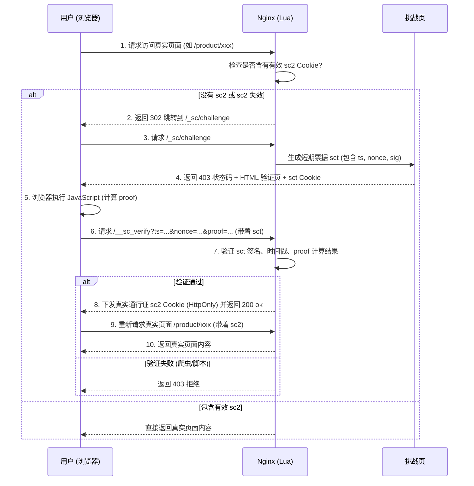
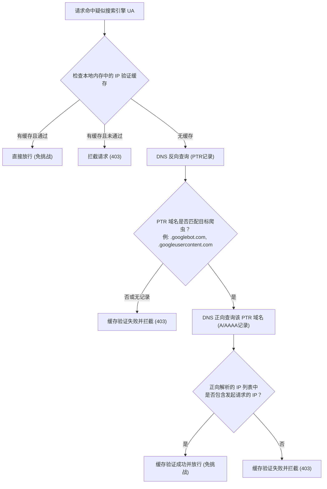
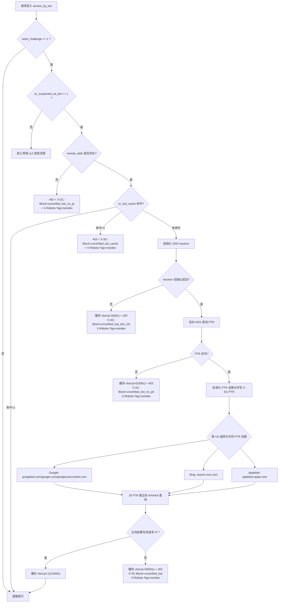

# OpenResty JS 挑战（签名 Cookie）— 部署与运维指南

本文档描述一个基于 **OpenResty（nginx + lua-nginx-module）** 实现的 **JavaScript 反爬挑战**。
目标：

- 阻止简单脚本工具（如 `curl`、基础 Python 请求）直接访问受保护页面。
- 允许正常浏览器通过验证页；可选择“自动验证”或“点击继续验证”两种模板模式。
- 允许指定搜索引擎/爬虫（非中国、可配置）直接放行。
- 适配 CDN / 反向代理场景（不强绑定 IP）。

### 基本效果

---

- 普通访客第一次访问页面时，可能会先看到一个验证页。
- 自动模式会直接执行验证；交互模式会要求用户点击一次 “Click to continue” 后再执行验证。
- 验证页里的 JavaScript 通过后，浏览器会拿到一个短期通行证 Cookie：`sc2`。
- 之后 30 分钟内，同一个浏览器访问页面通常不会再被挑战。
- 不会执行 JavaScript 的简单脚本通常拿不到 `sc2`，因此无法直接抓取真实页面。
- 静态资源和内部验证接口不能乱拦，否则页面会缺 CSS/JS，或者挑战流程会循环,但避免 `/backup/assets.zip` 这类请求被当作普通静态资源放行。

### 注意事项

当前版本主要针对服务器上所有网站的域名都是常规的**单段**后缀,例如`.com`,`.shop`这类型

如果是复杂的域名(双段后缀),不在此方案考虑之内,可能需要额外修改.

### 检查搜索引擎是否能够有效爬取真实内容

[验证来自 Google 抓取工具和抓取器的请求 | Google 抓取基础设施  | Crawling infrastructure  | Google for Developers](https://developers.google.cn/crawling/docs/crawlers-fetchers/verify-google-requests?hl=zh-cn)

[富媒体测试 Google Search Console](https://search.google.com/test/rich-results)

此外可选的还有:[PageSpeed Insights](https://pagespeed.web.dev/)


## 1. 功能特性

- **整站页面保护**
  - 当前版本默认保护整个站点的页面请求，而不是只保护 `/product/`、`/shop/` 等路径
  - 通过 server 级 `access_by_lua_block` 实现，尽量不改变 WordPress/宝塔原有 `location /`、PHP、rewrite 规则

- **两段式（必须 JS 执行）流程**
  - 挑战页下发一个短期 **票据 Cookie** `sct`（非 HttpOnly）
  - 浏览器 JS 读取 `sct`，计算 `proof`，请求 `/__sc_verify`
  - 自动模板会自动执行这一步；交互模板会在用户点击后执行这一步
  - 服务器校验票据 + proof，通过后才签发 **HttpOnly** 的 `sc2`
  - 不执行 JS 的情况下，无法通过单次 HTTP 请求直接获得有效 `sc2`

- **签名 Cookie：`sc2`（30 分钟）**
  - 格式：`sc2=<ts>_<nonce>_<mac>`
  - `mac = md5(secret|ts|nonce|ua)`
  - TTL：1800 秒（允许少量时钟误差）
  - 绑定 User-Agent（UA），降低 Cookie 被盗用后的复用价值

- **票据 Cookie：`sct`（2 分钟）**
  - 格式：`sct=<ts>_<nonce>_<sig>`
  - `sig = md5(secret|ticket|ts|nonce|ua)`
  - TTL：120 秒
  - 仅用于换取 `sc2`

- **跨子域 Cookie（避免 `www` <-> 裸域反复挑战）**
  - 本部署只使用 `example.com` 这类简单单段后缀域名
  - 配置会取 Host 最后两段作为主域，并写入 `Domain=.example.com`
  - 这样裸域、`www`、其他子域之间发生跳转时，`sc2` 仍可继续使用
  - 对 IP、`localhost` 等测试环境不会追加 Domain

- **挑战生成限速**
  - 使用 `lua_shared_dict sc_token_store` 对同一 IP 的挑战频率进行限制

- **爬虫白名单**
  - 可配置 UA allowlist（主流搜索引擎、社交爬虫等）

- **敏感归档文件拦截**
  - `/backup/assets.zip`、`/dump.sql`、`/database.sql` 等常见备份包探测会直接返回 `403`
  - `zip` 不再作为普通静态资源无条件放行

---

## 2. 工作原理（请求流程）

可以把这个方案想成“门口领临时通行证”：

1. 用户请求页面。
2. Nginx 先看有没有有效的 `sc2` 通行证。
3. 如果没有，就让浏览器去挑战页 `/_sc/challenge`。
4. 挑战页给浏览器一个短期票据 `sct`。
5. 自动模式直接继续；交互模式显示“点击继续验证”，等待用户点击。
6. JavaScript 带着计算结果访问 `/__sc_verify`。
7. 服务器确认结果正确后，签发真正的通行证 `sc2`。
8. 用户带着 `sc2` 再访问页面，就能看到真实内容。

这里有两个 Cookie：

- `sct`：临时票据，寿命短，只用于换取 `sc2`。
- `sc2`：真正通行证，HttpOnly，默认 30 分钟有效。

**完整的请求与验证流程如下图所示：**



### 2.1 访问受保护页面

> 将保护范围从部分路径扩展为整站页面保护时,注意避免用 `location /` 改写整站入口，降低和 WordPress/宝塔原有配置冲突的风险。

1. 客户端访问站点页面，例如：`/`、`/product/...`、`/shop/...`
2. Nginx Lua 判断该请求是否需要挑战（`$need_challenge`）
3. 若需要挑战，则校验 `sc2`：

- 解析 `sc2 = ts_nonce_mac`
- 检查时间戳是否在有效期内
- 计算期望值 `md5(secret|ts|nonce|ua)`
- 与 `mac` 比对

4. 若无效/缺失：

- 对 `GET/HEAD` 请求：`302` 跳转到 `/_sc/challenge?u=<原始URL>`。
- 对非 `GET/HEAD` 请求：直接返回 `403`。

说明：旧版曾对明显脚本请求在 access 阶段内部 `ngx.exec("@challenge")`。部分 OpenResty/nginx 环境中，这条路径可能表现为 `500`；当前统一走公开挑战入口，curl 即使使用 `-L` 跟随跳转，也只能拿到挑战页，不能换到有效 `sc2`。

#### 特殊网站跳过统一配置

> 部分情况下,服务器上的某些站点可能不适合参按照大多数一般站点的防护配置.
>
> 如果有特殊需求,请自行修改这些特殊站点的配置.

### 2.2 挑战页（`/_sc/challenge`）

挑战入口为：

- `GET /_sc/challenge?u=<urlencoded 原始 request_uri>`

行为（更接近 Cloudflare 的挑战页形态）：

- 返回 `403`，响应体为 `js_challenge_openresty.html`
- 同时下发一次性票据 Cookie `sct`
- 页面行为取决于当前启用的模板：
  - 自动版：页面加载后自动调用 `/__sc_verify`
  - 交互版：显示 “Click to continue”，点击后调用 `/__sc_verify`

票据生成逻辑：

-  `ts = ngx.time()`
-  `nonce = 类随机 md5 子串`
-  `sig = md5(secret|ticket|ts|nonce|ua)`
- 下发 Cookie：
  - `Set-Cookie: sct=ts_nonce_sig; Max-Age=120; SameSite=None/Lax;（客户端 https 时带 Secure）`
- 返回当前启用的挑战页模板内容

### 2.3 换票接口（`/__sc_verify`）

浏览器 JS 请求：

```
GET /__sc_verify?ts=...&nonce=...&proof=...
```

其中：

- `proof = md5(ts|nonce|ua)`

服务器校验：

- `sct` Cookie 存在且其 `ts/nonce` 与参数一致
- 票据签名 `sig = md5(secret|ticket|ts|nonce|ua)` 匹配
- `proof` 等于 `md5(ts|nonce|ua)`

成功后：

- 签发 `sc2`（HttpOnly）
- 清理 `sct`
- 返回 `200 ok`

说明：

- 在 Cloudflare Flexible 场景下，源站通常是 HTTP，但浏览器侧是 HTTPS。
- 本方案会根据 `X-Forwarded-Proto` 或 `CF-Visitor` 判断客户端是否为 HTTPS，来决定 Cookie 是否追加 `Secure` 以及是否使用 `SameSite=None`。

---

## 3. 文件与路径

### 3.1 核心配置

- **挑战配置**：`/www/server/nginx/conf/com_js_signed.conf`
- **共享密钥 include**：`/www/server/nginx/conf/com_secret.conf`
- **当前生效挑战页面模板**：`/www/server/nginx/conf/js_challenge_openresty.html`
- **挑战入口**：`/_sc/challenge`
- **换票接口**：`/__sc_verify`

### 3.1.1 挑战页模板模式

`com_js_signed.conf` 中实际读取的是固定路径：

```
/www/server/nginx/conf/js_challenge_openresty.html
```

也就是说，真正生效的永远是这个文件。其他模板文件只是候选版本。

建议保留两个候选模板：

- **自动版**：`js_challenge_openresty_auto.html`
  - 页面加载后自动执行 JS 验证。
  - 用户体验更顺滑。
  - 更像“无感 JS challenge”。

- **交互版**：`js_challenge_openresty_interactive.html`
  - 页面显示 “Click to continue”。
  - 用户点击后才执行 JS 验证。
  - 更像 Cloudflare 的简化验证交互。

如果线上文件名使用了 `js_challenge_openresty_interactivate.html` 这样的拼写，也可以使用；下方命令把文件名替换成你的实际文件名即可。

切换方式推荐用复制覆盖当前生效模板：

```bash
# 切换到自动版
cp /www/server/nginx/conf/js_challenge_openresty_auto.html \
   /www/server/nginx/conf/js_challenge_openresty.html

# 切换到交互版
cp /www/server/nginx/conf/js_challenge_openresty_interactive.html \
   /www/server/nginx/conf/js_challenge_openresty.html
```

说明：

- 只替换 HTML 模板通常不需要 reload nginx，因为 `@challenge` 每次会读取该 HTML 文件。
- 如果前面有 CDN 或页面缓存，可能需要清理缓存。
- 如果修改的是 `com_js_signed.conf` 中的 `io.open(...)` 路径，则需要 `nginx -t` 后 reload。
- 为避免误操作，建议把 `js_challenge_openresty.html` 当作“当前启用版本”，把 `*_auto.html`、`*_interactive.html` 当作“备份/候选版本”。

### 3.2 Nginx 主配置

- 运行中的 master 启动命令应类似：
  - `nginx -c /www/server/nginx/conf/nginx.conf`

---

## 4. 安装/启用

### 4.1 全局 nginx.conf（必需）

在 `/www/server/nginx/conf/nginx.conf` 的 `http {}` 内，确保：

- 已设置 `lua_package_path`（多数 OpenResty 已内置）
- 存在共享字典：

```
lua_shared_dict sc_token_store 10m;
```

然后 reload：

```
nginx -c /www/server/nginx/conf/nginx.conf -t
nginx -c /www/server/nginx/conf/nginx.conf -s reload
```

### 4.2 共享密钥（必需）

编辑：

- `/www/server/nginx/conf/com_secret.conf`

示例：

```
set $sc_secret "LONG_RANDOM_SECRET_32+";
```

要求：

- **务必保密**。
- 长度 **>= 16**（建议 32+）。
- 轮换密钥会使旧的 `sc2` 全部失效（用户会重新触发挑战）。

### 4.3 启用到站点（server 块）

在目标 vhost（例如：`/www/server/panel/vhost/nginx/drapeq.com.conf`）内：

```
include /www/server/nginx/conf/com_js_signed.conf;
```

放在该站点的 `server {}` 内。

然后 reload nginx。

---

## 5. 默认保护范围（以及如何调整）

当前 `com_js_signed.conf` 默认使用 **server 级 `access_by_lua_block` 做整站页面保护**：

- 默认所有非白名单页面请求都需要 `sc2`
- 普通静态资源 `js/css/png/jpg/...` 会跳过挑战；
  - 但是 `zip`、`tar.gz`、`tgz` 等压缩包文件路径不再无条件放行，避免备份包探测绕过防护

- 内部接口 `/__sc_verify` 和 `/_sc/challenge` 会跳过整站校验，避免挑战流程被自身拦截
- AI bot、社交媒体爬虫、支付/监控服务仍按配置策略放行
- Google/Bing/Applebot 等疑似搜索引擎 UA 仍需 PTR + A/AAAA 回查验证，通过后才放行

文件中仍保留了旧版显式保护路径：

- `location ~ ^/(product|shop|category|cart|checkout|account|admin) { ... }`

这主要用于兼容原有 WooCommerce 常见路径的 `try_files` 行为。整站保护不依赖把它改成 `location /`。

不建议直接新增或改成 `location / { ... }`：很多宝塔/WordPress vhost 已经自带 `location /`，重复定义会导致 `nginx -t` 失败；即使不重复，也可能改变 PHP、rewrite、静态资源等 location 的匹配顺序。

如需额外放行健康检查、特定 API 或 webhook，建议在 `com_js_signed.conf` 中通过 `set $need_challenge 0;` 或在 server 级 Lua 开头按 `ngx.var.uri` 精确跳过，避免误伤业务 POST 请求。

### 5.1 为什么不用 `location /` 做整站保护

初学者容易想到：既然要整站保护，直接写一个 `location / { ... }` 不就行了吗？

不推荐这样做，原因是：

- WordPress/宝塔站点通常已经有自己的 `location /`。
- 同一个 `server {}` 里重复定义 `location /` 可能导致 `nginx -t` 失败。
- 即使没有重复，新的 `location /` 也可能改变 PHP、rewrite、伪静态、缓存、静态资源的匹配顺序。
- 匹配顺序一变，轻则页面样式丢失，重则出现 404、403、500 或 PHP 不执行。

因此当前方案把整站检查放在 server 级 `access_by_lua_block`，让它像“门卫”一样先检查请求，但尽量不改原来的“房间布局”。

### 5.2 为什么保留旧的产品路径 location

配置里仍然有：

```nginx
location ~ ^/(product|shop|category|cart|checkout|account|admin){
    ...
    try_files $uri $uri/ /index.php?$args;
}
```

这不是因为整站保护还依赖它，而是为了兼容旧配置里对 WooCommerce 常见路径的处理方式。

注意：

- location 级 `access_by_lua_block` 会覆盖 server 级 `access_by_lua_block`。
- 所以这些旧路径内部仍保留了一份校验逻辑。
- 如果未来要重构，建议先抽成 Lua 文件再 `access_by_lua_file` 复用，避免两份逻辑长期手动同步。

### 5.3 为什么不把压缩包当普通静态资源放行

图片、CSS、JS、字体一般可以直接放行，否则浏览器通过挑战后还可能加载不到样式或脚本。

但 `zip`、`sql`、`tar.gz`、`bak` 这类文件经常是扫描器用来探测备份泄露的路径，例如：

- `/backup/assets.zip`
- `/backup.zip`
- `/dump.sql`
- `/database.sql`
- `/old-site.tar.gz`

如果把 `zip` 放进普通静态资源白名单，请求可能绕过挑战和敏感文件拦截。因此当前配置会先拦截常见备份/归档路径，再放行普通静态资源。

---

## 6. 测试方法

上线前建议按顺序测试，不要只看一个产品页。

### 6.1 浏览器测试

- 使用无痕窗口打开受保护页面。
- 应发生一次 `302` 跳转到 `/_sc/challenge?u=...`，挑战页响应为 `403`。
- 自动版：页面应自动完成验证并跳回原始 URL。
- 交互版：点击 “Click to continue” 后，应完成验证并跳回原始 URL。

在 DevTools > Application > Cookies 中应看到：

- `sct`（短暂存在）
- 随后出现 `sc2`（HttpOnly）

### 6.2 curl 测试（不执行 JS 应无法通过）

请求受保护页面：

```
curl -i https://www.example.com/
curl -i https://www.example.com/product/...
```

预期：

- 通常先 `302` 到 `/_sc/challenge?u=...`，随后挑战页返回 `403` HTML
- 首次响应 **不会**直接给出有效 `sc2`
- 不执行 JS 的情况下，重复请求仍会持续返回挑战页

测试静态资源：

```
curl -I https://www.example.com/wp-content/themes/example/style.css
```

预期：

- 应该能正常返回 CSS，不应该被挑战。

测试备份包探测：

```
curl -I https://www.example.com/backup/assets.zip # 使用-f获取状态码
```

预期：

- 应返回 `403`
- 响应头可见 `X-SC-Block: sensitive_archive`

### 6.3 命令行完整模拟（用于调试）

如果你想模拟浏览器行为：

1) Request protected page to get `sct`
2) Compute `proof = md5(ts|nonce|ua)`
3) Call `/__sc_verify` with cookie `sct` and the computed proof
4) Use returned `sc2` to request the page again

---

## 7. 故障排查

### 7.0 先看懂常见状态码

- `200`：请求成功。Googlebot 验证通过后拿到真实页面，通常就是 `200`。
- `302`：浏览器被引导到挑战页，这是正常流程的一部分。
- `403`：没有通过挑战、伪装爬虫验证失败、或访问敏感归档文件；很多场景是正常拦截。
- `429`：同一 IP 触发挑战过于频繁，被限速。
- `500`：服务端内部错误。偶发扫描路径的 `500` 不一定代表整站故障，但需要看 error log 确认原因。
- `503`：挑战模板缺失，通常说明 `/www/server/nginx/conf/js_challenge_openresty.html` 不存在或路径不对。

注意：如果 curl 访问首页时返回 `500`，但浏览器可以正常完成挑战，优先怀疑 curl 命中了旧版“access 阶段内部跳转 `@challenge`”路径。当前版本已经改为统一 `302` 到 `/_sc/challenge`，目标是让 curl 最终停在 `403` 挑战页，而不是出现 `500`。

### 7.1 挑战页反复循环

常见原因：

- **`/__sc_verify` 没有签发 `sc2`**
  - 表现：`/__sc_verify` 有响应，但没有 `Set-Cookie: sc2=...`
  - 修复：确保 `location = /__sc_verify` 在 `content_by_lua_block` 中执行 Lua（不要被 `return ...;` 短路）。

- **Host 在 `www` 与裸域之间跳转导致 cookie 丢失**
  - 表现：首页验证完成后又看到一次挑战页，Network 中常见 `example.com` -> `www.example.com` 或反向跳转。
  - 推荐修复：让裸域在进入 JS challenge 前直接 301 到 `www`，只在 `www` 站点上执行挑战。
  - 兼容修复：当前配置会自动带 `Domain=.example.com`，裸域与 `www` 可以共享 `sc2`。

- **首页存在额外规范化跳转**
  - 例如 HTTP -> HTTPS、裸域 -> `www`、`/` -> `/en/`、缓存/CDN 插件跳转等。
  - 如果跳转后 Host 没变，通常不会重新挑战；如果 Host 变了，就依赖跨子域 Cookie。

### 7.1.1 推荐的裸域跳转方式

关于 `co.uk`、`com.au` 这类公共后缀：

> 浏览器不允许网站设置 `Domain=.co.uk` 这类公共后缀 Cookie。原因是 `.co.uk` 不属于某个网站，而是公共注册后缀。
>
> 如果允许任意站点给 `.co.uk` 写 Cookie，就会影响所有 `.co.uk` 网站，存在严重安全问题。
>
> 浏览器会依据 Public Suffix List 拒绝这类 Cookie。

当前部署已确认不使用这类域名，因此配置按简单单段后缀处理。

### 7.1.2 同时兼容裸域站和 `www` 站

当前配置可以同时兼容两类站点：

A 类站：裸域跳转到 `www`

```
用户 -> example.com -> 301 -> www.example.com -> challenge -> 正常访问
```

B 类站：裸域就是正式站点

```
用户 -> example.com -> challenge -> 正常访问
```

兼容的关键是 Cookie Domain：

- `example.com` 签发：`Domain=.example.com`
- `www.example.com` 签发：`Domain=.example.com`
- `shop.example.com` 签发：`Domain=.example.com`

这样：

- A 类站如果先在裸域触发过挑战，再跳到 `www`，`sc2` 仍能被 `www` 使用，不会重复挑战。
- A 类站如果裸域先 301 到 `www`，挑战只会发生在 `www`，这是最推荐的路径。
- B 类站没有 `www` 跳转，裸域签发的 `sc2` 也能正常用于裸域后续访问。

注意：

- 这依赖“所有域名都是 `example.com` 这种简单单段后缀”的前提。
- 如果同一个主域下有多个完全不同业务的子域，它们会共享 `sc2`。一般防爬场景可以接受；如果不同子域需要完全隔离，应改回 Host-only Cookie 或为不同子域使用不同 Cookie 名。

- **密钥缺失或过短**
  - 检查 `com_secret.conf` 是否被 include 且内容正确。

- **系统时间不正确**
  - 服务器时间偏差会导致 `ts` 时间窗校验失败。

### 7.2 `/__sc_verify` 返回 403

可能原因：

- 票据过期（超出约 60 秒时间窗）
- `sct` 缺失（浏览器禁止 cookie）
- UA 不一致（隐私插件/浏览器策略导致请求前后 UA 变化）

### 7.3 Nginx reload 相关问题

务必使用与 master 进程相同的配置文件 reload：

```
nginx -c /www/server/nginx/conf/nginx.conf -t
nginx -c /www/server/nginx/conf/nginx.conf -s reload
```

确认 master 进程：

- `ps -ef | grep "nginx: master"`

### 7.4 看到 `/backup/assets.zip` 等扫描请求返回 500

这类请求通常是扫描器在找备份文件，不代表真实用户访问失败。

判断是否要紧：

- 如果只有 `/backup/...`、`/dump.sql`、`/wp-config.php.bak` 这类探测路径偶发 `500`，优先查看 error log，但一般不是前台故障。
- 如果 `/`、`/product/...`、`/shop/...`、`/checkout/` 等真实页面大量 `500`，需要立即回滚或排查。
- 如果 error log 中出现 `SC secret missing`，检查 `com_secret.conf`。
- 如果 error log 中出现 `challenge template missing`，检查 `js_challenge_openresty.html`。
- 如果 `nginx -t` 报 location 重复或语法错误，先不要 reload。

常用排查命令：

```bash
grep "metrics.livingdecorpro.com" /www/wwwlogs/nginx_error.log | tail -50
grep "SC secret missing" /www/wwwlogs/nginx_error.log | tail -20
grep "challenge template missing" /www/wwwlogs/nginx_error.log | tail -20
```

当前配置已经把常见备份/归档探测放在静态资源白名单之前拦截，正常情况下 `/backup/assets.zip` 应返回 `403`。


---

## 8. 搜索引擎放行策略（防 UA 伪装）

本方案默认不会仅凭 `User-Agent` 放行 Google/Bing/Applebot 等搜索引擎。

原因：

- `User-Agent` 很容易被伪造，如果仅靠 UA 放行，会导致“伪装成爬虫”直接绕过挑战。

实现方式（与 Cloudflare Verified Bots 思路类似）：

- 当请求 UA 命中疑似搜索引擎（如 `Googlebot`/`Bingbot`/`Google-InspectionTool`/`Applebot`）时，使用 **反向 DNS（PTR）+ 正向 DNS（A/AAAA）回查确认** 该 IP 是否确实属于对应搜索引擎。
- 验证通过才放行（`need_challenge=0`），否则继续走挑战（方案 A）。
- 使用 `lua_shared_dict sc_bot_cache` 对验证结果按 IP 缓存：
  - 通过：缓存较长时间（例如 6 小时）
  - 不通过：缓存较短时间（例如 10 分钟）

注意：

- 需要服务器能够正常解析 DNS。
- 如果你的服务器 DNS 环境受限，可以把 nameserver 替换为你可用的递归解析器。

推荐的 suspected UA 匹配（尽量不误伤）：

- Google：`(Googlebot|Google-InspectionTool|Storebot-Google|GoogleOther|AdsBot-Google|Mediapartners-Google|FeedFetcher-Google|APIs-Google|Google-Read-Aloud|Chrome-Lighthouse|Google-Site-Verification)`
- Bing：`(Bingbot|BingPreview|msnbot|adidxbot)`
- Apple：`Applebot`

Apple 官方说明：

- Applebot 的 UA 字符串包含 `Applebot`。
- Applebot 流量通常可通过反向 DNS 显示为 `*.applebot.apple.com` 来识别。
- 还应确认该 PTR 主机名的 A/AAAA 记录指回原始 IP。
- 参考：<https://support.apple.com/zh-cn/119829>

不建议：

- 使用 `google`/`bing` 这种过宽关键词匹配，否则会把大量非官方爬虫/普通 UA 拉入“必须 PTR 验证”的路径，导致误伤。

与 Cloudflare 类似的行为：

- 当请求 UA 像 `Googlebot`/`Bingbot`/`Applebot` 但验证失败时，直接返回 **403**（不返回挑战页）。
- 目的：避免“伪装爬虫”拿到挑战页 HTML 后把它当作正文抓取结果。
- 响应头会带 `X-SC-Block`，用于定位阻断原因（如 `unverified_bot`、`unverified_bot_no_ptr` 等）。

**搜索引擎 / 爬虫 IP 验证流程如下图所示：**

#### 主干版本



---

#### 细节补充版本




## 9. AI 爬虫策略（弱校验 + 严格限速）

由于多数 AI 爬虫缺少类似 Google/Bing 的稳定“可验证来源”（PTR 域名/固定 IP 段），本方案对 AI 爬虫采用 **弱校验**：主要基于 `User-Agent` 识别。

风险提示：

- `User-Agent` 容易被伪造，因此必须配合更严格的限速与敏感路径隔离。

当前实现策略：

- **常见 AI UA 命中**时，会设置 `is_ai_bot=1`。
- 对 AI bot 的弱放行开关为 `ai_allow`，满足以下条件时才会让 `need_challenge=0`：
  - 仅允许 `GET/HEAD`（非只读方法不弱放行）
  - 不属于敏感路径（账户/结算/后台等）

常见 AI UA 列表示例（可按需增删）：

- `GPTBot`
- `ChatGPT-User`
- `OAI-SearchBot`
- `OpenAI`
- `PerplexityBot`
- `ClaudeBot`
- `Anthropic`
- `cohere-ai`
- `Bytespider`
- `DuckAssistBot`

敏感路径（即使是 AI bot 也不弱放行）：

- `/wp-admin/`
- `/wp-login.php`
- `/xmlrpc.php`
- `/account/`、`/my-account/`
- `/cart/`、`/checkout/`

严格限速建议：

- 若你希望 AI bot 可抓取“几乎全站”，建议在全局启用专用限速区，例如：
  - `limit_req_zone $binary_remote_addr zone=ai_limit:10m rate=30r/m;`
- 并仅对 AI bot 生效（例如只对其访问的主要页面类型/路径开启）。

附加限制（可选）：

- 若你担心伪装 UA 刷挑战，可对 `@challenge` 内对 `is_ai_bot=1` 施加更严的每 IP 频率限制（本方案已加入）。

---

## 10. 安全说明 / 局限性

- 这不是 CAPTCHA。
- 高级攻击者仍可通过无头浏览器/真实浏览器自动化绕过。
- 本方案主要用于：
  - 提高低成本爬虫的攻击门槛
  - 阻止基础 `curl` / 脚本直接访问
  - 通过短 TTL + UA 绑定降低 cookie 重放价值

---

## 11. 快速检查清单

- [ ] `http {}` 内已设置 `lua_shared_dict sc_token_store 10m;`
- [ ] `http {}` 内已设置 `lua_shared_dict sc_bot_cache 10m;`
- [ ] `com_secret.conf` 内已设置 `set $sc_secret "...";`
- [ ] 站点 vhost 已 include `com_js_signed.conf`
- [ ] 挑战页模板存在：`/www/server/nginx/conf/js_challenge_openresty.html`
- [ ] `nginx -t` 通过
- [ ] reload 使用：`-c /www/server/nginx/conf/nginx.conf`

---

## 12. 常见问题 (FAQ)

### Q1: 为什么识别疑似 Google 爬虫时不用最简单的 `if ($http_user_agent ~* "google")` ？
**A:** 使用单纯的 `google` 确实更省事，而且在功能上是基本可行的。但是有以下两点原因我们采用了更精确的匹配：
1. **性能考虑**：任何 UA 中包含 `google` 的伪造爬虫都会触发后端的“反向 DNS (PTR) + 正向 DNS”回查逻辑。DNS 查询相对耗时，虽然我们加了 `lua_shared_dict` 缓存机制来减轻影响，但在面对海量且随机更换 IP 的伪造扫描时，使用精确匹配能更快地将明显不是 Google 官方工具的请求直接打入 JS 挑战，节省服务器的 DNS 解析性能。
2. **覆盖面问题**：诸如 PageSpeed Insights (富媒体检测同理) 等工具，其 User-Agent 是 `Chrome-Lighthouse`，根本不包含 `google` 关键字。所以如果要省事，至少也要写成 `google|lighthouse`。当前配置明确列出了常见的官方 UA 前缀以及 `Chrome-Lighthouse`，较好地兼顾了性能和准确性。

### Q2: Google Search Console (站长工具) 的网站所有权验证能免挑战吗？
**A:** **可以的**。网站所有权验证使用的 User-Agent 通常为 `Google-Site-Verification`，属于用户触发的抓取器。
1. 它的 UA 匹配了我们配置的 `Google-Site-Verification` 关键字，因此能进入 DNS 验证阶段。
2. 它的 IP 反向解析（PTR 记录）通常以 `.googleusercontent.com` 结尾（例如 `gae.googleusercontent.com`）。我们在 Lua 代码中已经加入了对 `ends_with(ptr, "googleusercontent.com")` 的支持。
因此，此类工具最终可以顺利通过反向 DNS 验证并被直接放行，无需进行 JS 挑战。

## 核心代码和变量定义说明


一、自定义 Nginx 变量（`set` 定义）

| 变量名                 |     默认值 | 作用                              | 关键赋值逻辑                                                 |
| ---------------------- | ---------: | --------------------------------- | ------------------------------------------------------------ |
| `$need_challenge`      |        `1` | 是否需要进入挑战/验签主流程       | 白名单或校验通过后置 `0`                                     |
| `$sc2_ok`              |        `0` | 标记 `sc2` 验签是否通过           | `access_by_lua` 验签成功后置 `1`                             |
| `$sc_suspected_se_bot` |        `0` | 是否“疑似搜索引擎爬虫”的UA        | UA 命中 Google/Bing/Applebot 关键词置 `1`                    |
| `$is_ai_bot`           |        `0` | 是否“疑似 AI 爬虫”                | UA 命中 GPTBot/ClaudeBot 等置 `1`                            |
| `$ai_allow`            |        `0` | AI 爬虫弱放行开关                 | AI UA + 非敏感路径 + GET/HEAD 时置 `1`，并将 `$need_challenge=0` |
| `$sc_secret`           | 无固定默认 | 签名密钥（可来自 include 或 env） | 用于 `sct/sc2` 的签名和验签                                  |

`$sc_suspected_se_bot` 这个名字可以拆成：

1. `sc` = **signed cookie**（你这套方案的核心就是签名 Cookie 挑战）
2. `suspected` = **疑似**
3. `se` = **search engine**（搜索引擎）
4. `bot` = **爬虫/机器人**

所以整体可理解为：

`sc_suspected_se_bot` = “**在 signed-cookie 挑战体系里，被识别为疑似搜索引擎爬虫**”的标记变量。

二、共享字典（`lua_shared_dict`）相关

| 名称             | 用途                  | 典型 key          | 值                    | TTL                                                          |
| ---------------- | --------------------- | ----------------- | --------------------- | ------------------------------------------------------------ |
| `sc_token_store` | 挑战频控计数          | `<ip>`、`ai:<ip>` | 计数值                | 60 秒窗口                                                    |
| `sc_bot_cache`   | 搜索引擎 DNS 验证缓存 | `vbot:<ip>`       | `"1"`通过 / `"0"`失败 | 通过约 21600 秒，失败约 600 秒（初始化失败可 60/300 秒短缓存） |

注：`sc_bot_cache` 也需要在 `http {}` 声明，否则相关缓存逻辑不可用。

三、Cookie 变量与字段

| 名称                 | 来源                       | 格式            | 含义                               |
| -------------------- | -------------------------- | --------------- | ---------------------------------- |
| `sc2`                | 客户端 Cookie              | `ts_nonce_mac`  | 访问凭证 Cookie（30 分钟）         |
| `sct`                | 客户端 Cookie              | `ts_nonce_tsig` | 挑战票据 Cookie（短期，约 120 秒） |
| `ngx.var.cookie_sct` | Nginx 内置 cookie 变量映射 | 同上            | `__sc_verify` 用于验证挑战票据     |

字段说明：

1. `ts`：时间戳（秒）。
2. `nonce`：随机串（配置里一般 6-32 长度限制）。
3. `mac/tsig`：签名摘要（当前实现为 MD5 32 位十六进制）。

`sc2` 是这套配置里的“**第二阶段签名通行 Cookie**”（核心访问凭证）。

1. 用户先经过挑战页，服务端先下发临时票据 `sct`。
2. 前端完成 JS 校验后调用 `/__sc_verify`。
3. 服务端验证通过后签发 `sc2`。
4. 后续请求带着有效 `sc2` 就可放行，不再反复挑战（直到过期）。

所以 `sc2` 本质就是“**短时有效、绑定 UA 的签名访问令牌**”，用于区分“通过挑战的真实浏览器请求”和普通脚本流量。


四、请求参数（挑战验证接口）

| 参数名                 | 使用位置               | 作用                           |
| ---------------------- | ---------------------- | ------------------------------ |
| `ts` (`$arg_ts`)       | `/__sc_verify`         | JS 提交的时间戳                |
| `nonce` (`$arg_nonce`) | `/__sc_verify`         | JS 提交的随机串                |
| `proof` (`$arg_proof`) | `/__sc_verify`         | 前端计算证明值（与 UA 绑定）   |
| `u`                    | `/_sc/challenge?u=...` | 原始访问 URL（挑战后回跳用途） |

五、Lua 中常用内置请求变量（`ngx.var.*`）

| 变量                                                    | 用途                                         |
| ------------------------------------------------------- | -------------------------------------------- |
| `remote_addr`                                           | 客户端 IP，做限速和 bot 验证缓存 key         |
| `http_user_agent`                                       | UA 识别、签名绑定、bot 判定                  |
| `request_uri` / `uri`                                   | 原请求路径，用于重定向挑战与放行判断         |
| `host`                                                  | 计算 Cookie Domain                           |
| `scheme` / `http_x_forwarded_proto` / `http_cf_visitor` | 判断客户端是否 HTTPS（决定 SameSite/Secure） |
| `http_cookie`                                           | 手动提取 `sc2`                               |
| `arg_ts/arg_nonce/arg_proof`                            | 验证接口参数读取                             |

六、响应头（调试/控制）相关变量意义

| Header                    | 含义                                                     |
| ------------------------- | -------------------------------------------------------- |
| `X-SC-Block`              | 标识拦截原因（如 `unverified_bot`、`sensitive_archive`） |
| `X-SC-PTR`                | 记录反向 DNS 解析结果（调试搜索引擎验证）                |
| `X-Robots-Tag: noindex`   | 防止错误页面/挑战页被收录                                |
| `Cache-Control: no-store` | 防止挑战页与验证响应缓存                                 |

七、签名相关“逻辑变量”（Lua 局部）

| 名称               | 作用                                   |
| ------------------ | -------------------------------------- |
| `secret`           | 密钥，来自 `$sc_secret` 或 `SC_SECRET` |
| `expected`         | 服务端计算的 `sc2` 期望签名            |
| `tsig` / `texpect` | `sct` 票据签名与期望值                 |
| `jexpect`          | JS proof 期望值                        |
| `client_https`     | 是否 HTTPS 客户端语义                  |
| `same_site`        | `None`（HTTPS）或 `Lax`（HTTP）        |

