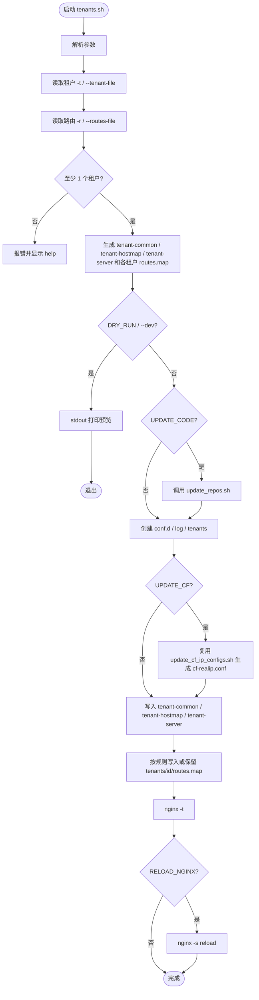
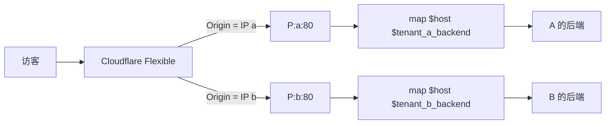

[toc]

## 关于 tenants 的设计说明

一台反代机 P 上有多个公网 IP，每个 IP 分给一个管理员/租户。

进入某个 IP 后，再只用该租户自己的 `routes.map` 按 Host 选后端。

---

## 1. tenants和 base.sh 的 hostmap 对比

两边都是 “Host -> Backend” 的 map 反代，容易看成同一件事。差别在入口怎么切。

|           | `base.sh -G hostmap`                                                                           | `tenants.sh`                                          |
| --------- | ------------------------------------------------------------------------------------------------ | ------------------------------------------------------- |
| 入口      | 全机一个 `listen 80`（所有网卡 IP 共用）                                                       | 每个租户一个 `listen <该租户公网IP>:80`               |
| Host 表   | 一张全局表                                                                                       | 每个租户一张表                                          |
| 表文件    | `$NGINX_CONF_HOME/gateway/maps/routes.map.conf` | `$NGINX_CONF_HOME/tenants/<id>/routes.map` |                                                         |
| 查表变量  | `map $host $backend_origin`                                                                    | `map $host $tenant_a_backend` / `$tenant_b_backend` |
| 未知 Host | 444                                                                                              | 444，而且只在当前 IP 的那张表里查                       |
| 跨管理员  | 同一张表，A 的域名写进去就能被任意入口打到                                                       | 把 B 的 Host 打到 A 的 IP 上，A 的表里没有，直接 444    |
| 配置来源  | 复制仓库模板 `gateway.conf` + `gateway/maps/`                                                | 按 `-t/-r` 生成 `tenant-*.conf`                     |
| 适用      | 一台反代机、一个管理员、很多站点                                                                 | 一台反代机、多个公网 IP、多个管理员                     |

`base.sh` 另外还有 `-G simple`：不按 Host 查表，`-i A_IP` 后所有请求都转到那一台上游。那是更老的“整机对一台源站”。

`vps_multi.sh` 也不按 Host 分流：一组 `B_IP -> A_IP`，进入该 IP 的所有 Host 都转到同一台 A。

关系可以看成：

```text
simple          一台上游，所有 Host 都去它
hostmap         一张全局 Host 表，所有 IP 共用
multi_plus      一个 IP 对应一台上游，仍不按 Host 拆
tenants         一个 IP 对应一个管理员，再按该管理员的 Host 表拆
```

hostmap 的日常改表：

```bash
# 全局一张
$NGINX_CONF_HOME/gateway/maps/routes.map.conf
```

tenants 的日常改表：

```bash
# 每人一张
$NGINX_CONF_HOME/tenants/a/routes.map
$NGINX_CONF_HOME/tenants/b/routes.map
```

两条 map 行格式接近（`host backend;`），不要把 hostmap 的全局文件和 tenants 的分租户文件混用。

backend 由 `--proxy-pass-mode` 决定，不要和 nginx 指令混用。

| 模式                 | 何时用                                               | routes.map                | nginx                                      |
| -------------------- | ---------------------------------------------------- | ------------------------- | ------------------------------------------ |
| `hostport`（默认） | 现网 `tenants/*/routes.map` 已是 `host ip:port;` | `10.10.10.11:80`        | `proxy_pass http://$tenant_xcx_backend;` |
| `url`              | 想和 hostmap 默认一样，或单站 HTTPS 源站             | `http://10.10.10.11:80` | `proxy_pass $tenant_xcx_backend;`        |

```bash
# 默认，兼容现网 xcx map
bash tenants.sh -t 'xcx=143.246.221.249'

# 与 base.sh -G hostmap 相同
bash tenants.sh --proxy-pass-mode url -t 'xcx=143.246.221.249'
```

选择会写入 `$TENANTS_DIR/proxy-pass-mode`，下次不传参数也沿用。从 hostport 切到 url 时，必须把已有 map 改成带 `http://` 的完整 URL 再 reload，否则会 500。

`-r` 会按当前模式规范化：hostport 剥掉 `http://`；url 没有协议就补上。

`base.sh -G hostmap` 也有 `--proxy-pass-mode`，含义相同，但 **hostmap 默认是 url**（现网 `gateway/maps/routes.map.conf` 已是完整 URL）。tenants 默认是 hostport。选择分别记在：

- tenants: `$TENANTS_DIR/proxy-pass-mode`
- hostmap: `$NGINX_CONF_DIR/gateway/proxy-pass-mode`

---

## 2. 为什么不用 10-/20-/30- 编号

方案文档里曾用 `10-common-map.conf` 这种名字，只是为了强调 include 顺序。

`conf.d/*.conf`（宝塔则是 `vhost/nginx/*.conf`）按**文件名排序**后依次 include。需要：

1. `map_hash_*`、`log_format`、公共 `map` 先出现
2. 各租户 `map $host $tenant_*_backend` 再出现
3. `server { listen IP:80 }` 最后出现

`log_format tenant_gateway` 必须在 `access_log ... tenant_gateway` 之前被解析。这是编号存在的真正原因。

脚本不用数字，因为这三个名字本身已经按字母排好：

```text
tenant-common.conf     # 公共 map / log_format / 可选 map_hash
tenant-hostmap.conf    # 每租户一张 Host -> Backend
tenant-server.conf     # 每租户 listen IP:80
```

```text
tenant-common  <  tenant-hostmap  <  tenant-server
```

Cloudflare 真实 IP 仍复用现成的 `cf-realip.conf`（`update_cf_ip_configs.sh`），不另造 `00-cloudflare-realip.conf`。

如果机器上还留着上一版的 `10-common-map.conf` / `20-tenant-maps.conf` / `30-tenant-gateways.conf`，正式写入时会删掉，避免重复 `listen` / `log_format` / `map`。

---

## 3. map_hash 警告

出现下面这行，说明 Host 表已经超出 nginx 默认哈希表：

```text
nginx: [warn] could not build optimal map_hash, you should increase either map_hash_max_size: 2048 or map_hash_bucket_size: 64; ignoring map_hash_bucket_size
```

`2048/64` 是默认值。`ignoring map_hash_bucket_size` 是建表算法的提示，不是“指令写错了就当没看见”。

这两条必须写在 **http{} 里、任何 `map {}` 之前**。只写在后面的 `tenant-common.conf` 里，如果 `nginx.conf` 已经先 `include com_com.conf`（宝塔会这样，里面已有 UA/国家 map），告警还是会按 2048/64 打出来。

脚本现在会：

1. 普通 `/etc/nginx/conf.d`：在 `tenant-common.conf` 开头写入 `128/65536`
2. 发现 `nginx.conf` 会先加载 `com_com.conf`：把 `map_hash_*` 插到 `http {}` 开头
3. `nginx.conf` 里已经是偏小的 `64/2048`：提高到 `128/65536`
4. 已经够大：不再重复写，避免 `directive is duplicate`
5. `-E`：提到 `256/131072`
6. `--no-map-hash`：完全不动

改完后应不再出现 2048/64 那条 warn。若域名极多仍报警，加 `-E` 再 `nginx -t`。

---

## 4. 执行流程



---

## 5. 生成文件

默认（可用 `-c` `-d` `--tenants-dir` 改）：

```text
$NGINX_CONF_HOME/
├── conf.d/                          # 或宝塔 vhost/nginx
│   ├── cf-realip.conf               # update_cf_ip_configs.sh 生成
│   ├── tenant-common.conf           # WebSocket / X-Forwarded-Proto / log_format
│   ├── tenant-hostmap.conf          # 每租户 map $host $tenant_<id>_backend
│   └── tenant-server.conf           # 每租户 listen IP:80
└── tenants/
    ├── proxy-pass-mode              # hostport 或 url，下次部署沿用
    ├── a/routes.map                 # 管理员 A 维护
    └── b/routes.map                 # 管理员 B 维护
```

`tenant-*.conf` 每次运行都会覆盖。`tenants/<id>/routes.map` 默认保留已有文件；只有下面情况才写：

- 文件还不存在
- 本次用 `-r` / `--routes-file` 给了该租户新路由
- 指定了 `--force-routes`

---

## 6. 请求怎么走



关键点：

1. Cloudflare DNS 里 A 的站 Origin 填 a，B 的站 Origin 填 b。
2. Nginx 先按 listen IP 选 server，再查该租户 map。
3. 把 B 的 Host 打到 a 上，`$tenant_a_backend` 为空，直接 444。
4. Flexible 下 P 只听 80，不要在 P 上做 http->https 强制跳转。

对比 hostmap：Cloudflare 无论 Origin 填哪个 IP，请求都会进同一个 `listen 80`，然后查同一张全局表。

---

## 7. 常用命令

标准 nginx：

```bash
bash tenants.sh \
  -t 'a=203.0.113.10' \
  -t 'b=203.0.113.11' \
  -r 'a:site-a1.example.com->10.10.10.11:80' \
  -r 'b:site-b1.example.net->10.20.20.11:80'
```

宝塔：

```bash
bash tenants.sh \
  -c /www/server/nginx/conf \
  -d /www/server/panel/vhost/nginx \
  -l /www/logs/ \
  -t 'a=203.0.113.10' \
  -t 'b=203.0.113.11'
```

只预览：

```bash
bash tenants.sh --dev \
  -t 'a=203.0.113.10' \
  -t 'b=203.0.113.11'
```

后端防火墙要求“必须从该公网 IP 出站”时再加 `--proxy-bind`。公网 IP 若只是 NAT 而不是本机接口地址，不要开。

---

## 8. 复用关系

- 仓库拉取：直接调用 `update_repos.sh`，与 `base.sh` / `vps_multi.sh` 相同。
- Cloudflare 访客 IP：复制并执行 `nginx_conf/update_cf_ip_configs.sh -s "$NGINX_CONFD" -n`，生成 `cf-realip.conf`。
- IPv4/IPv6 校验、`--dev` 行为：对齐 `vps_multi.sh`。

日常加站：管理员只改自己的 `tenants/<id>/routes.map`，然后：

```bash
nginx -t && nginx -s reload
```
