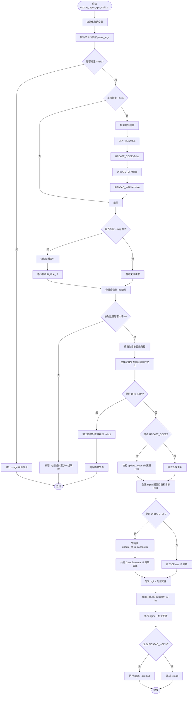
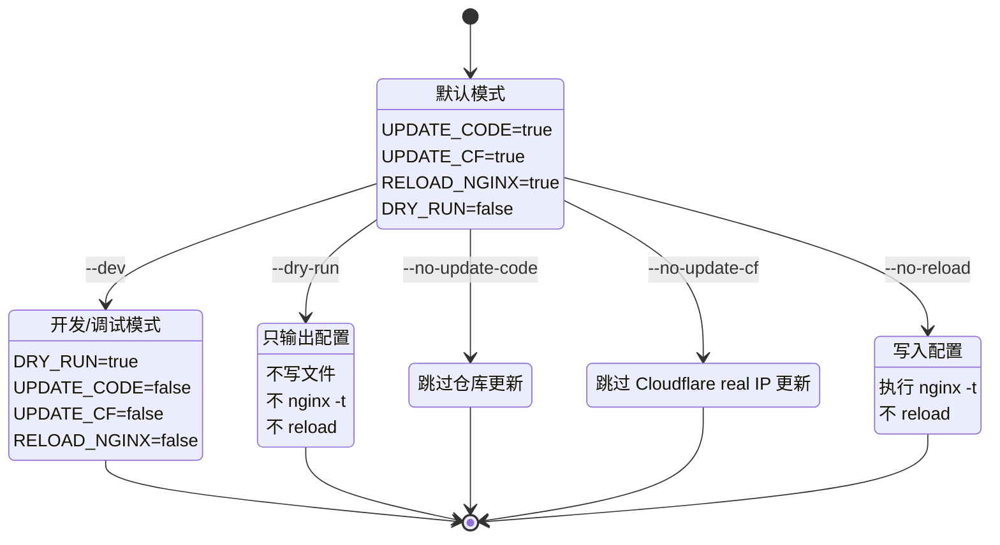
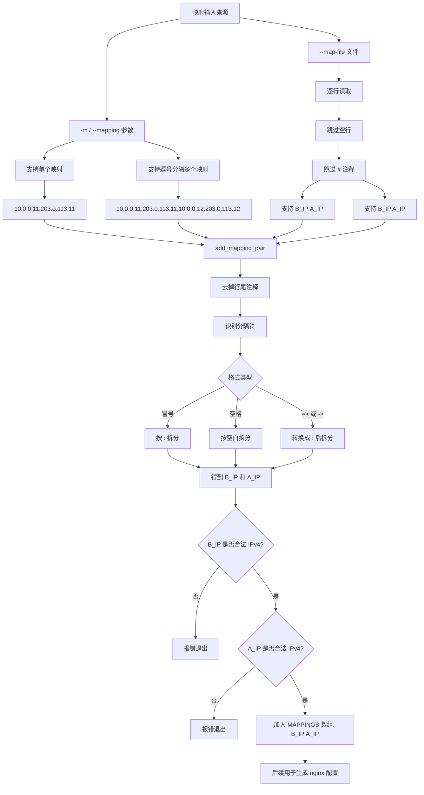
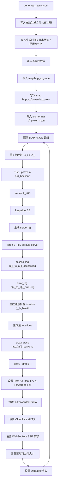
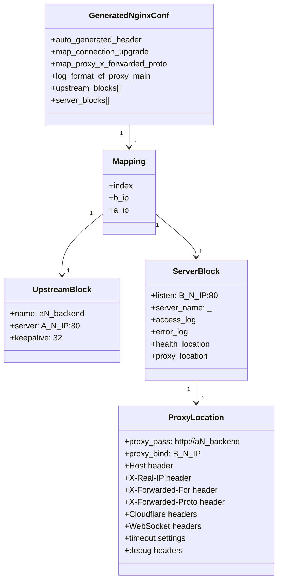
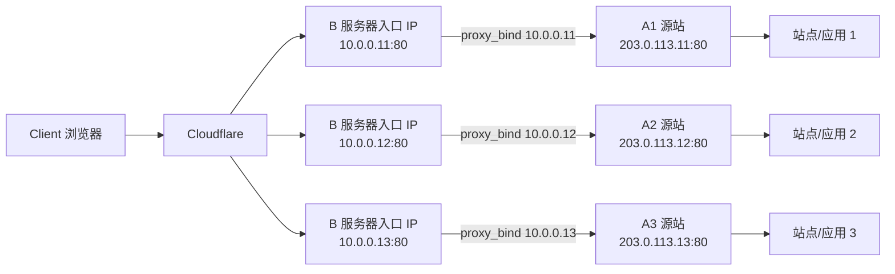
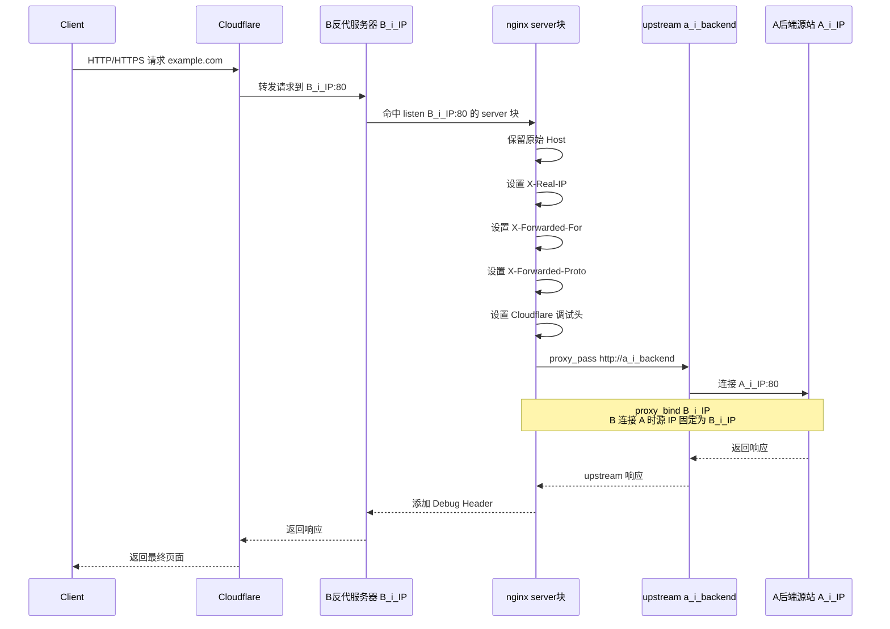
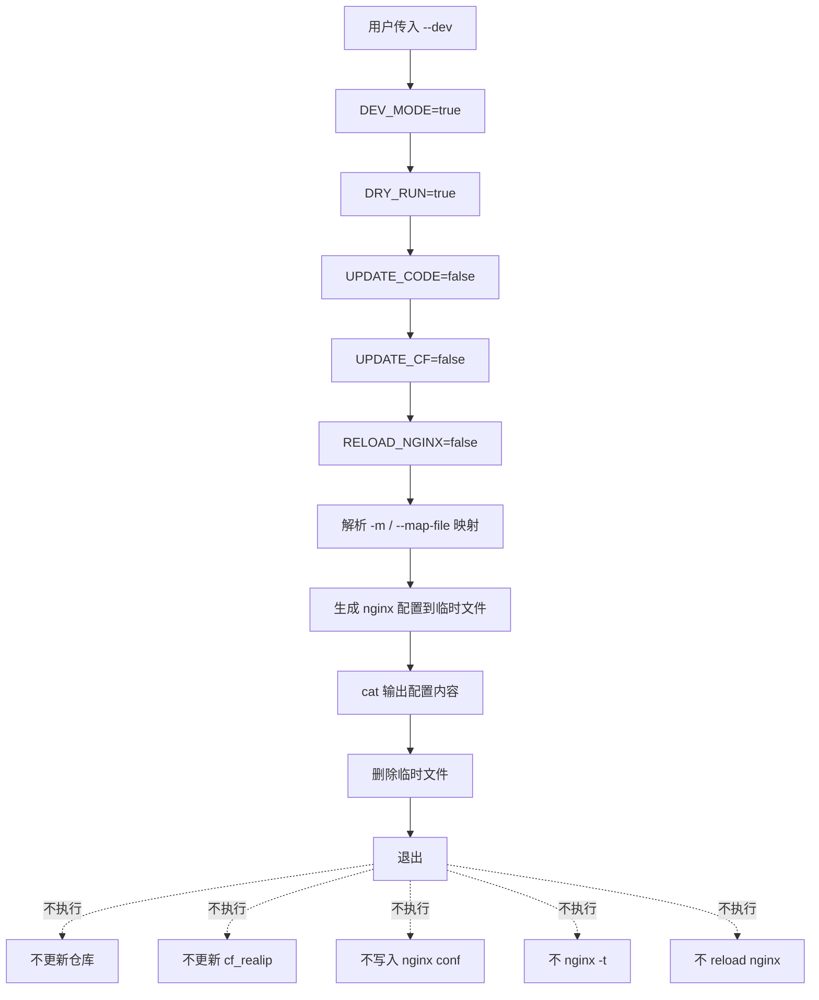
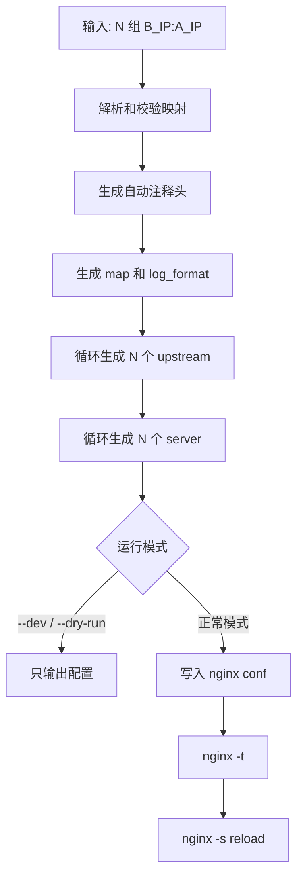

[toc]

## 关于update_repos_vps_multi配置生成脚本的设计说明

分别描述：**脚本执行流程、参数状态流、配置生成结构、网络转发关系、映射解析逻辑**。

---

## 1. 脚本整体执行流程图



---

## 2. 参数与运行模式状态图



---

## 3. 映射输入解析逻辑图



---

## 4. 生成 nginx 配置的结构图



---

## 5. 生成后的 nginx 配置抽象结构



---

## 6. 实际网络转发关系图

以你的示例：

```bash
-m '10.0.0.11:203.0.113.11'
-m '10.0.0.12:203.0.113.12'
-m '10.0.0.13:203.0.113.13'
```

对应逻辑如下：



---

## 7. 单组映射内部请求处理流程



---

## 8. `--dev` 模式逻辑图



---

## 9. 一句话总结版



