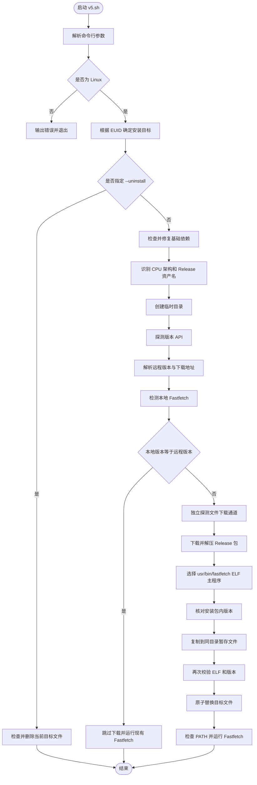
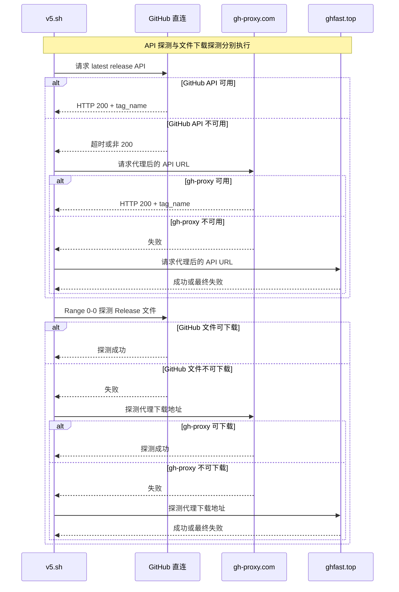
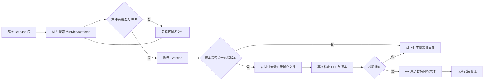

# Fastfetch 通用安装脚本

一个面向国内外 Linux 用户或服务器的 Fastfetch 自动安装、更新与卸载脚本。

脚本会根据当前用户权限选择安装目录，识别 CPU 架构，自动获取 Fastfetch 最新版本，并分别探测 GitHub API 与 Release 文件下载通道。在 GitHub 直连不可用时，可以自动切换到 `gh-proxy.com`、`ghfast.top`，也支持用户提供自定义镜像前缀。

## 主要功能

- 自动识别 Linux CPU 架构并下载对应的 Fastfetch 预编译包。
- 普通用户安装到 `~/.local/bin`，root 用户安装到 `/usr/local/bin`。
- 自动检测并安装缺失的基础命令。
- 支持 GitHub 直连、内置镜像和自定义镜像前缀。
- GitHub API 与 Release 文件下载通道分别探测，互不依赖。
- 自动读取远程最新版本和本地已安装版本。
- 本地版本与远程版本相同时跳过下载。
- 无 `jq` 时使用 `grep`、`cut`、`tr` 解析 GitHub Release JSON。
- 下载失败自动重试，并设置连接和总耗时限制。
- 在临时目录中解压，不污染当前工作目录。
- 只接受有效的 Linux ELF `fastfetch` 主程序，避免误装同名补全脚本。
- 安装包内版本必须与 GitHub API 返回的版本一致。
- 使用同目录暂存文件和原子替换，降低覆盖过程中损坏原程序的风险。
- 安装成功后检查 PATH，并自动运行 Fastfetch。
- 支持 `--uninstall` 卸载当前用户目标目录中的 Fastfetch。
- 退出时自动清理临时文件。

## 运行要求

脚本仅支持 Linux，并要求使用 Bash 执行。

推荐方式：

```bash
chmod +x v5.sh
./v5.sh
```

也可以显式调用 Bash：

```bash
bash v5.sh
```

不建议使用 `sh v5.sh`，因为脚本使用了 Bash 数组、`[[ ... ]]`、`pipefail` 等 Bash 特性。

## 快速开始

### 普通用户安装

```bash
chmod +x v5.sh
./v5.sh
```

安装目标：

```text
~/.local/bin/fastfetch
```

### root 用户全局安装

```bash
sudo ./v5.sh
```

安装目标：

```text
/usr/local/bin/fastfetch
```

### 查看帮助

```bash
./v5.sh --help
```

### 卸载

```bash
./v5.sh --uninstall
```

root 安装的版本需要使用：

```bash
sudo ./v5.sh --uninstall
```

## 命令行选项

| 选项                    | 说明                                                                       |
| ----------------------- | -------------------------------------------------------------------------- |
| `-h`, `--help`      | 显示帮助信息并退出。                                                       |
| `-u`, `--uninstall` | 删除当前用户对应安装目录中的 Fastfetch，不删除配置文件。                   |
| `--mirror auto`       | 自动依次探测 GitHub 直连、`gh-proxy.com`、`ghfast.top`。这是默认模式。 |
| `--mirror direct`     | 强制使用 GitHub 直连，不尝试镜像。                                         |
| `--mirror ghproxy`    | 强制使用`https://gh-proxy.com`。                                         |
| `--mirror ghfast`     | 强制使用`https://ghfast.top`。                                           |
| `--mirror URL`        | 使用以`http://` 或 `https://` 开头的自定义镜像前缀。                   |
| `--mirror=MODE`       | `--mirror MODE` 的等价写法。                                             |

注意：

- `--uninstall` 不能与 `--mirror` 同时使用。
- 脚本不接受位置参数。
- 自定义镜像必须支持“镜像前缀 + 原始 GitHub URL”的 URL 形式。

## 安装位置

脚本根据执行用户自动决定安装目录：

| 执行身份  | 安装目录                                              | 目标文件                     |
| --------- | ----------------------------------------------------- | ---------------------------- |
| 普通用户  | `$HOME/.local/bin` | `$HOME/.local/bin/fastfetch` |                              |
| root 用户 | `/usr/local/bin`                                    | `/usr/local/bin/fastfetch` |

脚本不会自动把普通用户安装提升为系统级安装。需要系统级安装时，请显式使用 `sudo`。

## 支持的架构

| `uname -m` 输出      | Fastfetch 架构名称 | Release 文件名                     |
| ---------------------- | ------------------ | ---------------------------------- |
| `x86_64`, `amd64`  | `amd64`          | `fastfetch-linux-amd64.tar.gz`   |
| `aarch64`, `arm64` | `aarch64`        | `fastfetch-linux-aarch64.tar.gz` |
| `armv7l`, `armv7`  | `armv7l`         | `fastfetch-linux-armv7l.tar.gz`  |

其他架构会被明确拒绝，避免下载不兼容的软件包。

## 镜像模式

### `auto`：自动选择

```bash
./v5.sh --mirror auto
```

自动模式按以下顺序探测：

1. GitHub 直连。
2. `https://gh-proxy.com`。
3. `https://ghfast.top`。

版本 API 和文件下载是两次独立探测。例如：

- GitHub API 可以直连；
- GitHub Release 文件无法直连；
- 脚本仍可使用直连 API 获取版本，再通过镜像下载文件。

### `direct`：强制直连

```bash
./v5.sh --mirror direct
```

只访问 GitHub，不尝试任何镜像。适合网络可以稳定访问 GitHub 的环境。

### `ghproxy`：强制使用 gh-proxy.com

```bash
./v5.sh --mirror ghproxy
```

### `ghfast`：强制使用 ghfast.top

```bash
./v5.sh --mirror ghfast
```

### 自定义镜像前缀

```bash
./v5.sh --mirror https://example.com/github-proxy
```

或：

```bash
./v5.sh --mirror=https://example.com/github-proxy
```

假设原始地址为：

```text
https://github.com/fastfetch-cli/fastfetch/releases/download/2.65.2/fastfetch-linux-amd64.tar.gz
```

脚本构造的地址为：

```text
https://example.com/github-proxy/https://github.com/fastfetch-cli/fastfetch/releases/download/2.65.2/fastfetch-linux-amd64.tar.gz
```

脚本会移除镜像前缀末尾多余的 `/`，避免出现重复斜杠。

## 工作流程



## 自动镜像探测流程



## 版本检测与异常处理

### 远程版本

脚本调用以下 GitHub Release API：

```text
https://api.github.com/repos/fastfetch-cli/fastfetch/releases/latest
```

解析顺序：

1. 系统存在 `jq` 时，使用 `jq` 精确解析 `tag_name` 和目标资产下载地址。
2. 没有 `jq` 时，使用 `tr + grep + cut` 解析。
3. API 中未找到目标资产时，根据版本标签构造标准 Release 下载地址。

### 本地版本

本地程序查找顺序：

1. 当前用户对应的目标路径，例如 `~/.local/bin/fastfetch`。
2. 如果目标路径不存在，则使用 `command -v fastfetch` 查找 PATH 中的程序。

脚本通过：

```bash
fastfetch --version
```

读取版本号。

### 本地文件异常

如果发现名为 `fastfetch` 的文件，但它不是 Linux ELF 二进制，或者无法从中解析版本号，脚本会：

1. 显示警告和文件路径。
2. 运行：

   ```bash
   fastfetch -v
   ```
3. 将该命令的标准输出、标准错误和非零退出状态展示给用户。
4. 询问是否删除旧文件并重新安装：

   ```text
   是否尝试移除旧文件 ...，并重新安装 Fastfetch（覆盖安装）？[y/N]
   ```
5. 只有输入 `y`、`Y` 或 `yes` 才会删除旧文件。
6. 直接回车或输入 `n` 会取消覆盖，不修改旧文件。

在管道、CI、计划任务等非交互环境中，如果遇到这种需要确认的异常文件，脚本会停止，不会自动删除。

## 安全安装机制

脚本不会把解压目录中第一个名为 `fastfetch` 的文件直接复制到安装目录。

Fastfetch Release 包可能同时包含：

- 真正的 `usr/bin/fastfetch` ELF 主程序；
- Bash、Zsh、Fish 补全文件；
- 其他同名文本文件。

为避免误装同名脚本，脚本采用以下校验链：



具体措施包括：

- 临时目录由 `mktemp -d` 创建。
- 解压内容不会写入当前工作目录。
- 优先匹配 `*/usr/bin/fastfetch`。
- 通过前四个字节 `0x7F 45 4C 46` 验证 ELF 文件头。
- 解压出的程序必须能返回有效版本号。
- 解压出的版本必须与 API 解析出的远程版本一致。
- 先复制到安装目录内的随机暂存文件。
- 暂存文件再次通过 ELF 和版本检查后，才使用 `mv` 替换正式目标。
- 安装失败或脚本退出时，自动清理暂存文件和临时目录。

## 依赖自动安装

脚本检查以下基础命令：

```text
curl tar gzip grep cut find install mktemp head tr mkdir chmod mv rm cat uname
```

如果有命令缺失，会尝试使用系统中第一个可用的包管理器安装依赖。

支持的包管理器：

| 包管理器命令 | 常见发行版                         |
| ------------ | ---------------------------------- |
| `apt-get`  | Debian、Ubuntu、Linux Mint 等      |
| `dnf`      | Fedora、Rocky Linux、AlmaLinux 等  |
| `pacman`   | Arch Linux、Manjaro 等             |
| `zypper`   | openSUSE、SUSE Linux Enterprise 等 |
| `apk`      | Alpine Linux                       |

普通用户安装系统依赖时需要 `sudo`。如果缺少依赖、当前不是 root，并且系统没有 `sudo`，脚本会停止并提示手动安装。

`jq` 是可选依赖，不会为了 JSON 解析而强制安装。

## 卸载 Fastfetch

### 普通用户卸载

```bash
./v5.sh --uninstall
```

删除：

```text
$HOME/.local/bin/fastfetch
```

### root 用户卸载

```bash
sudo ./v5.sh --uninstall
```

删除：

```text
/usr/local/bin/fastfetch
```

### 卸载边界

卸载功能有意保持保守：

- 只删除当前执行身份对应的目标文件。
- 不删除 Fastfetch 配置文件。
- 不删除缓存、主题或用户自定义资源。
- 如果目标位置不存在，但 PATH 中还有另一个 Fastfetch，只会提示其路径，不会删除。
- 如果目标路径是普通目录而不是文件或符号链接，脚本会拒绝删除。

常见 Fastfetch 配置目录可能包括：

```text
~/.config/fastfetch
```

本脚本不会修改或删除该目录。

## PATH 配置

普通用户安装后，如果 `~/.local/bin` 不在 PATH 中，脚本会根据当前 Shell 给出配置建议。

### Bash

```bash
printf '%s\n' 'export PATH="$HOME/.local/bin:$PATH"' >> "$HOME/.bashrc"
source "$HOME/.bashrc"
```

### Zsh

```bash
printf '%s\n' 'export PATH="$HOME/.local/bin:$PATH"' >> "$HOME/.zshrc"
source "$HOME/.zshrc"
```

### Fish

```fish
fish_add_path "$HOME/.local/bin"
```

重新打开终端后，也可以验证：

```bash
command -v fastfetch
fastfetch --version
```

## 日志与颜色

日志分为四级：

```text
[INFO]
[SUCCESS]
[WARN]
[ERROR]
```

满足以下条件时自动启用颜色：

- 标准错误连接到终端；
- `TERM` 不是 `dumb`；
- 环境变量 `NO_COLOR` 未设置。

禁用颜色：

```bash
NO_COLOR=1 ./v5.sh
```

日志主要写入标准错误，便于在需要时单独重定向。

## 常见使用示例

### 自动选择最佳通道

```bash
./v5.sh
```

等价于：

```bash
./v5.sh --mirror auto
```

### 强制 GitHub 直连

```bash
./v5.sh --mirror direct
```

### 强制使用 gh-proxy.com

```bash
./v5.sh --mirror ghproxy
```

### 强制使用 ghfast.top

```bash
./v5.sh --mirror ghfast
```

### 使用自定义代理前缀

```bash
./v5.sh --mirror https://example.com/github-proxy
```

### 安装到系统目录

```bash
sudo ./v5.sh --mirror auto
```

### 查看脚本帮助

```bash
./v5.sh -h
```

### 普通用户卸载

```bash
./v5.sh -u
```

### root 用户卸载

```bash
sudo ./v5.sh -u
```

### 保存完整日志

由于日志写入标准错误，可以使用：

```bash
./v5.sh 2>&1 | tee install-fastfetch.log
```

## 常见问题

### 1. 为什么 API 直连成功，下载却使用镜像？

版本 API 和 Release 文件下载通道会独立探测。某些网络可以访问 `api.github.com`，但无法稳定访问 GitHub Release 大文件，因此出现这种结果是正常的。

### 2. 为什么没有安装 `jq`？

`jq` 不是必需依赖。系统没有 `jq` 时，脚本会自动使用基础文本工具解析 Release JSON，以减少额外依赖。

### 3. 为什么脚本提示目标文件不是 ELF？

目标路径可能被旧脚本、补全文件、HTML 错误页或其他文本文件占用。脚本会运行该文件的 `-v` 参数并展示输出，然后由用户决定是否删除并重装。

### 4. 为什么不能在非交互环境中自动覆盖异常文件？

删除未知旧文件具有破坏性。遇到无法识别版本的文件时，脚本要求人工确认；没有交互终端时会安全退出。

### 5. 已经是最新版本时会发生什么？

脚本会跳过下载和覆盖，检查 PATH，并尝试运行现有 Fastfetch。

### 6. 卸载后为什么仍能运行 Fastfetch？

PATH 中可能存在其他安装来源，例如发行版软件包、Homebrew、Nix、另一个用户目录或手动安装文件。卸载命令只删除本次执行身份对应的目标路径，并会提示发现的其他路径。

可以检查：

```bash
type -a fastfetch
```

### 7. 为什么普通用户和 sudo 安装的是两个不同位置？

脚本按当前有效用户 ID 决定安装目录。普通运行安装到用户目录，使用 `sudo` 后以 root 身份运行，因此安装到 `/usr/local/bin`。

### 8. 下载完成后为什么还要执行多次版本检查？

这是为了避免镜像返回错误内容、压缩包结构变化、同名脚本误匹配或复制过程异常。只有候选文件和暂存文件都通过验证，正式目标才会被替换。

### 9. 如何仅更新，不重新安装同版本？

直接再次运行脚本即可。脚本自动比较版本，相同版本不会下载。

### 10. 如何删除 Fastfetch 配置？

本脚本不会删除配置。确认不再需要后，可以自行处理：

```bash
rm -rf -- "$HOME/.config/fastfetch"
```

该操作不可恢复，请先备份需要保留的配置。

## 安全说明与限制

- 建议从可信来源获取并审阅 `v5.sh` 后再执行。
- 使用 `sudo` 运行前应特别检查脚本内容。
- 自定义镜像和第三方镜像可以看到请求内容，并可能返回被修改的文件。请只使用可信镜像。
- 脚本验证 ELF 文件类型和版本号，但当前没有验证 Release 文件的加密签名或 SHA256 校验和。
- 脚本会运行下载包内候选程序的 `--version` 以确认版本，因此下载源可信度非常重要。
- 自动依赖安装会调用系统包管理器，并可能更新软件包索引。
- `--uninstall` 只移除二进制文件，不负责撤销用户自行添加的 PATH 配置。
- 镜像站的可用性和转发规则可能随时间变化；强制镜像失败时可切换回 `auto` 或使用其他可信前缀。

## 文件说明

```text
.
├── v5.sh       # Fastfetch 安装、更新和卸载脚本
└── README.md    # 使用说明、流程图和故障排查文档
```

## 本地检查

检查 Bash 语法：

```bash
bash -n v5.sh
```

查看帮助：

```bash
./v5.sh --help
```

验证文件权限：

```bash
ls -l v5.sh
```

预期脚本具有可执行权限，例如：

```text
-rwxr-xr-x ... v5.sh
```
