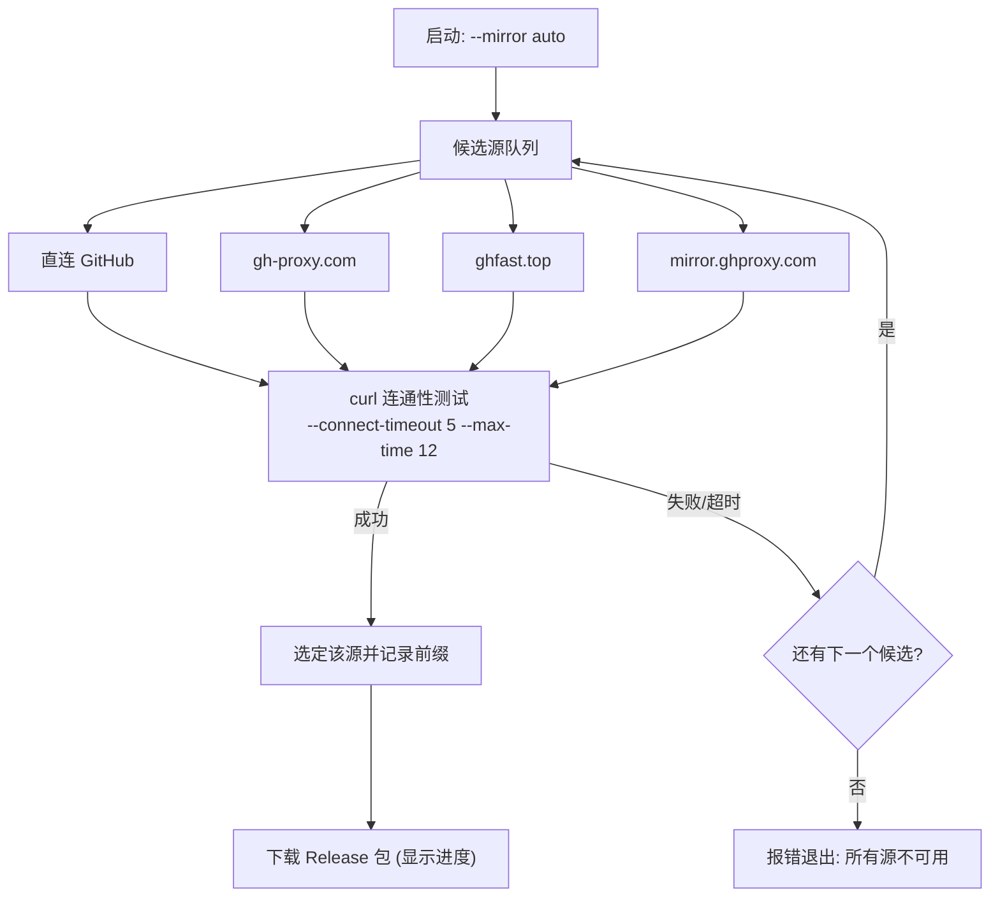

## 国内用户通过github安装工具的思路

```mermaid
flowchart TD
    A["启动: --mirror auto"] --> B["候选源队列"]
    B --> B1["直连 GitHub"]
    B --> B2["gh-proxy.com"]
    B --> B3["ghfast.top"]
    B --> B4["mirror.ghproxy.com"]
    B1 --> T["curl 连通性测试<br/>--connect-timeout 5 --max-time 12"]
    B2 --> T
    B3 --> T
    B4 --> T
    T -->|"成功"| S["选定该源并记录前缀"]
    T -->|"失败/超时"| N{"还有下一个候选?"}
    N -->|"是"| B
    N -->|"否"| F["报错退出: 所有源不可用"]
    S --> D["下载 Release 包 (显示进度)"]
```
